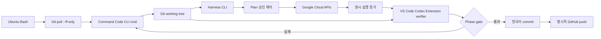

# 하네스 아키텍처

## 목표

15개 Google Cloud 실습의 교육 목표를 계정에 재현하고, 결과를 CLI로 판정하고, 남은 리소스 없이 정리하는 반복 가능한 자동화 도구를 만든다. 자동화의 단위는 “콘솔 클릭”이 아니라 “의도한 클라우드 상태와 관찰 가능한 결과”다.

## 시스템 경계



Command Code `cmd`는 현재 계정의 고정 모델을 상속해 Phase를 실행하고 machine verification에서 멈춘다. VS Code Codex Extension의 verifier는 저장소의 검증 명령을 실행한 뒤 diff와 실행 증거를 판정한다. commit과 push는 사용자의 Extension 승인 이후 controller가 수행한다.

## 계층

### 제어 계층

- `scripts/`: Command Code handoff, Extension review, 환경 검사, 공통 gate, commit/push 보호 장치
- `bin/gcp-lab-harness`: 사용자가 호출하는 단일 CLI 골격
- 향후 `phases/NN/manifest.yaml`: Phase 의존성, API, 비용 등급, timeout, lab adapter 선언
- `schemas/`: Command Code·Extension·하네스가 주고받는 구조화 결과

### 실행 계층

- Terraform: 수명주기를 소유할 수 있는 네트워크·VM·SQL·VPN·로드 밸런서 리소스
- `gcloud`/`bq`: 조회, 명령형 실습 동작, expected-denial, 데이터 적재와 쿼리
- SSH/`curl`/SQL: 게스트 OS와 실제 데이터 경로 검증
- REST API: CLI가 노출하지 않거나 구조화 판정이 필요한 관리 API

### 증거 계층

- `artifacts/<run-id>/`: 원시 로그, 저장된 plan, inventory, 검증 JSON. Git 제외.
- `evidence/phase-NN.md`: 비밀정보와 식별자를 제거한 결과 요약. 검토 후 Git 포함 가능.
- manifest 상태: `planned`, `applied`, `verified`, `failed`, `destroyed`, `cleanup_required`.

## 사용자 명령 계약

최종 CLI는 다음 표면을 제공한다.

```text
gcp-lab-harness doctor
gcp-lab-harness phase list
gcp-lab-harness plan NN
gcp-lab-harness apply NN --plan <file> --approve <run-id>
gcp-lab-harness verify NN --run <run-id>
gcp-lab-harness destroy NN --run <run-id>
gcp-lab-harness evidence NN --run <run-id>
gcp-lab-harness run NN --through destroy
```

`run`도 내부적으로 각 상태를 건너뛰지 않는다. 저장된 plan의 hash와 승인 run ID가 다르면 apply를 거부한다.

## Lab adapter 계약

각 실습은 공통 함수 또는 동등한 실행 단위를 제공한다.

```text
preflight   읽기 전용 권한·API·쿼터·비용 조건 확인
plan        변경 목록과 예상 비용 등급을 artifact로 저장
apply       고유 run ID와 공통 라벨로 리소스 생성
verify      실제 데이터 경로와 expected-denial을 구조화 판정
destroy     이 run이 소유한 리소스만 역순 제거
inventory   생성 전·후·정리 후 잔여 리소스 비교
```

리소스 이름은 `<prefix>-p<phase>-l<lab>-<run-suffix>`를 사용하고, 가능한 모든 리소스에 `managed-by`, `phase`, `lab`, `run-id` 라벨을 붙인다. 라벨을 지원하지 않는 리소스는 manifest의 전체 이름과 hash로 소유권을 추적한다.

## 안전 모델

- `GCP_PROJECT_ID`가 `GCP_ALLOWED_PROJECTS`에 정확히 포함되지 않으면 모든 변경을 거부한다.
- Phase 시작 전 working tree가 clean하지 않거나 `git pull --ff-only`가 실패하면 실행을 거부한다.
- production·조직 공용 프로젝트를 허용하지 않고 실습 전용 프로젝트를 사용한다.
- 서비스 계정 JSON 키를 만들지 않는다. 로컬 사용자 ADC 또는 단기 서비스 계정 가장을 사용한다.
- Terraform은 저장된 plan만 apply하고 state는 Git에 넣지 않는다. 운영 구현 시 버전 관리·암호화·접근 제어가 설정된 전용 GCS backend를 사용한다.
- CSEK, Cloud SQL 비밀번호, VPN PSK는 프로세스 수명 또는 Secret Manager 참조로만 유지한다.
- 예산 설정은 D-012에 따라 필수로 사용하지 않는다. 하네스 자체의 프로젝트 allowlist·최대 수량·timeout·강제 destroy를 적용한다.
- 실패 trap은 자동 정리를 시도하되, 데이터 삭제 위험이 있는 destroy는 manifest가 소유권을 증명할 때만 실행한다.

## 멱등성과 동시성

- 같은 run ID의 재실행은 현재 상태를 읽고 완료된 동작을 건너뛴다.
- 다른 run ID는 이름과 state를 분리한다.
- 프로젝트·Phase별 lock을 두고 동시에 같은 Phase를 apply하지 않는다.
- 비동기 리소스는 timeout이 있는 polling으로 기다리고 고정된 장시간 sleep을 쓰지 않는다.
- expected-denial 테스트는 명령 실패 여부뿐 아니라 예상 오류 코드·권한명을 확인한다.

## GUI 의존 실습 처리

- 콘솔 탐색, Cloud Shell 편집기, RDP 같은 사용자 경험은 자동 완료로 주장하지 않는다. 같은 상태를 CLI로 만들고 API 결과를 증거로 남긴다.
- Marketplace VM 제품은 해당 상품이 CLI Terraform 배포를 지원할 때만 정확한 어댑터를 제공한다. 지원하지 않으면 Phase를 `blocked`로 만들고 임의의 대체 배포를 동일 결과로 표시하지 않는다.
- IAM의 두 사용자 실습은 별도 테스트 서비스 계정과 가장을 사용해 권한 부여·회수·거부를 재현한다.

## 성공 기준

각 Phase는 오프라인 정적 gate, 제한된 계정 통합 검증, destroy 후 잔여 리소스 0, VS Code Codex Extension review의 P0/P1 0과 사용자 승인을 모두 만족해야 완료된다. 전체 완료는 Foundation을 통과하고 Phase 01~15를 깨끗한 실습 프로젝트에서 순서대로 실행·정리한 E2E 증거가 있을 때만 선언한다.
