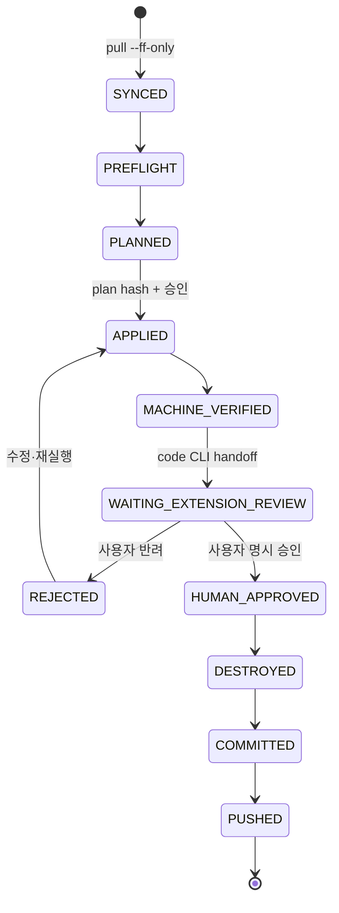

# 단일 실행 15-Phase 오케스트레이션

## 사용자 경험

사용자는 clone과 bootstrap 뒤 Bash 또는 PowerShell에서 한 번 시작한다.

```bash
gcp-lab-harness run-all --run <RUN_ID>
```

PowerShell 진입점은 `.\harness.ps1 run-all --run <RUN_ID>`다. Windows에서는 WSL 대신 Git for Windows의 Bash 호환층이 동일 스크립트를 실행한다. 오케스트레이터는 전체 offline gate 뒤 Command Code 대화형 세션을 열고 사용자의 자연어 지시를 받는다. clean working tree에서 `git pull --ff-only`를 먼저 수행한 뒤 Lab 01부터 15까지 순차 실행한다. 각 Lab마다 VS Code Codex Extension의 사용자 승인 게이트에서 대기하고, 승인 뒤 `handoff next`가 같은 Command Code 세션을 재개해 해당 Lab 리소스를 정리하고 한국어 commit과 push를 완료한다.

## `cmd`, `codex`, `code`의 역할

- `cmd`: Command Code CLI의 실제 실행 명령이다. 사용자 Command Code 계정과 현재 고정 모델로 Phase 계획, adapter 호출, 오류 복구 handoff를 담당한다.
- `gcp-lab-harness`: 상태·소유권·비용·승인·Git 전이를 결정하는 deterministic controller다.
- `codex`: VS Code Codex Extension과 공유되는 MCP 설정을 관리할 때만 쓰는 보조 CLI다. Phase 실행자나 별도 verifier가 아니다.
- `code` CLI: 선택적으로 현재 사용자의 VS Code workspace와 Phase 검증 패키지를 화면에 여는 로컬 launcher다. Command Code 실행 명령이 아니며 클라우드 명령을 실행하지 않는다.
- VS Code Codex Extension: Phase gate, 실제 GCP read-only 조회, diff와 evidence 검토를 수행한다.
- 단일 모델 선택 경로: 같은 Command Code 고정 모델이 구현 뒤 별도 자기 검증 패스를 수행하고 schema 기반 review JSON을 남긴다. 사용자 승인 gate는 그대로다.
- GCP 인증: Codex 계정과 별개이며 ADC 또는 서비스 계정 가장으로 제공한다.

## Phase 상태 머신



Lab 01의 `PUSHED`가 확인되어야 Lab 02가 시작된다. `WAITING_EXTENSION_REVIEW`에서는 새 GCP 변경을 만들지 않는다.

## Extension handoff 계약

기계 검증이 끝나면 오케스트레이터가 다음을 수행한다.

1. `artifacts/runs/<run-id>/phase-NN/extension/EXTENSION_REVIEW_PROMPT.md` 생성
2. plan hash, diff hash, evidence manifest hash, 리소스 inventory를 묶음
3. `code --reuse-window <repo> <review-prompt>` 실행
4. gate 상태를 `waiting_extension_review`로 원자적으로 기록
5. 승인 파일을 기다리되 heartbeat와 최대 대기 시간만 관리하고 Cloud 작업은 하지 않음

Extension은 prompt에 따라 저장소 명령과 공식 Monitoring/Logging MCP 조회를 실행하고 결과를 사용자에게 보여준다. **Extension 자신이 승인을 추론하면 안 된다.** 사용자가 정확히 승인 의사를 밝힌 뒤에만 다음 명령을 실행한다.

단일 모델 경로도 같은 원칙을 사용한다. 모델은 review 결과만 작성하고 `single-model approve`를 실행하지 않는다. 사용자가 결과와 hash를 확인해 승인 명령을 직접 실행해야 cleanup과 다음 Phase handoff가 열린다.

```bash
./bin/gcp-lab-harness gate approve NN \
  --run <run-id> \
  --plan-hash <hash> \
  --diff-hash <hash> \
  --evidence-hash <hash> \
  --reviewer <local-id>
```

문제가 있으면 Extension은 `gate reject`와 finding 파일을 남긴다. 오케스트레이터는 다음 Phase로 가지 않고 같은 Command Code session에 finding을 handoff한다.

## 승인 파일 보안

- approval JSON은 run ID, Phase, 세 hash, decision, timestamp, reviewer-local-id를 포함한다.
- 임시 파일에 작성하고 같은 filesystem에서 atomic rename한다.
- 현재 plan/diff/evidence hash와 하나라도 다르면 stale approval로 거부한다.
- 승인 파일을 Git에서 제외하고 정제 summary에 승인 시각과 hash prefix만 기록한다.
- 자동 timeout은 승인으로 간주하지 않는다.

## 승인 후 자동 처리

사용자 승인 뒤 오케스트레이터가 다음을 연속 실행한다.

1. `destroy`와 post-destroy inventory
2. 잔여 run 소유 리소스 0 확인
3. 정제 evidence 생성과 secret scan
4. Phase가 허용한 path만 stage
5. `Phase NN: <한국어 Lab 이름> 자동화 및 검증 완료` commit
6. configured `origin`으로 push
7. remote commit SHA 확인
8. pipeline cursor를 NN+1로 이동
9. `git pull --ff-only`로 다음 Phase 기준을 확인하고 시작

cleanup 또는 push가 실패하면 다음 Phase로 가지 않는다. 재실행 시 성공한 전이는 건너뛰고 실패 지점부터 resume한다.

## 단일 실행과 재개

대화형 supervisor는 상태를 `artifacts/runs/<run-id>/pipeline.json`에 매 전이마다 저장한다. Foundation B는 0600 임시 JSON을 같은 filesystem에서 atomic rename하고, Command Code나 VS Code가 종료되어도 다음 명령이 동일 run의 다음 동작을 계산한다.

```bash
gcp-lab-harness resume --run <run-id>
```

승인 대기 중인 run이 있으면 새 `run-all`은 중복 pipeline을 만들지 않고 해당 run ID를 안내한다.

## Git 정책

- Phase 하나당 완료 commit 하나
- Phase 시작 전 clean working tree와 `git pull --ff-only` 성공 필수
- push 실패 시 새 commit을 만들지 않고 같은 SHA를 재전송
- 원격 main이 예상 base에서 이동했으면 자동 merge/rebase하지 않고 중단
- raw artifact, state, credentials, IP·계정 식별자는 stage 대상에서 제외
- 최종 Phase 15 이후 release tag는 별도 사용자 승인 항목
