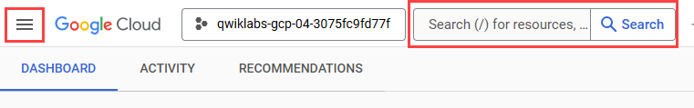
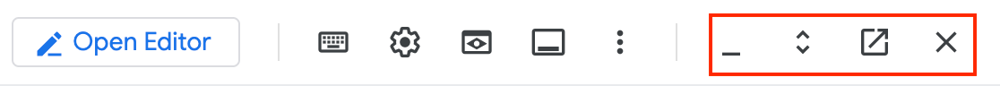

# 01. Google Cloud Console 및 Cloud Shell 다루기

> [📚 전체 목록](../README.md) · [다음 실습 →](02.Infrastructure%20Preview_KR.md)

## Overview (개요)

이 실습에서는 Google Cloud의 웹 기반 인터페이스에 익숙해집니다. Google Cloud에는 두 가지 통합 환경이 있습니다. 하나는 **Google Cloud console**이라는 GUI(그래픽 사용자 인터페이스) 환경이고, 다른 하나는 **Cloud Shell**이라는 CLI(명령줄 인터페이스) 환경입니다. 이 실습에서는 두 환경을 모두 사용합니다.

Cloud console에 대해 알아두어야 할 몇 가지 사항은 다음과 같습니다.

- Cloud console은 지속적으로 개발되고 있기 때문에 그래픽 레이아웃이 가끔 변경될 수 있습니다. 이는 대개 새로운 Google Cloud 기능을 추가하거나 기술 변화를 반영하기 위한 것이며, 그 결과 워크플로가 조금씩 달라질 수 있습니다.
- 대부분의 일반적인 Google Cloud 작업은 Cloud console에서 수행할 수 있지만, 모든 작업이 가능한 것은 아닙니다. 특히 매우 새로운 기술이거나 세부적인 API 또는 명령어 옵션은 Cloud console에 구현되어 있지 않을 수 있습니다(또는 아직 구현되지 않았을 수 있습니다). 이런 경우에는 명령줄이나 API를 사용하는 것이 가장 좋은 대안입니다.
- Cloud console은 일부 작업에서 매우 빠릅니다. Cloud console은 여러 개의 CLI 명령어가 필요할 수 있는 여러 작업을 대신 한 번에 수행할 수 있으며, 반복적인 작업도 처리할 수 있습니다. 몇 번의 클릭만으로 많은 타이핑이 필요하고 오타가 발생하기 쉬운 작업을 수행할 수 있습니다.
- Cloud console은 메뉴를 통해 유효한 옵션만 제공함으로써 오류를 줄일 수 있습니다. Google Cloud API를 통해 "백그라운드"에서 플랫폼에 접근하여 변경 사항을 제출하기 전에 구성을 검증할 수 있습니다. 명령줄은 이런 종류의 동적 검증을 수행할 수 없습니다.

## Objectives (목표)

이 실습에서는 다음 작업을 수행하는 방법을 배웁니다.

- Google Cloud에 액세스합니다.
- Cloud console을 사용하여 Cloud Storage 버킷을 생성합니다.
- Cloud Shell을 사용하여 Cloud Storage 버킷을 생성합니다.
- Cloud Shell의 기능에 익숙해집니다.

> **💡 참고:** Google Cloud 제품 및 서비스 목록이 있는 메뉴를 보려면 왼쪽 상단의 **Navigation menu(탐색 메뉴)**를 클릭하거나 **Search(검색)** 필드에 서비스 또는 제품 이름을 입력하세요.



---

---

## 🧩 Task 1. Cloud console을 사용하여 버킷 생성하기

이 작업에서는 버킷을 생성합니다. 다만 이 텍스트는 이 과정의 실습 안내에서 작업이 어떻게 제시되는지 익히고, Cloud console 인터페이스에 대해서도 배울 수 있도록 도와줍니다.

### Storage 서비스로 이동하여 버킷 생성하기

1. Google Cloud console에서 **Navigation menu(탐색 메뉴)**의 **Cloud Storage(클라우드 스토리지) > Buckets(버킷)**를 클릭합니다.
2. **Create(만들기)**를 클릭합니다.
3. **Name(이름)**에 전역적으로 고유한 버킷 이름을 입력하고, 다른 값은 모두 기본값으로 둡니다. 이 이름을 기록해 두세요. 이후 정리 단계에서 `[CONSOLE_BUCKET_NAME]`으로 참조됩니다.
4. **Create(만들기)**를 클릭합니다.
5. `Public access will be prevented` 메시지가 표시되면 **Confirm(확인)**을 클릭합니다.

### Cloud console의 기능 살펴보기

Google Cloud 메뉴에는 Notifications 아이콘이 있습니다. 실행 중인 명령어에 대한 피드백이 이곳에 표시되는 경우가 있습니다. 현재 무슨 일이 일어나고 있는지 확실하지 않다면, 추가 정보와 기록을 확인하기 위해 Notifications를 확인하세요.

---

---

## 🧩 Task 2. Cloud Shell 액세스하기

이 섹션에서는 Cloud Shell과 그 기능 일부를 살펴봅니다.

Cloud Shell을 사용하면 자신의 컴퓨터에 Google Cloud CLI 및 기타 도구를 설치하지 않고도 명령줄을 통해 프로젝트와 리소스를 관리할 수 있습니다.

Cloud Shell이 제공하는 기능은 다음과 같습니다.

- 임시 Compute Engine VM
- 브라우저를 통한 인스턴스 명령줄 액세스
- 5GB의 영구 디스크 스토리지(`$HOME` 디렉터리)
- 사전 설치된 Google Cloud CLI 및 기타 도구
  - `gcloud`: Compute Engine 및 여러 Google Cloud 서비스 작업용
  - `gcloud storage`: Cloud Storage 작업용
  - `kubectl`: Google Kubernetes Engine 및 Kubernetes 작업용
  - `bq`: BigQuery 작업용
- Java, Go, Python, Node.js, PHP, Ruby 언어 지원
- 웹 미리보기 기능
- 리소스 및 인스턴스 액세스를 위한 내장 인증

Cloud Shell에 대해 더 자세히 알아보려면 Google Cloud의 [Cloud Shell Documentation](https://cloud.google.com/shell/docs)을 참고하세요.

> **💡 참고:** Cloud Shell의 VM과 그 안에서 실행되는 컨테이너는 임시 환경입니다. VM이 재시작되거나 유휴 상태로 종료되면 `$HOME` 밖의 변경 사항과 실행 중인 프로세스는 사라집니다. 반면 기본 Cloud Shell에서는 5GB의 영구 디스크가 `$HOME`에 마운트되므로, `$HOME`에 저장한 파일과 `.profile` 같은 사용자 설정은 세션 간에 유지됩니다.

### Cloud Shell 열고 기능 살펴보기

1. Google Cloud 메뉴에서 **Activate Cloud Shell(Cloud Shell 활성화)**을 클릭합니다. 메시지가 표시되면 **Continue(계속)**를 클릭합니다. Cloud Shell이 Cloud console 창 하단에 열립니다.

   Cloud Shell 툴바 맨 오른쪽에는 4개의 버튼이 있습니다.

   

   - **Minimize(최소화)**: 첫 번째 버튼은 창을 최소화합니다.
   - **Restore/Maximize(복원/최대화)**: 다음 버튼은 최소화된 창을 복원하거나, 창을 최대화하여 Cloud Shell을 닫지 않고도 Cloud console에 완전히 접근할 수 있게 해줍니다.
   - **Open in a new window(새 창에서 열기)**: Cloud Shell을 Cloud console 하단에 두는 것은 개별 명령어를 실행할 때 유용합니다. 하지만 파일을 편집하거나 명령어의 전체 출력을 보고 싶을 때가 있습니다. 이런 경우 이 버튼을 누르면 Cloud Shell이 전체 크기의 터미널 창으로 분리되어 열립니다.
   - **Close terminal(터미널 닫기)**: 이 버튼은 터미널 패널을 닫습니다. 패널을 닫는 것만으로는 Cloud Shell VM이 반드시 초기화되지 않습니다. VM을 확실히 초기화하려면 **More(더보기) > Restart(다시 시작)**를 사용합니다.

2. 지금 Cloud Shell을 닫습니다.

---

---

## 🧩 Task 3. Cloud Shell을 사용하여 Cloud Storage 버킷 생성하기

### 두 번째 버킷을 생성하고 Cloud console에서 확인하기

1. Cloud Shell을 다시 엽니다.
2. `gcloud storage` 명령어를 사용하여 또 다른 버킷을 생성합니다. `[BUCKET_NAME]`을 전역적으로 고유한 이름으로 바꾸세요(이전에 사용한 전역 고유 버킷 이름 뒤에 **2**를 붙여도 됩니다).

   ```bash
   gcloud storage buckets create gs://[BUCKET_NAME]
   ```

3. 메시지가 표시되면 **Authorize(승인)**를 클릭합니다.
4. Google Cloud console에서 **Navigation menu(탐색 메뉴)**의 **Cloud Storage(클라우드 스토리지) > Buckets(버킷)**를 클릭하거나, 이미 Storage 브라우저에 있다면 **Refresh(새로고침)**를 클릭합니다. 두 번째 버킷이 **Buckets(버킷)** 목록에 표시됩니다.

> **💡 참고:** 지금까지 Cloud console과 Cloud Shell을 사용해 동일한 작업을 각각 수행해 보았습니다. Cloud console로 버킷 하나를, Cloud Shell로 또 다른 버킷을 생성했습니다.

---

---

## 🧩 Task 4. Cloud Shell의 추가 기능 살펴보기

### 파일 업로드하기

1. Cloud Shell을 엽니다.
2. Cloud Shell 툴바에서 **More(더보기)** 버튼을 클릭하여 추가 옵션을 표시합니다.
3. **Upload(업로드)**를 클릭합니다. 로컬 컴퓨터에서 아무 파일이나 Cloud Shell VM으로 업로드합니다. 이 파일은 앞으로 `[MY_FILE]`로 지칭됩니다.
4. Cloud Shell에서 `ls`를 입력하여 파일이 업로드되었는지 확인합니다.
5. 파일을 이 실습 앞부분에서 생성한 버킷 중 하나로 복사합니다. `[MY_FILE]`을 업로드한 파일로, `[BUCKET_NAME]`을 버킷 이름 중 하나로 바꾸세요.

   ```bash
   gcloud storage cp [MY_FILE] gs://[BUCKET_NAME]
   ```

   파일 이름에 공백이 있는 경우, 파일 이름을 작은따옴표로 감싸야 합니다. 예를 들면 다음과 같습니다.

   ```bash
   gcloud storage cp 'my file.txt' gs://[BUCKET_NAME]
   ```

> **💡 참고:** 파일을 Cloud Shell VM에 업로드하고 버킷으로 복사해 보았습니다.

6. Cloud Shell 툴바의 여러 아이콘을 클릭해 보면서 Cloud Shell에서 사용할 수 있는 옵션들을 살펴보세요.
7. 모든 Cloud Shell 세션을 닫습니다.

---

---

## 🧩 Task 5. Cloud Shell에서 지속 상태(persistent state) 만들기

이 섹션에서는 Cloud Shell을 사용할 때의 모범 사례(best practice)를 배웁니다. `gcloud` 명령어는 흔히 **Region(리전)**, **Zone(영역)**, **Project ID** 같은 값을 지정하도록 요구합니다. 이런 값들을 매번 입력하면 오타가 발생할 가능성이 커집니다. Cloud Shell을 자주 사용한다면, 자주 쓰는 값을 환경 변수로 설정해 두고 실제 값을 직접 입력하는 대신 이를 사용하는 것이 좋습니다.

### 사용 가능한 리전 확인하기

1. Google Cloud console에서 Cloud Shell을 엽니다. 이 과정에서 새로운 VM이 할당됩니다.
2. 사용 가능한 리전 목록을 확인하려면 다음 명령어를 실행합니다.

   ```bash
   gcloud compute regions list
   ```

3. 목록에서 리전을 하나 선택하고 텍스트 편집기에 값을 기록해 두세요. 이 리전은 실습의 나머지 부분에서 `[YOUR_REGION]`으로 지칭됩니다.

### 환경 변수 생성 및 확인하기

1. 환경 변수를 생성합니다. `[YOUR_REGION]`을 이전 단계에서 선택한 리전으로 바꾸세요.

   ```bash
   export INFRACLASS_REGION=[YOUR_REGION]
   ```

2. `echo`로 값을 확인합니다.

   ```bash
   echo $INFRACLASS_REGION
   ```

이런 식으로 환경 변수를 `gcloud` 명령어에 사용하면 오타 가능성을 줄이고, 세부적인 정보를 일일이 기억할 필요가 없어집니다.

> **💡 참고:** 이 환경 변수는 현재 Cloud Shell VM 세션에만 설정됩니다. 터미널 패널을 닫았다가 다시 여는 것만으로 VM이 반드시 초기화되는 것은 아닙니다. 다음 단계에서는 **More(더보기) > Restart(다시 시작)**로 VM을 명시적으로 초기화하고, 값을 다시 입력하지 않아도 되도록 설정 파일에 저장하는 방법을 배웁니다.

### 환경 변수를 파일에 추가하기

1. 이 실습에서 사용할 자료를 위한 하위 디렉터리를 생성합니다.

   ```bash
   mkdir infraclass
   ```

2. `infraclass` 디렉터리에 `config`라는 파일을 생성합니다.

   ```bash
   touch infraclass/config
   ```

3. Region 환경 변수의 값을 `config` 파일에 추가합니다.

   ```bash
   echo "export INFRACLASS_REGION=$INFRACLASS_REGION" >> "$HOME/infraclass/config"
   ```

4. 현재 `gcloud` 구성에 설정된 Project ID를 가져와 두 번째 환경 변수로 생성합니다.

   ```bash
   export INFRACLASS_PROJECT_ID="$(gcloud config get-value project)"
   echo "$INFRACLASS_PROJECT_ID"
   ```

5. Project ID 환경 변수의 값을 `config` 파일에 추가합니다.

   ```bash
   echo "export INFRACLASS_PROJECT_ID=$INFRACLASS_PROJECT_ID" >> "$HOME/infraclass/config"
   ```

6. `source` 명령어를 사용하여 환경 변수를 설정하고, `echo` 명령어를 사용하여 project 변수가 설정되었는지 확인합니다.

   ```bash
   source "$HOME/infraclass/config"
   echo "$INFRACLASS_PROJECT_ID"
   ```

> **💡 참고:** 이 방법을 사용하면 Cloud Shell이 재활용되거나 초기화되더라도 환경 변수를 쉽게 다시 만들 수 있습니다. 다만 Cloud Shell을 열 때마다 `source` 명령어를 직접 입력해야 한다는 점을 기억해야 합니다. 다음 단계에서는 `.profile` 파일을 수정하여 Cloud Shell 터미널이 열릴 때마다 `source` 명령어가 자동으로 실행되도록 만듭니다.

7. Cloud Shell 툴바에서 **More(더보기) > Restart(다시 시작)**를 클릭하고, 메시지가 표시되면 **Restart(다시 시작)**를 클릭합니다. 새 VM이 준비되면 `echo` 명령어를 다시 실행합니다.

   ```bash
   echo "$INFRACLASS_PROJECT_ID"
   ```

   VM이 초기화되어 환경 변수가 더 이상 존재하지 않기 때문에 아무 출력도 나타나지 않습니다. 그러나 `config` 파일은 `$HOME`에 저장했으므로 그대로 유지됩니다.

### bash 프로필 수정 및 지속성 설정하기

1. 다음 명령어로 셸 프로필을 편집합니다.

   ```bash
   nano .profile
   ```

2. 파일 맨 끝에 다음 줄을 추가합니다.

   ```bash
   source "$HOME/infraclass/config"
   ```

3. `Ctrl+O`, `ENTER`를 눌러 파일을 저장한 다음 `Ctrl+X`를 눌러 nano를 종료합니다.
4. Cloud Shell 툴바에서 **More(더보기) > Restart(다시 시작)**를 클릭하여 VM을 초기화합니다.
5. `echo` 명령어를 사용하여 변수가 여전히 설정되어 있는지 확인합니다.

   ```bash
   echo $INFRACLASS_PROJECT_ID
   ```

   이제 `config` 파일에서 설정했던 값이 예상대로 표시되는 것을 확인할 수 있습니다.

> **💡 참고:** Cloud Shell 환경이 손상된 경우, 초기화 방법은 Cloud Shell Documentation의 ["Disabling or Resetting Cloud Shell"](https://cloud.google.com/shell/docs/resetting-cloud-shell) 문서에서 확인할 수 있습니다. 이 작업을 수행하면 Cloud Shell 환경의 모든 것이 원래의 기본 상태로 되돌아갑니다.

---

---

## 🧩 Task 6. Google Cloud 인터페이스 정리하기

Cloud Shell은 `gcloud`, `gcloud storage`와 같은 Google Cloud CLI 명령어를 사용하여 Google Cloud를 탐색하기에 훌륭한 대화형 환경입니다.

Google Cloud CLI는 자신의 컴퓨터나 Google Cloud의 VM 인스턴스에 설치할 수 있습니다. `gcloud`와 `gcloud storage` 명령어는 bash(Linux)나 PowerShell(Windows) 같은 스크립팅 언어를 사용해 자동화할 수 있습니다. 또한 Cloud Shell에서 명령줄 도구들을 먼저 탐색해 보고, 지원되는 언어의 Google Cloud 클라이언트 라이브러리를 사용할 때 그 매개변수를 구현 가이드로 활용할 수도 있습니다.

Google Cloud 인터페이스는 Cloud console과 Cloud Shell 두 부분으로 구성됩니다.

**Console(콘솔)의 특징:**

- 작업을 빠르게 수행할 수 있는 방법을 제공합니다.
- 알아야 할 것을 직접 기억하지 않아도 선택지를 제시해 줍니다.
- 명령어를 제출하기 전에 백그라운드에서 검증을 수행합니다.

**Cloud Shell의 특징:**

- 세밀한 제어
- 다양한 범위의 옵션과 기능
- 스크립팅을 통한 자동화 경로

### 개인 프로젝트에서 생성한 리소스 정리하기

관리형 교육 환경에서는 **End Lab(실습 종료)**을 클릭하면 리소스가 자동으로 정리될 수 있습니다. 개인 프로젝트에서 실습한 경우에는 불필요한 저장 비용을 방지하기 위해 생성한 두 버킷을 직접 삭제합니다.

1. 삭제할 버킷 이름을 확인합니다.

   ```bash
   gcloud storage buckets list --format="value(name)"
   ```

2. `[CONSOLE_BUCKET_NAME]`과 `[BUCKET_NAME]`이 이 실습에서 생성한 버킷이 맞는지 확인한 다음 삭제합니다.

   ```bash
   gcloud storage rm --recursive gs://[CONSOLE_BUCKET_NAME]/
   gcloud storage rm --recursive gs://[BUCKET_NAME]/
   ```

   > **⚠️ 주의:** `--recursive`는 버킷 안의 모든 객체와 버전을 삭제한 뒤 버킷 자체도 삭제합니다. 이름을 정확히 확인한 경우에만 실행하세요. 이 작업은 되돌릴 수 없습니다.

---

## End your lab (실습 종료)

---

> [📚 전체 목록](../README.md) · [다음 실습 →](02.Infrastructure%20Preview_KR.md)
