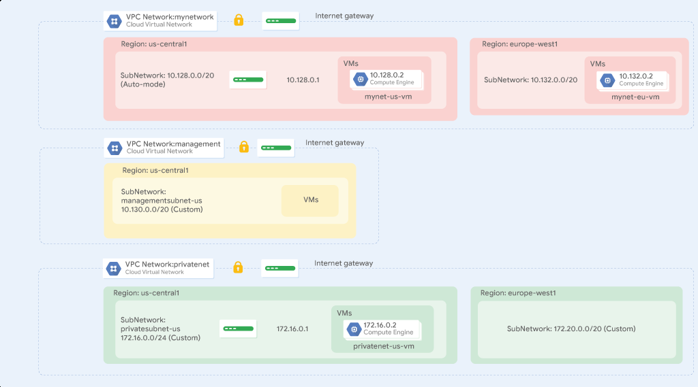

# 03. VPC Networking

> [← 이전 실습](02.Infrastructure%20Preview_KR.md) · [📚 전체 목록](../README.md) · [다음 실습 →](04.Implement%20Private%20Google%20Access%20and%20Cloud%20NAT_KR.md)

## Overview (개요)

Google Cloud Virtual Private Cloud(VPC)는 Compute Engine 가상 머신(VM) 인스턴스, Kubernetes Engine 컨테이너, App Engine 유연한 환경(flexible environment)에 네트워킹 기능을 제공합니다. 다시 말해, VPC 네트워크가 없으면 VM 인스턴스, 컨테이너, App Engine 애플리케이션을 생성할 수 없습니다. 그렇기 때문에 모든 Google Cloud 프로젝트에는 시작을 위한 **default** 네트워크가 기본으로 제공됩니다.

VPC 네트워크는 물리적 네트워크와 비슷하다고 생각하면 되지만, Google Cloud 안에서 가상화되어 있다는 점이 다릅니다. VPC 네트워크는 전역(global) 리소스로서, 데이터센터에 위치한 여러 리전별 가상 서브네트워크(서브넷)의 목록으로 구성되며, 이들은 모두 전역 광역 네트워크(WAN)로 연결되어 있습니다. Google Cloud 안에서 VPC 네트워크들은 서로 논리적으로 격리되어 있습니다.

이 실습에서는 방화벽 규칙과 VM 인스턴스 2개를 가진 auto mode VPC 네트워크를 생성합니다. 그런 다음 이 auto mode 네트워크를 custom mode 네트워크로 변환하고, 아래 예시 네트워크 다이어그램과 같이 다른 custom mode 네트워크들도 생성합니다. 또한 네트워크 간 연결성(connectivity)도 테스트해봅니다.



## Objectives (목표)

이 실습에서는 다음 작업을 수행하는 방법을 배웁니다.

- 기본(default) VPC 네트워크를 살펴봅니다.
- 방화벽 규칙을 가진 auto mode 네트워크를 생성합니다.
- auto mode 네트워크를 custom mode 네트워크로 변환합니다.
- 방화벽 규칙을 가진 custom mode VPC 네트워크를 생성합니다.
- Compute Engine을 사용하여 VM 인스턴스를 생성합니다.
- VPC 네트워크 간 VM 인스턴스의 연결성을 살펴봅니다.

---

---

## 🧩 Task 1. 기본(default) 네트워크 살펴보기

모든 Google Cloud 프로젝트에는 서브넷, 라우트, 방화벽 규칙을 갖춘 **default** 네트워크가 있습니다.

### 서브넷 확인하기

**default** 네트워크는 각 [Google Cloud region](https://cloud.google.com/compute/docs/regions-zones/#available)마다 서브넷을 하나씩 가지고 있습니다.

- Google Cloud console에서 **Navigation menu(탐색 메뉴)**의 **VPC network(VPC 네트워크) > VPC networks(VPC 네트워크)**를 클릭합니다.
- **default** 네트워크와 그 서브넷들을 확인합니다.

  각 서브넷은 하나의 Google Cloud 리전에 연결되어 있으며, 내부 **IP addresses range**(내부 IP 주소 범위)와 **gateway**(게이트웨이)를 위한 프라이빗 RFC 1918 CIDR 블록을 가지고 있습니다.

### 라우트 확인하기

라우트(경로)는 VM 인스턴스와 VPC 네트워크에게 인스턴스로부터 목적지(네트워크 내부든 Google Cloud 외부든)까지 트래픽을 어떻게 보낼지 알려줍니다. 각 VPC 네트워크에는 서브넷 간에 트래픽을 라우팅하고, 적격한 인스턴스에서 인터넷으로 트래픽을 보내기 위한 몇 가지 기본 라우트가 함께 제공됩니다.

1. 왼쪽 패널에서 **Routes**를 클릭합니다.
2. **Network** 드롭다운 목록에서 **default**를 클릭합니다.
3. **Region(리전)** 드롭다운 목록에서 **us-central1**을 클릭합니다.
4. **View**를 클릭합니다.

각 서브넷마다 라우트가 하나씩 있고, **Default internet gateway**(0.0.0.0/0)를 위한 라우트가 하나 더 있는 것을 확인하세요.
이러한 라우트는 자동으로 관리되지만, 특정 패킷을 특정 목적지로 보내기 위한 커스텀 정적 라우트(static route)를 직접 만들 수도 있습니다. 예를 들어, NAT 게이트웨이로 구성된 인스턴스로 모든 아웃바운드 트래픽을 보내는 라우트를 만들 수 있습니다.

### 방화벽 규칙 확인하기

각 VPC 네트워크는 사용자가 구성할 수 있는 분산 가상 방화벽(distributed virtual firewall)을 구현합니다. 방화벽 규칙을 사용하면 어떤 패킷이 어떤 목적지로 이동할 수 있는지 제어할 수 있습니다. 모든 VPC 네트워크에는 모든 수신(incoming) 연결을 차단하고 모든 발신(outgoing) 연결을 허용하는 암시적(implied) 방화벽 규칙 2개가 기본으로 있습니다.

- 왼쪽 패널에서 **Firewall policies**를 클릭한 다음 **VPC firewall rules** 탭을 선택합니다.

  **default** 네트워크에 대한 **Ingress**(수신) 방화벽 규칙이 4개 있는 것을 확인하세요.
  - `default-allow-icmp`
  - `default-allow-rdp`
  - `default-allow-ssh`
  - `default-allow-internal`

  이 방화벽 규칙들은 어디에서든(0.0.0.0/0) 들어오는 **ICMP**, **RDP**, **SSH(SSH 접속)** 인그레스 트래픽과, 네트워크 내부(10.128.0.0/9)의 모든 **TCP**, **UDP**, **ICMP** 트래픽을 허용합니다. **Targets**, **Filters**, **Protocols/ports**, **Action** 열에서 각 규칙에 대한 설명을 확인할 수 있습니다.

### 방화벽 규칙 삭제하기

1. 왼쪽 패널에서 **Firewall policies**를 클릭합니다.
2. **VPC firewall rules**에서 default 네트워크의 방화벽 규칙을 모두 선택합니다.
3. **Delete(삭제)**를 클릭합니다.
4. 방화벽 규칙 삭제를 확인하기 위해 **Delete(삭제)**를 클릭합니다.

### 기본(default) 네트워크 삭제하기

1. **Navigation menu(탐색 메뉴)**에서 **VPC network(VPC 네트워크) > VPC networks(VPC 네트워크)**를 클릭합니다.
2. **default** 네트워크를 선택합니다.
3. **Delete VPC network**를 클릭하고 **default**라고 입력합니다.
4. **default** 네트워크 삭제를 확인하기 위해 **Delete(삭제)**를 클릭합니다.

네트워크가 삭제될 때까지 기다렸다가 계속 진행하세요.

5. 왼쪽 패널에서 **Routes**를 클릭합니다.

   라우트가 하나도 없는 것을 확인하세요.

6. 왼쪽 패널에서 **Firewall policies**를 클릭한 다음 **VPC firewall rules** 탭을 선택합니다.

   방화벽 규칙이 하나도 없는 것을 확인하세요.

> **💡 참고:** VPC 네트워크가 없으면 라우트도 존재하지 않습니다!

### VM 인스턴스 생성 시도하기

VPC 네트워크 없이는 VM 인스턴스를 생성할 수 없다는 것을 확인합니다.

1. **Navigation menu(탐색 메뉴)**에서 **Compute Engine(컴퓨트 엔진) > VM instances(VM 인스턴스)**를 클릭합니다.
2. **Create Instance(인스턴스 만들기)**를 클릭합니다.
3. 기본값을 그대로 두고 **Create(만들기)**를 클릭합니다.

**Networking(네트워킹)** 탭에 오류가 표시됩니다.

4. **Go to Issues**를 클릭합니다.

   **Network Interfaces**에서 **No more networks available** 오류가 표시되는 것을 확인하세요.

5. **Cancel(취소)**을 클릭합니다.

> **💡 참고:** 예상대로, VPC 네트워크 없이는 VM 인스턴스를 생성할 수 없습니다!

---

---

## 🧩 Task 2. auto mode 네트워크 생성하기

이번 작업에서는 VM 인스턴스 2개를 가진 auto mode 네트워크를 생성하는 임무를 맡았습니다. auto mode 네트워크는 각 리전에 서브넷을 자동으로 생성해 주기 때문에 설정과 사용이 간편합니다. 다만 리전이나 사용되는 IP 주소 범위를 포함해, VPC 네트워크에 생성되는 서브넷을 완전히 제어할 수는 없습니다.

auto mode 네트워크를 선택할 때 고려할 사항은 Google VPC 문서의 [considerations for choosing an auto mode network](https://cloud.google.com/vpc/docs/vpc#auto-mode-considerations)에서 자유롭게 살펴볼 수 있지만, 지금은 프로토타이핑 목적으로 auto mode 네트워크를 사용한다고 가정합니다.

### 방화벽 규칙을 가진 auto mode VPC 네트워크 생성하기

1. **Navigation menu(탐색 메뉴)**에서 **VPC network(VPC 네트워크) > VPC networks(VPC 네트워크)**를 클릭합니다.
2. **Create VPC network(VPC 네트워크 만들기)**를 클릭합니다.
3. **Name(이름)**에 `mynetwork`를 입력합니다.
4. **Subnet creation mode(서브넷 생성 모드)**에서 **Automatic(자동)**을 클릭합니다.

   auto mode 네트워크는 각 리전에 자동으로 서브넷을 생성합니다.

5. **Firewall rules**에서 사용 가능한 규칙을 모두 선택합니다.

   이는 default 네트워크에 있던 것과 동일한 표준 방화벽 규칙들입니다. **deny-all-ingress**와 **allow-all-egress** 규칙도 함께 표시되지만, 이 규칙들은 암시적(implied)으로 적용되므로 선택하거나 비활성화할 수는 없습니다. 이 두 규칙은 **Priority**(우선순위) 값이 더 낮게(정수가 클수록 우선순위가 낮음) 설정되어 있어서, ICMP·custom·RDP·SSH를 허용하는 규칙이 먼저 검토됩니다.

6. **Create(만들기)**를 클릭합니다.
7. 새 네트워크가 준비되면 **mynetwork > Subnets**를 클릭합니다. `us-central1`과 `europe-west1` 서브넷의 IP 주소 범위를 확인해 두세요.

> **💡 참고:** default 네트워크를 삭제한 경우, 방금 한 것처럼 auto mode 네트워크를 생성하면 빠르게 다시 만들 수 있습니다.

### us-central1 리전에 VM 인스턴스(mynet-us-vm) 생성하기

us-central1 리전에 VM 인스턴스를 생성합니다. 리전과 존(zone)을 선택하면 서브넷이 결정되고, 해당 서브넷의 IP 주소 범위에서 내부 IP 주소가 할당됩니다.

1. **Navigation menu(탐색 메뉴)**에서 **Compute Engine(컴퓨트 엔진) > VM instances(VM 인스턴스)**를 클릭합니다.
2. **Create Instance(인스턴스 만들기)**를 클릭합니다.
3. 다음과 같이 지정합니다.

   | Property (속성) | Value (값) |
   |---|---|
   | Name | `mynet-us-vm` |
   | Region | `us-central1` |
   | Zone | `us-central1-c` |

4. **Series(시리즈)**에서 **E2**를 선택합니다.
5. **Machine type(머신 유형)**에서 **e2-micro (2 vCPU, 1 GB 메모리)**를 선택합니다.
6. **OS and storage(OS 및 스토리지)**를 클릭합니다.
7. **Image(이미지)**가 **Debian GNU/Linux 12 (bookworm)**이 아니라면, **Change(변경)**를 클릭하여 **Debian GNU/Linux 12 (bookworm)**을 선택한 다음 **Select(선택)**를 클릭합니다.
8. **Create(만들기)**를 클릭합니다.

### europe-west1 리전에 VM 인스턴스(mynet-eu-vm) 생성하기

europe-west1 리전에 두 번째 VM 인스턴스를 생성합니다.

1. **Create instance(인스턴스 만들기)**를 클릭합니다.
2. 다음과 같이 지정합니다.

   | Property (속성) | Value (값) |
   |---|---|
   | Name | `mynet-eu-vm` |
   | Region | `europe-west1` |
   | Zone | `europe-west1-c` |

3. **Series(시리즈)**에서 **E2**를 선택합니다.
4. **Machine type(머신 유형)**에서 **e2-micro (2 vCPU, 1 GB 메모리)**를 선택합니다.
5. **OS and storage(OS 및 스토리지)**를 클릭합니다.
6. **Image(이미지)**가 **Debian GNU/Linux 12 (bookworm)**이 아니라면, **Change(변경)**를 클릭하여 **Debian GNU/Linux 12 (bookworm)**을 선택한 다음 **Select(선택)**를 클릭합니다.
7. **Create(만들기)**를 클릭합니다.

> **💡 참고:** 두 VM 인스턴스의 외부 IP 주소는 임시(ephemeral)입니다. 인스턴스가 중지되면, 인스턴스에 할당된 임시 외부 IP 주소는 Compute Engine의 공용 풀로 반환되어 다른 프로젝트에서 사용할 수 있게 됩니다.

중지된 인스턴스를 다시 시작하면 새로운 임시 외부 IP 주소가 할당됩니다. 원한다면 정적(static) 외부 IP 주소를 예약할 수도 있으며, 이 경우 명시적으로 해제하기 전까지 해당 주소가 프로젝트에 계속 할당된 상태로 유지됩니다.

### VM 인스턴스의 연결성 확인하기

**mynetwork**에서 생성한 방화벽 규칙은 **mynetwork** 내부(내부 IP)와 외부(외부 IP) 모두에서 들어오는 SSH 및 ICMP 트래픽을 허용합니다.

1. **Navigation menu(탐색 메뉴)**에서 **Compute Engine(컴퓨트 엔진) > VM instances(VM 인스턴스)**를 클릭합니다.

   **mynet-eu-vm**의 외부 IP 주소와 내부 IP 주소를 확인해 둡니다.

2. **mynet-us-vm**에서 **SSH(SSH 접속)**를 클릭하여 터미널을 실행하고 접속합니다. 메시지가 표시되면 **Authorize(승인)**를 클릭합니다.

   > **💡 참고:** SSH 접속이 가능한 이유는 `tcp:22`에 대해 어디에서든(0.0.0.0/0) 들어오는 트래픽을 허용하는 **allow-ssh** 방화벽 규칙 때문입니다. Compute Engine이 자동으로 SSH 키를 생성해서 다음 위치 중 한 곳에 저장해 주기 때문에 SSH 연결이 매끄럽게 이루어집니다.
   - 기본적으로 Compute Engine은 생성된 키를 프로젝트 또는 인스턴스 메타데이터에 추가합니다.
   - 계정이 OS Login을 사용하도록 구성되어 있다면, Compute Engine은 생성된 키를 사용자 계정과 함께 저장합니다.

   또는 SSH 키를 직접 만들어 공개 SSH 키 메타데이터를 편집함으로써 Linux 인스턴스에 대한 액세스를 제어할 수도 있습니다.

3. **mynet-eu-vm**의 내부 IP로의 연결성을 테스트하려면, **mynet-eu-vm**의 내부 IP로 바꿔서 다음 명령어를 실행합니다.

   ```bash
   ping -c 3 <mynet-eu-vm의 내부 IP 입력>
   ```

   **allow-custom** 방화벽 규칙 덕분에 **mynet-eu-vm**의 내부 IP로 ping을 보낼 수 있습니다.

4. **mynet-eu-vm**의 외부 IP로의 연결성을 테스트하려면, **mynet-eu-vm**의 외부 IP로 바꿔서 다음 명령어를 실행합니다.

   ```bash
   ping -c 3 <mynet-eu-vm의 외부 IP 입력>
   ```

> **💡 참고:** 예상대로 **mynet-us-vm**에 SSH로 접속하여 **mynet-eu-vm**의 내부·외부 IP 주소로 ping을 보낼 수 있습니다. 반대로 **mynet-eu-vm**에 SSH로 접속하여 **mynet-us-vm**의 내부·외부 IP 주소로 ping을 보내는 것도 마찬가지로 가능합니다.

### 네트워크를 custom mode 네트워크로 변환하기

지금까지는 auto mode 네트워크가 잘 동작했지만, 새로운 리전이 추가될 때마다 서브넷이 자동으로 생성되지 않도록 custom mode 네트워크로 변환하라는 요청을 받았습니다. 자동 생성은 수동으로 만든 서브넷이나 정적 라우트가 사용하는 IP 주소와 겹칠 수 있고, 전체 네트워크 설계 계획을 방해할 수도 있습니다.

1. **Navigation menu(탐색 메뉴)**에서 **VPC network(VPC 네트워크) > VPC networks(VPC 네트워크)**를 클릭합니다.
2. **mynetwork**를 클릭하여 네트워크 세부정보를 엽니다.
3. **Edit(수정)**를 클릭합니다.
4. **Subnet creation mode(서브넷 생성 모드)**에서 **Custom(커스텀)**을 선택합니다.
5. **Save(저장)**를 클릭합니다.
6. **VPC networks(VPC 네트워크)** 페이지로 돌아갑니다.

**mynetwork**의 **Mode**가 **Custom(커스텀)**으로 바뀔 때까지 기다립니다.

기다리는 동안 **Refresh(새로고침)**를 클릭할 수 있습니다.

> **💡 참고:** auto mode 네트워크를 custom mode 네트워크로 변환하는 작업은 간단하며, 더 많은 유연성을 제공합니다. 프로덕션 환경에서는 custom mode 네트워크를 사용하는 것을 권장합니다.

---

---

## 🧩 Task 3. custom mode 네트워크 생성하기

이번에는 **managementnet**과 **privatenet**이라는 custom 네트워크 2개를 추가로 생성하고, SSH·ICMP·RDP 인그레스 트래픽을 허용하는 방화벽 규칙과 아래 예시 다이어그램에 나온 VM 인스턴스들(vm-appliance는 제외)을 만드는 임무를 맡았습니다.


이 네트워크들의 IP CIDR 범위는 서로 겹치지 않는다는 점에 유의하세요. 덕분에 네트워크 간에 VPC 피어링(peering) 같은 메커니즘을 구성할 수 있습니다. 온프레미스 네트워크와 다른 IP CIDR 범위를 지정한다면, VPN이나 Cloud Interconnect를 이용한 하이브리드 연결까지도 구성할 수 있습니다.

### managementnet 네트워크 생성하기

Cloud console을 사용하여 **managementnet** 네트워크를 생성합니다.

1. Google Cloud console에서 **Navigation menu(탐색 메뉴)**의 **VPC network(VPC 네트워크) > VPC networks(VPC 네트워크)**를 클릭합니다.
2. **Create VPC network(VPC 네트워크 만들기)**를 클릭합니다.
3. **Name(이름)**에 `managementnet`을 입력합니다.
4. **Subnet creation mode(서브넷 생성 모드)**에서 **Custom(커스텀)**을 클릭합니다.
5. 다음과 같이 지정하고 나머지는 기본값으로 둡니다.

   | Property (속성) | Value (값) |
   |---|---|
   | Name | `managementsubnet-us` |
   | Region | `us-central1` |
   | IPv4 range | `10.130.0.0/20` |

6. **Done(완료)**을 클릭합니다.
7. **Equivalent Command line**을 클릭합니다.

   이 명령어들은 네트워크와 서브넷을 `gcloud` 명령줄로도 만들 수 있음을 보여줍니다. 곧 이와 비슷한 매개변수를 사용해 **privatenet** 네트워크를 만들게 됩니다.

8. **Close**를 클릭합니다.
9. **Create(만들기)**를 클릭합니다.

### privatenet 네트워크 생성하기

`gcloud` 명령줄을 사용하여 **privatenet** 네트워크를 생성합니다.

1. Google Cloud console에서 **Activate Cloud Shell(Cloud Shell 활성화)**을 클릭합니다.
2. 메시지가 표시되면 **Continue(계속)**를 클릭합니다.
3. **privatenet** 네트워크를 생성하려면 다음 명령어를 실행합니다. 메시지가 표시되면 **Authorize(승인)**를 클릭합니다.

   ```bash
   gcloud compute networks create privatenet --subnet-mode=custom
   ```

4. **privatesubnet-us** 서브넷을 생성하려면 다음 명령어를 실행합니다.

   ```bash
   gcloud compute networks subnets create privatesubnet-us --network=privatenet --region=us-central1 --range=172.16.0.0/24
   ```

5. **privatesubnet-eu** 서브넷을 생성하려면 다음 명령어를 실행합니다.

   ```bash
   gcloud compute networks subnets create privatesubnet-eu --network=privatenet --region=europe-west1 --range=172.20.0.0/20
   ```

6. 사용 가능한 VPC 네트워크 목록을 확인하려면 다음 명령어를 실행합니다.

   ```bash
   gcloud compute networks list
   ```

   출력은 다음과 비슷하게 나타납니다.

   ```text
   NAME: managementnet
   SUBNET_MODE: CUSTOM
   BGP_ROUTING_MODE: REGIONAL
   IPV4_RANGE:
   GATEWAY_IPV4:

   NAME: mynetwork
   SUBNET_MODE: CUSTOM
   BGP_ROUTING_MODE: REGIONAL
   IPV4_RANGE:
   GATEWAY_IPV4:

   NAME: privatenet
   SUBNET_MODE: CUSTOM
   BGP_ROUTING_MODE: REGIONAL
   IPV4_RANGE:
   GATEWAY_IPV4:
   ```

   > **💡 참고:** **managementnet**과 **privatenet** 네트워크는 custom mode 네트워크이기 때문에 직접 만든 서브넷만 가지고 있습니다. **mynetwork**도 custom mode 네트워크이지만, 처음에는 auto mode 네트워크로 시작했기 때문에 각 리전에 서브넷이 있습니다.

7. 사용 가능한 VPC 서브넷 목록을 (VPC 네트워크 기준으로 정렬하여) 확인하려면 다음 명령어를 실행합니다.

   ```bash
   gcloud compute networks subnets list --sort-by=NETWORK
   ```

8. Google Cloud console에서 **Navigation menu(탐색 메뉴)**의 **VPC network(VPC 네트워크) > VPC networks(VPC 네트워크)**를 클릭합니다.

   Cloud console에도 동일한 네트워크와 서브넷이 표시되는지 확인합니다.

### managementnet의 방화벽 규칙 생성하기

**managementnet** 네트워크의 VM 인스턴스에 대해 SSH, ICMP, RDP 인그레스 트래픽을 허용하는 방화벽 규칙을 생성합니다.

1. Google Cloud console에서 **Navigation menu(탐색 메뉴)**의 **VPC network(VPC 네트워크) > Firewall policies**를 클릭한 다음 **VPC firewall rules** 탭을 선택합니다.
2. **Create firewall rule(방화벽 규칙 만들기)**을 클릭합니다.
3. 다음과 같이 지정하고 나머지는 기본값으로 둡니다.

   | Property (속성) | Value (값) |
   |---|---|
   | Name | `managementnet-allow-icmp-ssh-rdp` |
   | Network | managementnet |
   | Targets | All instances in the network |
   | Source filter | IPv4 Ranges |
   | Source IPv4 ranges | `0.0.0.0/0` |
   | Protocols and ports | Specified protocols and ports |

> **💡 참고:** 모든 네트워크를 지정하려면 **Source IPv4 ranges(소스 IPv4 범위)**에 `/0`을 반드시 포함해야 합니다.

4. **tcp**를 선택하고 포트 **22**와 **3389**를 지정합니다.
5. **Other protocols**를 선택하고 **icmp** 프로토콜을 지정합니다.
6. **Equivalent Command line**을 클릭합니다.

   이 명령어들은 방화벽 규칙 역시 `gcloud` 명령줄로 만들 수 있음을 보여줍니다. 곧 이와 비슷한 매개변수를 사용해 **privatenet**의 방화벽 규칙을 만들게 됩니다.

7. **Close**를 클릭합니다.
8. **Create(만들기)**를 클릭합니다.

### privatenet의 방화벽 규칙 생성하기

`gcloud` 명령줄을 사용하여 **privatenet** 네트워크의 방화벽 규칙을 생성합니다.

1. **Cloud Shell**로 돌아갑니다. 필요하다면 **Activate Cloud Shell(Cloud Shell 활성화)**을 클릭합니다.
2. **privatenet-allow-icmp-ssh-rdp** 방화벽 규칙을 생성하려면 다음 명령어를 실행합니다.

   ```bash
   gcloud compute firewall-rules create privatenet-allow-icmp-ssh-rdp --direction=INGRESS --priority=1000 --network=privatenet --action=ALLOW --rules=icmp,tcp:22,tcp:3389 --source-ranges=0.0.0.0/0
   ```

   출력은 다음과 비슷하게 나타납니다.

   ```text
   NAME: privatenet-allow-icmp-ssh-rdp
   NETWORK: privatenet
   DIRECTION: INGRESS
   PRIORITY: 1000
   ALLOW: icmp,tcp:22,tcp:3389
   DENY:
   DISABLED: False
   ```

3. 모든 방화벽 규칙 목록을 (VPC 네트워크 기준으로 정렬하여) 확인하려면 다음 명령어를 실행합니다.

   ```bash
   gcloud compute firewall-rules list --sort-by=NETWORK
   ```

   출력은 다음과 비슷하게 나타납니다.

   ```text
   NAME: managementnet-allow-icmp-ssh-rdp
   NETWORK: managementnet
   DIRECTION: INGRESS
   PRIORITY: 1000
   ALLOW: tcp:22,tcp:3389,icmp
   DENY:
   DISABLED: False

   NAME: mynetwork-allow-custom
   NETWORK: mynetwork
   DIRECTION: INGRESS
   PRIORITY: 65534
   ALLOW: all
   DENY:
   DISABLED: False

   NAME: mynetwork-allow-icmp
   NETWORK: mynetwork
   DIRECTION: INGRESS
   PRIORITY: 65534
   ALLOW: icmp
   DENY:
   DISABLED: False

   NAME: mynetwork-allow-rdp
   NETWORK: mynetwork
   DIRECTION: INGRESS
   PRIORITY: 65534
   ALLOW: tcp:3389
   DENY:
   DISABLED: False

   NAME: mynetwork-allow-ssh
   NETWORK: mynetwork
   DIRECTION: INGRESS
   PRIORITY: 65534
   ALLOW: tcp:22
   DENY:
   DISABLED: False

   NAME: privatenet-allow-icmp-ssh-rdp
   NETWORK: privatenet
   DIRECTION: INGRESS
   PRIORITY: 1000
   ALLOW: icmp,tcp:22,tcp:3389
   DENY:
   DISABLED: False
   ```

   **mynetwork** 네트워크의 방화벽 규칙은 이미 생성되어 있었습니다. 하나의 방화벽 규칙에 여러 프로토콜과 포트를 정의할 수도 있고(**privatenet**과 **managementnet**), 여러 규칙으로 나눠 정의할 수도 있습니다(**default**와 **mynetwork**).

4. Cloud console에서 **Navigation menu(탐색 메뉴)**의 **VPC network(VPC 네트워크) > Firewall policies**를 클릭한 다음 **VPC firewall rules** 탭을 선택합니다.

   Cloud console에도 동일한 방화벽 규칙이 표시되는지 확인합니다.

다음으로, VM 인스턴스 2개를 생성합니다.

- **managementsubnet-us**에 **managementnet-us-vm**
- **privatesubnet-us**에 **privatenet-us-vm**

### managementnet-us-vm 인스턴스 생성하기

Cloud console을 사용하여 **managementnet-us-vm** 인스턴스를 생성합니다.

1. Google Cloud console에서 **Navigation menu(탐색 메뉴)**의 **Compute Engine(컴퓨트 엔진) > VM instances(VM 인스턴스)**를 클릭합니다.
2. **Create instance(인스턴스 만들기)**를 클릭합니다.
3. 다음과 같이 지정하고 나머지는 기본값으로 둡니다.

   | Property (속성) | Value (값) |
   |---|---|
   | Name | `managementnet-us-vm` |
   | Region | `us-central1` |
   | Zone | `us-central1-c` |
   | Series | E2 |
   | Machine type | e2-micro (2 vCPU, 1 GB 메모리) |
   | Boot disk | Debian GNU/Linux 12 (bookworm) |

4. **Networking(네트워킹)**을 클릭합니다.
5. **Network interfaces(네트워크 인터페이스)**에서 드롭다운 화살표를 클릭해 편집합니다.
6. 다음과 같이 지정하고 나머지는 기본값으로 둡니다.

   | Property (속성) | Value (값) |
   |---|---|
   | Network | managementnet |
   | Subnetwork | managementsubnet-us |

> **💡 참고:** 선택 가능한 서브넷은 선택한 리전에 속한 서브넷으로 제한됩니다.

7. **Done(완료)**을 클릭합니다.
8. **Equivalent Code**를 클릭합니다.

   이는 VM 인스턴스 역시 `gcloud` 명령줄로 만들 수 있음을 보여줍니다. 곧 이와 비슷한 매개변수를 사용해 **privatenet-us-vm** 인스턴스를 만들게 됩니다.

9. **Create(만들기)**를 클릭합니다.

### privatenet-us-vm 인스턴스 생성하기

`gcloud` 명령줄을 사용하여 **privatenet-us-vm** 인스턴스를 생성합니다.

1. **Cloud Shell**로 돌아갑니다. 필요하다면 **Activate Cloud Shell(Cloud Shell 활성화)**을 클릭합니다.
2. **privatenet-us-vm** 인스턴스를 생성하려면 다음 명령어를 실행합니다.

   ```bash
   gcloud compute instances create privatenet-us-vm --zone=us-central1-c --machine-type=e2-micro --subnet=privatesubnet-us --image-family=debian-12 --image-project=debian-cloud --boot-disk-size=10GB --boot-disk-type=pd-standard --boot-disk-device-name=privatenet-us-vm
   ```

3. 모든 VM 인스턴스 목록을 (존 기준으로 정렬하여) 확인하려면 다음 명령어를 실행합니다.

   ```bash
   gcloud compute instances list --sort-by=ZONE
   ```

4. Cloud console에서 **Navigation menu(탐색 메뉴)**의 **Compute Engine(컴퓨트 엔진) > VM instances(VM 인스턴스)**를 클릭합니다.

   Cloud console에도 VM 인스턴스들이 표시되는지 확인합니다.

> **💡 참고:** **Internal IP** 열의 **nic0** 링크를 클릭하면 각 VM 인스턴스에 대한 더 자세한 네트워킹 정보를 확인할 수 있습니다. 네트워크 인터페이스 세부정보 페이지에서는 서브넷과 IP CIDR 범위, 해당 인스턴스에 적용되는 방화벽 규칙과 라우트, 기타 네트워크 분석 정보를 확인할 수 있습니다.

5. **Columns**에서 **Zone(영역)**을 선택합니다.

   `us-central1-c` 존에는 인스턴스가 3개(`mynet-us-vm`, `managementnet-us-vm`, `privatenet-us-vm`), `europe-west1-c` 존에는 인스턴스가 1개(`mynet-eu-vm`) 있습니다. 하지만 이 인스턴스들은 **managementnet**, **mynetwork**, **privatenet**이라는 세 개의 VPC 네트워크에 흩어져 있어서, 같은 존과 같은 네트워크에 속한 인스턴스는 하나도 없습니다. 다음 작업에서는 이것이 내부 연결성에 미치는 영향을 살펴봅니다.

---

---

## 🧩 Task 4. 네트워크 간 연결성 살펴보기

VM 인스턴스 간의 연결성을 살펴봅니다. 특히, VM 인스턴스가 같은 존에 있는 경우와 같은 VPC 네트워크에 있는 경우 각각 어떤 영향이 있는지 확인합니다.

### 외부 IP 주소로 ping 보내기

VM 인스턴스의 외부 IP 주소로 ping을 보내서 공용 인터넷에서 해당 인스턴스에 도달할 수 있는지 확인합니다.

1. Google Cloud console에서 **Navigation menu(탐색 메뉴)**의 **Compute Engine(컴퓨트 엔진) > VM instances(VM 인스턴스)**를 클릭합니다.

   **mynet-eu-vm**, **managementnet-us-vm**, **privatenet-us-vm**의 외부 IP 주소를 확인해 둡니다.

2. **mynet-us-vm**에서 **SSH(SSH 접속)**를 클릭하여 터미널을 실행하고 접속합니다. 메시지가 표시되면 **Authorize(승인)**를 클릭합니다.
3. **mynet-eu-vm**의 외부 IP로의 연결성을 테스트하려면, **mynet-eu-vm**의 외부 IP로 바꿔서 다음 명령어를 실행합니다.

   ```bash
   ping -c 3 <mynet-eu-vm의 외부 IP 입력>
   ```

   정상적으로 동작합니다!

4. **managementnet-us-vm**의 외부 IP로의 연결성을 테스트하려면, **managementnet-us-vm**의 외부 IP로 바꿔서 다음 명령어를 실행합니다.

   ```bash
   ping -c 3 <managementnet-us-vm의 외부 IP 입력>
   ```

   정상적으로 동작합니다!

5. **privatenet-us-vm**의 외부 IP로의 연결성을 테스트하려면, **privatenet-us-vm**의 외부 IP로 바꿔서 다음 명령어를 실행합니다.

   ```bash
   ping -c 3 <privatenet-us-vm의 외부 IP 입력>
   ```

   정상적으로 동작합니다!

> **💡 참고:** 서로 다른 존이나 VPC 네트워크에 있더라도 모든 VM 인스턴스의 외부 IP 주소로는 ping을 보낼 수 있습니다. 이는 해당 인스턴스에 대한 공개(public) 액세스가 오직 앞서 설정한 **ICMP** 방화벽 규칙에 의해서만 제어된다는 것을 보여줍니다.

### 내부 IP 주소로 ping 보내기

VM 인스턴스의 내부 IP 주소로 ping을 보내서 VPC 네트워크 내부에서 해당 인스턴스에 도달할 수 있는지 확인합니다.

1. Cloud console에서 **Navigation menu(탐색 메뉴)**의 **Compute Engine(컴퓨트 엔진) > VM instances(VM 인스턴스)**를 클릭합니다.

   **mynet-eu-vm**, **managementnet-us-vm**, **privatenet-us-vm**의 내부 IP 주소를 확인해 둡니다.

2. **mynet-us-vm**의 SSH 터미널로 돌아갑니다.
3. **mynet-eu-vm**의 내부 IP로의 연결성을 테스트하려면, **mynet-eu-vm**의 내부 IP로 바꿔서 다음 명령어를 실행합니다.

   ```bash
   ping -c 3 <mynet-eu-vm의 내부 IP 입력>
   ```

   > **💡 참고:** **mynet-eu-vm**은 ping을 보내는 출발지인 **mynet-us-vm**과 같은 VPC 네트워크에 있기 때문에 내부 IP로 ping을 보낼 수 있습니다. 두 VM 인스턴스가 서로 다른 존, 리전, 심지어 다른 대륙에 있더라도 마찬가지입니다!

4. **managementnet-us-vm**의 내부 IP로의 연결성을 테스트하려면, **managementnet-us-vm**의 내부 IP로 바꿔서 다음 명령어를 실행합니다.

   ```bash
   ping -c 3 <managementnet-us-vm의 내부 IP 입력>
   ```

   > **💡 참고:** 100% 패킷 손실(packet loss)이 나타나는 것처럼, 이 명령은 동작하지 않아야 합니다!

5. **privatenet-us-vm**의 내부 IP로의 연결성을 테스트하려면, **privatenet-us-vm**의 내부 IP로 바꿔서 다음 명령어를 실행합니다.

   ```bash
   ping -c 3 <privatenet-us-vm의 내부 IP 입력>
   ```

   > **💡 참고:** 이 역시 100% 패킷 손실이 나타나는 것처럼 동작하지 않아야 합니다! **managementnet-us-vm**과 **privatenet-us-vm**은 모두 같은 존에 있더라도, ping을 보내는 출발지인 **mynet-us-vm**과는 서로 다른 VPC 네트워크에 속해 있기 때문에 내부 IP로 ping을 보낼 수 없습니다.

---

---

## 🧩 Task 5. Review (검토)

이 실습에서는 기본(default) 네트워크를 살펴보고, VPC 네트워크가 없으면 VM 인스턴스를 생성할 수 없다는 것을 확인했습니다. 그래서 서브넷, 라우트, 방화벽 규칙, VM 인스턴스 2개를 가진 새로운 auto mode VPC 네트워크를 만들고 VM 인스턴스 간의 연결성을 테스트했습니다. auto mode 네트워크는 프로덕션 환경에는 권장되지 않기 때문에, 이 auto mode 네트워크를 custom mode 네트워크로 변환했습니다.

이어서 Cloud console과 `gcloud` 명령줄을 사용하여 방화벽 규칙과 VM 인스턴스를 가진 custom mode VPC 네트워크 2개를 추가로 생성했습니다. 그런 다음 VPC 네트워크 간의 연결성을 테스트한 결과, 외부 IP 주소로 ping을 보낼 때는 동작했지만 내부 IP 주소로 ping을 보낼 때는 동작하지 않았습니다.

VPC 네트워크는 기본적으로 서로 격리된 프라이빗 네트워킹 도메인입니다. 따라서 VPC 피어링(peering)이나 VPN 같은 메커니즘을 별도로 구성하지 않는 한, 네트워크 간의 내부 IP 주소 통신은 허용되지 않습니다.

### 개인 프로젝트에서 실습 리소스 정리하기

교육용 임시 프로젝트에서는 **End Lab(실습 종료)**을 클릭하면 됩니다. 개인 프로젝트에서 실습했다면 과금과 리소스 충돌을 방지하기 위해 아래 순서로 정리합니다.

> **주의:** 다음 명령은 이 실습에서 만든 리소스를 삭제합니다. 다른 용도로 사용 중인 리소스가 없는지 이름과 현재 프로젝트를 먼저 확인하세요.

1. 현재 프로젝트와 삭제할 리소스를 확인합니다.

   ```bash
   gcloud config get-value project
   gcloud compute instances list
   gcloud compute firewall-rules list --sort-by=NETWORK
   gcloud compute networks subnets list --sort-by=NETWORK
   gcloud compute networks list
   ```

2. VPC 네트워크를 사용 중인 VM 인스턴스를 먼저 삭제합니다.

   ```bash
   gcloud compute instances delete \
     mynet-us-vm managementnet-us-vm privatenet-us-vm \
     --zone=us-central1-c

   gcloud compute instances delete mynet-eu-vm \
     --zone=europe-west1-c
   ```

3. 실습에서 만든 방화벽 규칙을 삭제합니다.

   ```bash
   gcloud compute firewall-rules delete \
     mynetwork-allow-custom mynetwork-allow-icmp \
     mynetwork-allow-rdp mynetwork-allow-ssh \
     managementnet-allow-icmp-ssh-rdp \
     privatenet-allow-icmp-ssh-rdp
   ```

4. custom mode VPC에서 직접 만든 서브넷을 삭제합니다.

   ```bash
   gcloud compute networks subnets delete \
     managementsubnet-us privatesubnet-us \
     --region=us-central1

   gcloud compute networks subnets delete privatesubnet-eu \
     --region=europe-west1
   ```

5. 마지막으로 실습에서 만든 VPC 네트워크를 삭제합니다.

   ```bash
   gcloud compute networks delete mynetwork managementnet privatenet
   ```

6. 목록을 다시 조회하여 실습 리소스가 남아 있지 않은지 확인합니다.

   ```bash
   gcloud compute instances list
   gcloud compute firewall-rules list --sort-by=NETWORK
   gcloud compute networks subnets list --sort-by=NETWORK
   gcloud compute networks list
   ```

---

## End your lab (실습 종료)

---

> [← 이전 실습](02.Infrastructure%20Preview_KR.md) · [📚 전체 목록](../README.md) · [다음 실습 →](04.Implement%20Private%20Google%20Access%20and%20Cloud%20NAT_KR.md)
