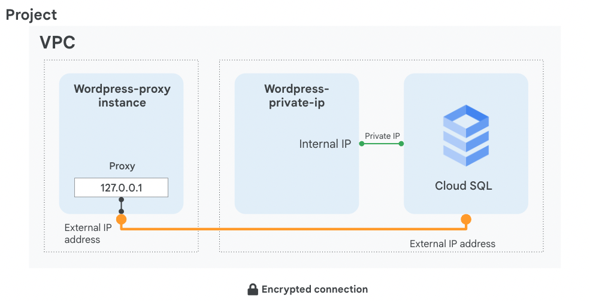

# 09. Implementing Cloud SQL

> [← 이전 실습](08.Cloud%20Storage_KR.md) · [📚 전체 목록](../README.md) · [다음 실습 →](10.Examining%20Billing%20data%20with%20BigQuery_KR.md)

## Overview (개요)

이 실습에서는 Cloud SQL 인스턴스를 구성하고, Cloud SQL Auth Proxy를 통해 애플리케이션을 연결하는 방법을 배웁니다. 또한 내부 네트워크 경로를 사용하는 프라이빗 IP(Private IP) 직접 연결도 구성합니다. 이 실습에서 사용하는 애플리케이션은 WordPress이지만, 여기서 다루는 연결 방식은 관계형 데이터베이스가 필요한 다른 애플리케이션에도 적용할 수 있습니다.

이 실습을 마치면, 서로 다른 두 가지 연결 방식으로 Cloud SQL 백엔드에 연결된 WordPress 프론트엔드 인스턴스 2개가 아래 다이어그램과 같이 동작하게 됩니다.



## Objectives (목표)

이 실습에서는 다음 작업을 수행하는 방법을 배웁니다.

- Cloud SQL 데이터베이스를 생성합니다.
- 가상 머신에 Apache, PHP 및 WordPress를 설치합니다.
- 프록시를 실행하도록 가상 머신을 구성합니다.
- 애플리케이션과 Cloud SQL 간의 연결을 생성합니다.
- 프라이빗 IP 주소를 사용하여 애플리케이션을 Cloud SQL에 연결합니다.

---

---

## 🧩 Task 1. Cloud SQL 데이터베이스 생성하기

이 작업에서는 Cloud SQL for MySQL 인스턴스를 구성하고 퍼블릭 IP와 프라이빗 IP 연결을 모두 사용 설정합니다. Task 3의 Auth Proxy는 기본적으로 퍼블릭 IP 경로를 사용하고, Task 5에서는 프라이빗 IP로 직접 연결합니다.

1. Google Cloud console에서 **Navigation menu(탐색 메뉴)**의 **SQL**을 클릭합니다.

   > **💡 참고:** Gemini in Databases를 살펴보라는 팝업이 나타나면 **DISMISS**를 클릭합니다.

2. **Create instance(인스턴스 만들기)**를 클릭합니다.
3. **Choose MySQL(MySQL 선택)**을 클릭합니다.
4. 다음과 같이 지정하고 나머지는 기본값으로 둡니다.

   | Property (속성) | Value (값) |
   |---|---|
   | Instance ID | `wordpress-db` |
   | Root password | 비밀번호를 입력합니다 |
   | Choose a Cloud SQL edition | Enterprise |
   | Region | `us-central1` (또는 지정된 리전) |
   | Zone | Any |
   | Database Version | MySQL 8.0 |

   > **💡 참고:** 루트 비밀번호를 기록해 두세요. 이후 단계에서 `[ROOT_PASSWORD]`로 참조됩니다.

5. **Show configuration options(구성 옵션 표시)**를 펼칩니다.
6. **Machine configuration(머신 구성)** 섹션을 펼칩니다.
7. 적절한 양의 vCPU와 메모리를 프로비저닝합니다. **Machine configuration(머신 구성)**을 선택하려면 드롭다운 메뉴를 클릭하고 옵션들을 살펴봅니다.

   > **💡 참고:** 고려할 사항 몇 가지:
   - 공유 코어(shared-core) 머신과 단일 영역 인스턴스는 [Cloud SQL SLA](https://cloud.google.com/sql/sla)의 적용 대상이 아닙니다. SLA가 필요한 프로덕션 워크로드에는 고가용성(HA) 구성을 사용합니다.
   - CPU, 메모리, 네트워크 및 스토리지 성능 한도는 선택한 머신 구성과 Cloud SQL 에디션에 따라 달라집니다. 콘솔에 표시되는 예상 성능을 확인합니다.
   - OLTP(온라인 트랜잭션 처리)와 같이 성능에 민감한 워크로드의 경우, 일반적인 지침은 전체 작업 데이터 집합(working set)을 담고 활성 연결 수를 감당할 수 있을 만큼 충분한 메모리를 인스턴스에 할당하는 것입니다.

8. 이 실습에서는 드롭다운 메뉴에서 **Dedicated core**를 선택한 다음 **1 vCPU, 3.75 GB**를 선택합니다.
9. 다음으로 **Storage** 섹션을 펼치고 **Storage type(스토리지 유형)**과 **Storage capacity(스토리지 용량)**를 선택합니다.

   > **💡 참고:** 고려할 사항 몇 가지:
   - 대부분의 사용 사례에서는 SSD(solid-state drive)가 최선의 선택입니다. HDD(hard-disk drive)는 성능은 더 낮지만 [storage costs](https://cloud.google.com/sql/pricing?hl=en_US&_ga=2.74997202.-1973607953.1558530686#v2-storage-networking-prices)가 훨씬 저렴하기 때문에, 자주 액세스하지 않고 아주 낮은 지연 시간이 필요 없는 데이터를 저장하는 데는 HDD가 더 적합할 수 있습니다.
   - 스토리지 용량과 처리량 사이에는 직접적인 상관관계가 있습니다.

10. 용량 옵션을 각각 **클릭**하여 처리량에 어떤 영향을 미치는지 확인합니다. 옵션을 다시 실습에서 지정한 최소 용량으로 되돌립니다.

   > **💡 참고:** 자동 스토리지 증설을 사용 설정하지 않은 채 스토리지 용량을 너무 낮게 설정하면 인스턴스가 SLA 적용 대상에서 제외될 수 있습니다.

11. **Connections(연결)** 섹션을 펼칩니다.
12. **Public IP(공개 IP)**가 사용 설정되어 있는지 확인합니다. Cloud SQL Auth Proxy를 사용하므로 **Authorized networks(승인된 네트워크)**에는 VM의 외부 IP를 추가하지 않아도 됩니다.
13. **Private IP(비공개 IP)**를 선택합니다.
14. **Network** 드롭다운에서 **default**를 선택합니다.
15. 나타나는 **Set up Connection(연결 설정)** 버튼을 클릭합니다.
16. 오른쪽 패널에서 **Enable API(API 사용 설정)**를 클릭하고, **Use an automatically allocated IP range**를 클릭한 다음, **Continue(계속)**를 클릭하고, **Create Connection**을 클릭합니다.
17. 페이지 하단의 **Create Instance(인스턴스 만들기)**를 클릭하여 데이터베이스 인스턴스를 생성합니다.

   > **💡 참고:** 프라이빗 IP 변경 사항이 전파될 때까지 기다려야 **Create(만들기)** 버튼을 클릭할 수 있는 상태가 될 수 있습니다.

---

---

## 🧩 Task 2. 두 가상 머신에 WordPress 설치하기

이 작업에서는 이미 생성되어 있는 `wordpress-proxy`와 `wordpress-private-ip` VM에 Apache, PHP 및 WordPress를 설치합니다. 다음 명령은 Debian 또는 Ubuntu 계열 VM을 기준으로 합니다.

1. Google Cloud console에서 **Navigation menu(탐색 메뉴)**의 **Compute Engine**을 클릭합니다.
2. **wordpress-proxy** 옆의 **SSH(SSH 접속)**를 클릭합니다.
3. Apache, PHP와 WordPress가 MySQL에 연결할 때 필요한 PHP 확장 모듈을 설치합니다.

   ```bash
   sudo apt-get update
   sudo apt-get install -y apache2 php libapache2-mod-php \
     php-mysql php-curl php-gd php-mbstring php-xml php-zip curl
   ```

4. WordPress 공식 최신 패키지를 내려받아 Apache 웹 루트에 배치합니다.

   ```bash
   cd /tmp
   curl -LO https://wordpress.org/latest.tar.gz
   tar -xzf latest.tar.gz
   sudo rm -f /var/www/html/index.html
   sudo cp -a wordpress/. /var/www/html/
   ```

5. Apache가 WordPress 파일을 읽을 수 있도록 소유권과 권한을 설정합니다.

   ```bash
   sudo chown -R www-data:www-data /var/www/html
   sudo find /var/www/html -type d -exec chmod 755 {} \;
   sudo find /var/www/html -type f -exec chmod 644 {} \;
   ```

6. Apache를 시작하고 VM이 재부팅되어도 자동으로 시작되도록 설정합니다.

   ```bash
   sudo systemctl enable --now apache2
   sudo systemctl is-active apache2
   ```

   예상 출력은 다음과 같습니다.

   ```text
   active
   ```

7. WordPress 설치 페이지가 로컬에서 응답하는지 확인합니다.

   ```bash
   curl -I http://localhost/wp-admin/setup-config.php
   ```

   예상 출력의 첫 줄은 다음과 같습니다.

   ```text
   HTTP/1.1 200 OK
   ```

   > **💡 참고:** 날짜, 서버 정보 등 다른 HTTP 헤더도 함께 출력됩니다.

8. SSH 창을 닫고 **wordpress-private-ip** VM에서도 2~7단계를 동일하게 수행합니다.
9. 두 VM의 **External IP(외부 IP)**를 각각 브라우저에서 열어 WordPress 설정 화면이 표시되는지 확인합니다. 데이터베이스 정보는 아직 입력하지 않고 브라우저 창을 닫습니다.

   **문제 해결:** 웹 페이지가 열리지 않으면 Apache 상태가 `active`인지 확인하고, VM에 적용된 방화벽 규칙이 TCP 포트 80의 인바운드 트래픽을 허용하는지 확인합니다.

---

---

## 🧩 Task 3. 가상 머신에 프록시 구성하기

이 작업에서는 `wordpress-proxy`라는 가상 머신에 프록시를 구성하여 `wordpress-db`라는 Cloud SQL 인스턴스에 안전하게 연결합니다.

Cloud SQL Auth Proxy는 IAM으로 연결 권한을 확인하고, 단기 인증서와 TLS를 사용하여 연결을 암호화합니다. 프록시는 새로운 네트워크 경로를 만들지 않으므로, 프록시를 실행하는 VM에서 Cloud SQL 인스턴스의 퍼블릭 IP 또는 프라이빗 IP로 도달할 수 있어야 합니다. 이 작업에서는 기본값인 퍼블릭 IP 경로를 사용합니다.

프록시를 구성하려면 Cloud SQL 인스턴스의 연결 이름(connection name)이 필요합니다.

> **💡 참고:** 프로젝트에는 **Cloud SQL Admin API**가 사용 설정되어 있어야 하며, 프록시를 실행하는 VM의 서비스 계정에는 **Cloud SQL Client** 역할(`roles/cloudsql.client`)이 필요합니다. 가상 머신 이름을 클릭하면 서비스 계정 액세스 권한을 확인할 수 있습니다. 또한 이 실습을 위해 모든 호스트에서 포트 80으로 접속할 수 있도록 네트워크 태그와 방화벽 규칙이 미리 구성되어 있습니다. 프로덕션 환경에서는 신뢰할 수 있는 IP 범위로 소스를 제한하고 HTTPS를 사용합니다.

1. Google Cloud console에서 **Navigation menu(탐색 메뉴)**의 **Compute Engine**을 클릭합니다.
2. **wordpress-proxy** 옆의 **SSH(SSH 접속)**를 클릭합니다.
3. Cloud SQL Auth Proxy v2를 다운로드하고 실행 가능하게 만듭니다.

   ```bash
   curl -o cloud-sql-proxy \
     https://storage.googleapis.com/cloud-sql-connectors/cloud-sql-proxy/v2.25.2/cloud-sql-proxy.linux.amd64
   chmod +x cloud-sql-proxy
   ```

   프록시를 시작하려면 Cloud SQL 인스턴스의 연결 이름이 필요합니다. SSH 창은 열어 둔 채로 Cloud console로 돌아갑니다.

4. **Navigation menu(탐색 메뉴)**의 **SQL**을 클릭합니다.
5. **wordpress-db** 인스턴스를 클릭하고 이름 옆에 녹색 체크 표시가 나타날 때까지 기다립니다. 이는 인스턴스가 정상 작동 중임을 나타냅니다 (몇 분 정도 걸릴 수 있습니다).
6. **connection name**을 기록해 두세요. 이후 `[SQL_CONNECTION_NAME]`으로 참조됩니다.
7. 또한 애플리케이션이 동작하려면 테이블을 생성해야 합니다. **Databases(데이터베이스)**를 클릭합니다.
8. **Create database(데이터베이스 만들기)**를 클릭하고, 애플리케이션이 필요로 하는 이름인 `wordpress`를 입력한 다음 **Create(만들기)**를 클릭합니다.
9. SSH 창으로 돌아가서, 이전 단계에서 복사한 고유한 이름으로 `[SQL_CONNECTION_NAME]`을 바꿔서 연결 이름을 환경 변수에 저장합니다.

   ```bash
   export SQL_CONNECTION=[SQL_CONNECTION_NAME]
   ```

10. 환경 변수가 설정되었는지 확인하려면 다음 명령어를 실행합니다.

    ```bash
    echo $SQL_CONNECTION
    ```

    연결 이름이 출력되어야 합니다.

11. Cloud SQL 데이터베이스에 대한 프록시 연결을 활성화하고 프로세스를 백그라운드로 보내려면 다음 명령어를 실행합니다.

    ```bash
    ./cloud-sql-proxy --address 127.0.0.1 --port 3306 "$SQL_CONNECTION" &
    ```

    예상 출력은 다음과 같습니다.

    ```text
    [SQL_CONNECTION_NAME] Listening on 127.0.0.1:3306
    The proxy has started successfully and is ready for new connections!
    ```

    > **💡 참고:** 실제 로그에는 각 줄 앞에 날짜, 시간과 로그 수준이 함께 표시될 수 있습니다.

12. **ENTER**를 누릅니다.

    > **💡 참고:** 이 프록시는 `127.0.0.1:3306`(localhost)에서 대기합니다. 애플리케이션의 로컬 연결을 받아 IAM으로 권한을 확인하고 TLS로 암호화하여 Cloud SQL 인스턴스로 전달합니다. 이 실습에서는 Cloud SQL의 퍼블릭 IP 경로를 사용하지만, Authorized networks 등록은 필요하지 않습니다.

---

---

## 🧩 Task 4. 애플리케이션을 Cloud SQL 인스턴스에 연결하기

이 작업에서는 샘플 애플리케이션을 Cloud SQL 인스턴스에 연결합니다.

1. WordPress 애플리케이션을 구성합니다. 가상 머신의 외부 IP 주소를 확인하려면 메타데이터를 조회합니다.

   ```bash
   curl -H "Metadata-Flavor: Google" http://169.254.169.254/computeMetadata/v1/instance/network-interfaces/0/access-configs/0/external-ip && echo
   ```

2. 브라우저에서 **wordpress-proxy**의 외부 IP 주소로 이동하여 WordPress 애플리케이션을 구성합니다.

   > **💡 참고:** **EXTERNAL_IP doesn't support a secure connection**이라는 팝업이 나타나면 **Continue to site**를 클릭합니다.

3. **Let's Go**를 클릭합니다.
4. 다음과 같이 지정하고, 머신 생성 시 설정한 비밀번호로 `[ROOT_PASSWORD]`를 바꾸고, 나머지는 기본값으로 둡니다.

   | Property (속성) | Value (값) |
   |---|---|
   | Database Name | `wordpress` |
   | Username | `root` |
   | Password | `[ROOT_PASSWORD]` |
   | Database Host | `127.0.0.1` |

   > **💡 참고:** Database IP로 127.0.0.1(localhost)을 사용하는 이유는, 앞서 시작한 프록시가 이 주소에서 대기하며 해당 트래픽을 SQL 서버로 안전하게 리다이렉션하기 때문입니다.

5. **Submit**을 클릭합니다.
6. 연결이 완료되면 **Run the installation**을 클릭하여 WordPress와 그 데이터베이스를 Cloud SQL에 인스턴스화합니다. 완료까지 잠시 시간이 걸릴 수 있습니다.
7. 데모 사이트 정보에 임의의 정보를 입력하고 **Install WordPress**를 클릭합니다. 이 정보는 나중에 기억하거나 사용할 필요가 없습니다.

   > **💡 참고:** 필요한 테이블과 데이터를 Cloud SQL에 생성하기 때문에 WordPress 설치에는 최대 3분 정도 걸릴 수 있습니다.

8. **'Success!'** 창이 나타나면, 웹 브라우저 주소창에서 IP 주소 뒤의 텍스트를 지우고 **ENTER**를 누릅니다.

   정상적으로 작동하는 WordPress 블로그가 나타납니다!

---

---

## 🧩 Task 5. 내부 IP를 통해 Cloud SQL에 연결하기

이 작업에서는 `wordpress-db`라는 Cloud SQL 인스턴스에 프라이빗 IP 주소를 사용하여 연결하도록 애플리케이션을 구성합니다.

애플리케이션이 Cloud SQL의 프라이빗 IP로 라우팅할 수 있는 VPC 네트워크에 있다면 내부 네트워크 경로로 연결할 수 있습니다. 같은 리전을 사용하는 것은 필수 조건은 아니지만, 지연 시간과 리전 간 네트워크 비용을 줄이기 위해 권장합니다.

프라이빗 IP를 사용하면 데이터베이스 트래픽이 공용 인터넷을 통과하지 않으며 Cloud SQL 인스턴스의 공격 표면(attack surface)을 줄일 수 있습니다. 단, 프라이빗 IP 직접 연결 자체가 TLS 암호화를 제공하는 것은 아닙니다.

1. Google Cloud console에서 **Navigation menu(탐색 메뉴)**의 **SQL**을 클릭합니다.
2. **wordpress-db**를 클릭합니다.
3. Cloud SQL 서버의 Internal IP 주소를 기록해 두세요. 이후 `[SQL_PRIVATE_IP]`로 참조됩니다.
4. **Navigation menu(탐색 메뉴)**에서 **Compute Engine**을 클릭합니다.

   > **💡 참고:** **wordpress-private-ip**가 Cloud SQL의 프라이빗 IP로 도달할 수 있는 `default` VPC 네트워크에 있는지 확인합니다. 이 실습에서는 지연 시간을 줄이기 위해 Cloud SQL과 같은 리전(`us-central1`)을 사용합니다.

5. **wordpress-private-ip**의 외부 IP 주소를 복사하여 브라우저 창에 붙여넣고 **ENTER**를 누릅니다.
6. **Let's Go**를 클릭합니다.
7. 다음과 같이 지정하고 나머지는 기본값으로 둡니다.

   | Property (속성) | Value (값) |
   |---|---|
   | Database Name | `wordpress` |
   | Username | `root` |
   | Password | Cloud SQL 인스턴스 생성 시 설정한 `[ROOT_PASSWORD]`를 입력합니다 |
   | Database Host | `[SQL_PRIVATE_IP]` |

8. **Submit**을 클릭합니다.

   > **💡 참고:** 이번에는 프록시를 구성하는 대신 프라이빗 IP로 직접 연결한다는 점에 주목하세요. 트래픽은 공용 인터넷을 통과하지 않지만, 이 직접 연결에는 Auth Proxy가 제공하는 IAM 기반 연결 승인과 자동 TLS 암호화가 적용되지 않습니다. 프로덕션 환경에서는 프라이빗 IP 경로와 함께 Cloud SQL Auth Proxy의 `--private-ip` 옵션 또는 공식 Cloud SQL 커넥터를 사용하는 방식을 권장합니다.

9. **Run the installation**을 클릭합니다.

   **'Already Installed!'** 창이 표시됩니다. 이는 애플리케이션이 프라이빗 IP를 통해 Cloud SQL 서버에 연결되어 있음을 의미합니다.

10. 웹 브라우저 주소창에서 IP 주소 뒤의 텍스트를 지우고 **ENTER**를 누릅니다.

    정상적으로 작동하는 WordPress 블로그가 나타납니다!

---

---

## 🧩 Task 6. Review (검토)

이 실습에서는 두 VM에 Apache, PHP 및 WordPress를 설치하고 Cloud SQL 데이터베이스를 생성한 다음, Auth Proxy를 통한 퍼블릭 IP 연결과 프라이빗 IP 직접 연결을 구성했습니다. 프라이빗 IP 연결의 핵심 조건은 애플리케이션 네트워크에서 Cloud SQL의 프라이빗 IP로 라우팅할 수 있어야 한다는 것입니다. 같은 리전 배치는 지연 시간과 비용 측면에서 권장되지만 필수 조건은 아닙니다. 또한 Auth Proxy는 네트워크 경로를 대신 만들지 않으며, 퍼블릭 IP와 프라이빗 IP 경로 모두에서 IAM 기반 연결 승인과 TLS 암호화를 제공할 수 있습니다.

---

## End your lab (실습 종료)

---

> [← 이전 실습](08.Cloud%20Storage_KR.md) · [📚 전체 목록](../README.md) · [다음 실습 →](10.Examining%20Billing%20data%20with%20BigQuery_KR.md)
