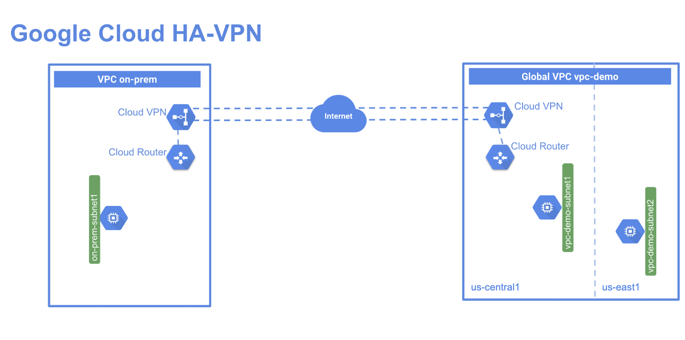

# 12. Configuring Google Cloud HA VPN

> [← 이전 실습](11.Resource%20Monitoring_KR.md) · [📚 전체 목록](../README.md) · [다음 실습 →](13.Configure%20an%20Application%20Load%20Balancer%20(HTTP)%20with%20Autoscaling_KR.md)

## Overview (개요)

HA VPN은 IPsec VPN 연결을 통해 온프레미스 네트워크를 VPC 네트워크에 안전하게 연결하는 고가용성(HA) Cloud VPN 솔루션입니다. HA VPN 게이트웨이는 리전 리소스이며, 두 피어 게이트웨이를 같은 리전에 배포하고 각 인터페이스에 터널을 구성하면 99.99%의 서비스 가용성 SLA를 제공합니다.

HA VPN은 VPC별 리전 단위(regional per VPC) VPN 솔루션입니다. HA VPN 게이트웨이는 각각 고유한 공개 IP 주소를 가진 두 개의 인터페이스를 갖습니다. HA VPN 게이트웨이를 생성하면 서로 다른 주소 풀에서 두 개의 공개 IP 주소가 자동으로 선택됩니다. HA VPN이 터널 2개로 구성되면, Cloud VPN은 99.99%의 서비스 가용성 업타임을 제공합니다.

이 실습에서는 us-east1와 us-central1에 커스텀 서브넷 2개를 가진 **vpc-demo**라는 전역(global) VPC를 생성합니다. 이 VPC에는 각 리전마다 Compute Engine 인스턴스를 하나씩 추가합니다. 그런 다음 고객의 온프레미스 데이터센터를 시뮬레이션하기 위해 **on-prem**이라는 두 번째 VPC를 생성합니다. 이 두 번째 VPC에는 us-central1 리전에 서브넷과 이 리전에서 실행되는 Compute Engine 인스턴스를 추가합니다. 마지막으로 각 VPC에 HA VPN과 Cloud Router를 추가하고, 각 HA VPN 게이트웨이에서 터널 2개를 실행한 다음 99.99% SLA를 검증하기 위해 구성을 테스트합니다.



## Objectives (목표)

이 실습에서는 다음 작업을 수행하는 방법을 배웁니다.

- VPC 네트워크 2개와 인스턴스를 생성합니다.
- HA VPN 게이트웨이를 구성합니다.
- VPN 터널을 사용한 동적 라우팅(dynamic routing)을 구성합니다.
- 전역 동적 라우팅 모드(global dynamic routing mode)를 구성합니다.
- HA VPN 게이트웨이 구성을 검증하고 테스트합니다.

---

---

## 🧩 Task 1. 전역(Global) VPC 환경 설정하기

이번 작업에서는 커스텀 서브넷 2개와 각 리전에서 실행되는 VM 인스턴스 2개를 가진 전역 VPC를 설정합니다.

1. Cloud Shell에서 **vpc-demo**라는 VPC 네트워크를 생성합니다.

   ```bash
   gcloud compute networks create vpc-demo --subnet-mode custom
   ```

   출력은 다음과 비슷하게 나타납니다.

   ```text
   Created
   [https://www.googleapis.com/compute/v1/projects/qwiklabs-gcp-03-cdb29e18d20d/global/networks/vpc-demo].
   NAME: vpc-demo
   SUBNET_MODE: CUSTOM
   BGP_ROUTING_MODE: REGIONAL
   IPV4_RANGE:
   GATEWAY_IPV4:
   ```

2. Cloud Shell에서 us-central1 리전에 서브넷 **vpc-demo-subnet1**을 생성합니다.

   ```bash
   gcloud compute networks subnets create vpc-demo-subnet1 \
   --network vpc-demo --range 10.1.1.0/24 --region us-central1
   ```

3. us-east1 리전에 서브넷 **vpc-demo-subnet2**를 생성합니다.

   ```bash
   gcloud compute networks subnets create vpc-demo-subnet2 \
   --network vpc-demo --range 10.2.1.0/24 --region us-east1
   ```

4. 네트워크 내부의 모든 custom 트래픽을 허용하는 방화벽 규칙을 생성합니다.

   ```bash
   gcloud compute firewall-rules create vpc-demo-allow-custom \
    --network vpc-demo \
    --allow "tcp:0-65535,udp:0-65535,icmp" \
    --source-ranges 10.0.0.0/8
   ```

   출력은 다음과 비슷하게 나타납니다.

   ```text
   Creating firewall...working..Created
   [https://www.googleapis.com/compute/v1/projects/qwiklabs-gcp-03-cdb29e18d20d/global/firewalls/vpc-demo-allow-custom].
   Creating firewall...done.
   NAME: vpc-demo-allow-custom
   NETWORK: vpc-demo
   DIRECTION: INGRESS
   PRIORITY: 1000
   ALLOW: tcp:0-65535,udp:0-65535,icmp
   DENY:
   DISABLED: False
   ```

5. 어디서든 SSH 및 ICMP 트래픽을 허용하는 방화벽 규칙을 생성합니다.

   ```bash
   gcloud compute firewall-rules create vpc-demo-allow-ssh-icmp \
    --network vpc-demo \
    --allow "tcp:22,icmp"
   ```

6. us-central1-b 존에 VM 인스턴스 **vpc-demo-instance1**을 생성합니다.

   ```bash
   gcloud compute instances create vpc-demo-instance1 --machine-type=e2-medium --zone us-central1-b --subnet vpc-demo-subnet1
   ```

   출력은 다음과 비슷하게 나타납니다.

   ```text
   Created
   [https://www.googleapis.com/compute/v1/projects/qwiklabs-gcp-03-cdb29e18d20d/zones/us-central1-b/instances/vpc-demo-instance1].
   NAME: vpc-demo-instance1
   ZONE: us-central1-b
   MACHINE_TYPE: e2-medium
   PREEMPTIBLE:
   INTERNAL_IP: 10.1.1.2
   EXTERNAL_IP: 34.71.135.218
   STATUS: RUNNING
   ```

7. us-east1-b 존에 VM 인스턴스 **vpc-demo-instance2**를 생성합니다.

   ```bash
   gcloud compute instances create vpc-demo-instance2 --machine-type=e2-medium --zone us-east1-b --subnet vpc-demo-subnet2
   ```

---

---

## 🧩 Task 2. 시뮬레이션된 온프레미스 환경 설정하기

이번 작업에서는 고객이 Google Cloud 환경에 연결하는 온프레미스 환경을 시뮬레이션하는 **on-prem** VPC를 생성합니다.

1. Cloud Shell에서 **on-prem**이라는 VPC 네트워크를 생성합니다.

   ```bash
   gcloud compute networks create on-prem --subnet-mode custom
   ```

   출력은 다음과 비슷하게 나타납니다.

   ```text
   Created
   [https://www.googleapis.com/compute/v1/projects/qwiklabs-gcp-03-cdb29e18d20d/global/networks/on-prem].
   NAME: on-prem
   SUBNET_MODE: CUSTOM
   BGP_ROUTING_MODE: REGIONAL
   IPV4_RANGE:
   GATEWAY_IPV4:
   ```

2. **on-prem-subnet1**이라는 서브넷을 생성합니다.

   ```bash
   gcloud compute networks subnets create on-prem-subnet1 \
   --network on-prem --range 192.168.1.0/24 --region us-central1
   ```

3. 네트워크 내부의 모든 custom 트래픽을 허용하는 방화벽 규칙을 생성합니다.

   ```bash
   gcloud compute firewall-rules create on-prem-allow-custom \
    --network on-prem \
    --allow "tcp:0-65535,udp:0-65535,icmp" \
    --source-ranges 192.168.0.0/16
   ```

4. 인스턴스에 대해 SSH 및 ICMP 트래픽을 허용하는 방화벽 규칙을 생성합니다.

   ```bash
   gcloud compute firewall-rules create on-prem-allow-ssh-icmp \
    --network on-prem \
    --allow "tcp:22,icmp"
   ```

5. us-central1 리전에 **on-prem-instance1**이라는 인스턴스를 생성합니다.

   > **💡 참고:** 아래 명령어에서 `us-central1-a`은 us-central1의 존으로 바꾸되, **vpc-demo-subnet1**에 **vpc-demo-instance1**을 생성할 때 사용한 존과는 다른 존을 사용해야 합니다.

   ```bash
   gcloud compute instances create on-prem-instance1 --machine-type=e2-medium --zone us-central1-a --subnet on-prem-subnet1
   ```

---

---

## 🧩 Task 3. HA VPN 게이트웨이 설정하기

이번 작업에서는 각 VPC 네트워크에 HA VPN 게이트웨이를 생성한 다음, 각 Cloud VPN 게이트웨이에 HA VPN 터널을 생성합니다.

1. Cloud Shell에서 **vpc-demo** 네트워크에 HA VPN을 생성합니다.

   ```bash
   gcloud compute vpn-gateways create vpc-demo-vpn-gw1 --network vpc-demo --region us-central1
   ```

   출력은 다음과 비슷하게 나타납니다.

   ```text
   Creating VPN Gateway...done. 
   NAME: vpc-demo-vpn-gw1
   INTERFACE0: 35.242.117.95
   INTERFACE1: 35.220.73.93
   NETWORK: vpc-demo
   REGION: us-central1
   ```

2. **on-prem** 네트워크에 HA VPN을 생성합니다.

   ```bash
   gcloud compute vpn-gateways create on-prem-vpn-gw1 --network on-prem --region us-central1
   ```

3. **vpc-demo-vpn-gw1** 게이트웨이의 세부정보를 확인하여 설정을 검증합니다.

   ```bash
   gcloud compute vpn-gateways describe vpc-demo-vpn-gw1 --region us-central1
   ```

   출력은 다음과 비슷하게 나타납니다.

   ```yaml
   creationTimestamp: '2022-01-25T03:02:20.983-08:00'
   id: '7306781839576950355'
   kind: compute#vpnGateway
   labelFingerprint: 42WmSpB8rSM=
   name: vpc-demo-vpn-gw1
   network:
   https://www.googleapis.com/compute/v1/projects/qwiklabs-gcp-03-cdb29e18d20d/global/networks/vpc-demo
   region:
   https://www.googleapis.com/compute/v1/projects/qwiklabs-gcp-03-cdb29e18d20d/regions/us-central1
   selfLink:
   https://www.googleapis.com/compute/v1/projects/qwiklabs-gcp-03-cdb29e18d20d/regions/us-central1/vpnGateways/vpc-demo-vpn-gw1
   vpnInterfaces:
   - id: 0
    ipAddress: 35.242.117.95
   - id: 1
    ipAddress: 35.220.73.93
   ```

4. **on-prem-vpn-gw1** VPN 게이트웨이의 세부정보를 확인하여 설정을 검증합니다.

   ```bash
   gcloud compute vpn-gateways describe on-prem-vpn-gw1 --region us-central1
   ```

   출력은 다음과 비슷하게 나타납니다.

   ```yaml
   creationTimestamp: '2022-01-25T03:03:34.305-08:00'
   id: '3697047034868688873'
   kind: compute#vpnGateway
   labelFingerprint: 42WmSpB8rSM=
   name: on-prem-vpn-gw1
   network:
   https://www.googleapis.com/compute/v1/projects/qwiklabs-gcp-03-cdb29e18d20d/global/networks/on-prem
   region:
   https://www.googleapis.com/compute/v1/projects/qwiklabs-gcp-03-cdb29e18d20d/regions/us-central1
   selfLink:
   https://www.googleapis.com/compute/v1/projects/qwiklabs-gcp-03-cdb29e18d20d/regions/us-central1/vpnGateways/on-prem-vpn-gw1
   vpnInterfaces:
   - id: 0
    ipAddress: 35.242.106.234
   - id: 1
    ipAddress: 35.220.88.140
   ```

### Cloud Router 생성하기

1. **vpc-demo** 네트워크에 Cloud Router를 생성합니다.

   ```bash
   gcloud compute routers create vpc-demo-router1 \
    --region us-central1 \
    --network vpc-demo \
    --asn 65001
   ```

   출력은 다음과 비슷하게 나타납니다.

   ```text
   Creating router [vpc-demo-router1]...done. 
   NAME: vpc-demo-router1
   REGION: us-central1
   NETWORK: vpc-demo
   ```

2. **on-prem** 네트워크에 Cloud Router를 생성합니다.

   ```bash
   gcloud compute routers create on-prem-router1 \
    --region us-central1 \
    --network on-prem \
    --asn 65002
   ```

---

---

## 🧩 Task 4. VPN 터널 2개 생성하기

이번 작업에서는 두 게이트웨이 사이에 VPN 터널을 생성합니다. HA VPN 설정에서는 각 게이트웨이에서 원격 설정으로 향하는 터널을 2개씩 추가합니다. **interface0**에 터널을 생성하여 원격 게이트웨이의 **interface0**에 연결하고, 이어서 **interface1**에 또 다른 터널을 생성하여 원격 게이트웨이의 **interface1**에 연결합니다.

두 Google Cloud VPC 간에 HA VPN 터널을 실행할 때는 **interface0**의 터널이 원격 VPN 게이트웨이의 **interface0**에 연결되어 있는지 반드시 확인해야 합니다. 마찬가지로 **interface1**의 터널도 원격 VPN 게이트웨이의 **interface1**에 연결되어야 합니다.

> **💡 참고:** 실제 환경에서 고객을 위해 온프레미스의 원격 VPN 게이트웨이로 HA VPN을 실행하는 경우, 다음 방법 중 하나로 연결할 수 있습니다.

- *온프레미스 VPN 게이트웨이 장치 2개*: Cloud VPN 게이트웨이의 각 인터페이스에서 나오는 터널은 각각 자신의 피어 게이트웨이에 연결되어야 합니다.
- *인터페이스 2개를 가진 단일 온프레미스 VPN 게이트웨이 장치*: Cloud VPN 게이트웨이의 각 인터페이스에서 나오는 터널은 피어 게이트웨이의 각 인터페이스에 개별적으로 연결되어야 합니다.
- *인터페이스 1개를 가진 단일 온프레미스 VPN 게이트웨이 장치*: Cloud VPN 게이트웨이의 각 인터페이스에서 나오는 두 터널이 모두 피어 게이트웨이의 동일한 인터페이스에 연결되어야 합니다.

이 실습에서는 두 VPN 게이트웨이가 모두 Google Cloud에 있는 온프레미스 설정을 시뮬레이션합니다. 한 게이트웨이의 **interface0**은 다른 게이트웨이의 **interface0**에, **interface1**은 원격 게이트웨이의 **interface1**에 연결되도록 합니다.

터널을 만들기 전에 Cloud Shell에서 두 피어에 동일하게 사용할 공유 비밀값을 설정합니다. 아래 값은 실습용 예시이므로 실제 환경에서는 Secret Manager 등의 안전한 방법으로 관리합니다.

```bash
SHARED_SECRET='ha-vpn-lab-secret'
```

1. **vpc-demo** 네트워크에 첫 번째 VPN 터널을 생성합니다.

   ```bash
   gcloud compute vpn-tunnels create vpc-demo-tunnel0 \
    --peer-gcp-gateway on-prem-vpn-gw1 \
    --region us-central1 \
    --ike-version 2 \
    --shared-secret "$SHARED_SECRET" \
    --router vpc-demo-router1 \
    --vpn-gateway vpc-demo-vpn-gw1 \
    --interface 0
   ```

   출력은 다음과 비슷하게 나타납니다.

   ```text
   Creating VPN tunnel...done. 
   NAME: vpc-demo-tunnel0
   REGION: us-central1
   GATEWAY: vpc-demo-vpn-gw1
   VPN_INTERFACE: 0
   PEER_ADDRESS: 35.242.106.234
   ```

2. **vpc-demo** 네트워크에 두 번째 VPN 터널을 생성합니다.

   ```bash
   gcloud compute vpn-tunnels create vpc-demo-tunnel1 \
    --peer-gcp-gateway on-prem-vpn-gw1 \
    --region us-central1 \
    --ike-version 2 \
    --shared-secret "$SHARED_SECRET" \
    --router vpc-demo-router1 \
    --vpn-gateway vpc-demo-vpn-gw1 \
    --interface 1
   ```

3. **on-prem** 네트워크에 첫 번째 VPN 터널을 생성합니다.

   ```bash
   gcloud compute vpn-tunnels create on-prem-tunnel0 \
    --peer-gcp-gateway vpc-demo-vpn-gw1 \
    --region us-central1 \
    --ike-version 2 \
    --shared-secret "$SHARED_SECRET" \
    --router on-prem-router1 \
    --vpn-gateway on-prem-vpn-gw1 \
    --interface 0
   ```

4. **on-prem** 네트워크에 두 번째 VPN 터널을 생성합니다.

   ```bash
   gcloud compute vpn-tunnels create on-prem-tunnel1 \
    --peer-gcp-gateway vpc-demo-vpn-gw1 \
    --region us-central1 \
    --ike-version 2 \
    --shared-secret "$SHARED_SECRET" \
    --router on-prem-router1 \
    --vpn-gateway on-prem-vpn-gw1 \
    --interface 1
   ```

---

---

## 🧩 Task 5. 각 터널에 대해 BGP(Border Gateway Protocol) 피어링 생성하기

이번 작업에서는 **vpc-demo**와 VPC **on-prem** 사이의 각 VPN 터널에 대해 BGP 피어링을 구성합니다. HA VPN이 99.99% 가용성을 제공하려면 동적 라우팅이 필요합니다.

1. **vpc-demo** 네트워크에서 **tunnel0**에 대한 라우터 인터페이스를 생성합니다.

   ```bash
   gcloud compute routers add-interface vpc-demo-router1 \
    --interface-name if-tunnel0-to-on-prem \
    --ip-address 169.254.0.1 \
    --mask-length 30 \
    --vpn-tunnel vpc-demo-tunnel0 \
    --region us-central1
   ```

   출력은 다음과 비슷하게 나타납니다.

   ```text
   Updated
   [https://www.googleapis.com/compute/v1/projects/binal-sandbox/regions/us-central1/routers/vpc-demo-router1].
   ```

2. **vpc-demo** 네트워크에서 **tunnel0**에 대한 BGP 피어를 생성합니다.

   ```bash
   gcloud compute routers add-bgp-peer vpc-demo-router1 \
    --peer-name bgp-on-prem-tunnel0 \
    --interface if-tunnel0-to-on-prem \
    --peer-ip-address 169.254.0.2 \
    --peer-asn 65002 \
    --region us-central1
   ```

   출력은 다음과 비슷하게 나타납니다.

   ```text
   Creating peer [bgp-on-prem-tunnel0] in router [vpc-demo-router1]...done.
   ```

3. **vpc-demo** 네트워크에서 **tunnel1**에 대한 라우터 인터페이스를 생성합니다.

   ```bash
   gcloud compute routers add-interface vpc-demo-router1 \
    --interface-name if-tunnel1-to-on-prem \
    --ip-address 169.254.1.1 \
    --mask-length 30 \
    --vpn-tunnel vpc-demo-tunnel1 \
    --region us-central1
   ```

4. **vpc-demo** 네트워크에서 **tunnel1**에 대한 BGP 피어를 생성합니다.

   ```bash
   gcloud compute routers add-bgp-peer vpc-demo-router1 \
    --peer-name bgp-on-prem-tunnel1 \
    --interface if-tunnel1-to-on-prem \
    --peer-ip-address 169.254.1.2 \
    --peer-asn 65002 \
    --region us-central1
   ```

5. **on-prem** 네트워크에서 **tunnel0**에 대한 라우터 인터페이스를 생성합니다.

   ```bash
   gcloud compute routers add-interface on-prem-router1 \
    --interface-name if-tunnel0-to-vpc-demo \
    --ip-address 169.254.0.2 \
    --mask-length 30 \
    --vpn-tunnel on-prem-tunnel0 \
    --region us-central1
   ```

6. **on-prem** 네트워크에서 **tunnel0**에 대한 BGP 피어를 생성합니다.

   ```bash
   gcloud compute routers add-bgp-peer on-prem-router1 \
    --peer-name bgp-vpc-demo-tunnel0 \
    --interface if-tunnel0-to-vpc-demo \
    --peer-ip-address 169.254.0.1 \
    --peer-asn 65001 \
    --region us-central1
   ```

7. **on-prem** 네트워크에서 **tunnel1**에 대한 라우터 인터페이스를 생성합니다.

   ```bash
   gcloud compute routers add-interface on-prem-router1 \
    --interface-name if-tunnel1-to-vpc-demo \
    --ip-address 169.254.1.2 \
    --mask-length 30 \
    --vpn-tunnel on-prem-tunnel1 \
    --region us-central1
   ```

8. **on-prem** 네트워크에서 **tunnel1**에 대한 BGP 피어를 생성합니다.

   ```bash
   gcloud compute routers add-bgp-peer on-prem-router1 \
    --peer-name bgp-vpc-demo-tunnel1 \
    --interface if-tunnel1-to-vpc-demo \
    --peer-ip-address 169.254.1.1 \
    --peer-asn 65001 \
    --region us-central1
   ```

---

---

## 🧩 Task 6. 라우터 구성 검증하기

이번 작업에서는 두 VPC의 라우터 구성을 검증합니다. 각 VPC 간 트래픽을 허용하도록 방화벽 규칙을 구성하고 터널 상태를 확인합니다. 또한 각 VPC 사이의 VPN을 통한 프라이빗 연결을 검증하고, VPC에 대해 전역 라우팅 모드를 활성화합니다.

1. Cloud Router **vpc-demo-router1**의 세부정보를 확인하여 설정을 검증합니다.

   ```bash
   gcloud compute routers describe vpc-demo-router1 \
    --region us-central1
   ```

   출력은 다음과 비슷하게 나타납니다.

   ```yaml
   bgp:
    advertiseMode: DEFAULT
    asn: 65001
    keepaliveInterval: 20
   bgpPeers:
   - bfd:
    minReceiveInterval: 1000
    minTransmitInterval: 1000
    multiplier: 5
    sessionInitializationMode: DISABLED
    enable: 'TRUE'
    interfaceName: if-tunnel0-to-on-prem
    ipAddress: 169.254.0.1
    name: bgp-on-prem-tunnel0
    peerAsn: 65002
    peerIpAddress: 169.254.0.2
   - bfd:
    minReceiveInterval: 1000
    minTransmitInterval: 1000
    multiplier: 5
    sessionInitializationMode: DISABLED
    enable: 'TRUE'
    interfaceName: if-tunnel1-to-on-prem
    ipAddress: 169.254.1.1
    name: bgp-on-prem-tunnel1
    peerAsn: 65002
    peerIpAddress: 169.254.1.2
   creationTimestamp: '2022-01-25T03:06:23.370-08:00'
   id: '2408056426544129856'
   interfaces:
   - ipRange: 169.254.0.1/30
    linkedVpnTunnel:
   https://www.googleapis.com/compute/v1/projects/qwiklabs-gcp-03-cdb29e18d20d/regions/us-central1/vpnTunnels/vpc-demo-tunnel0
    name: if-tunnel0-to-on-prem
   - ipRange: 169.254.1.1/30
    linkedVpnTunnel:
   https://www.googleapis.com/compute/v1/projects/qwiklabs-gcp-03-cdb29e18d20d/regions/us-central1/vpnTunnels/vpc-demo-tunnel1
    name: if-tunnel1-to-on-prem
   kind: compute#router
   name: vpc-demo-router1
   network:
   https://www.googleapis.com/compute/v1/projects/qwiklabs-gcp-03-cdb29e18d20d/global/networks/vpc-demo
   region:
   https://www.googleapis.com/compute/v1/projects/qwiklabs-gcp-03-cdb29e18d20d/regions/us-central1
   selfLink:
   https://www.googleapis.com/compute/v1/projects/qwiklabs-gcp-03-cdb29e18d20d/regions/us-central1/routers/vpc-demo-router1
   ```

2. Cloud Router **on-prem-router1**의 세부정보를 확인하여 설정을 검증합니다.

   ```bash
   gcloud compute routers describe on-prem-router1 \
    --region us-central1
   ```

   출력은 다음과 비슷하게 나타납니다.

   ```yaml
   bgp:
    advertiseMode: DEFAULT
    asn: 65002
    keepaliveInterval: 20
   bgpPeers:
   - bfd:
    minReceiveInterval: 1000
    minTransmitInterval: 1000
    multiplier: 5
    sessionInitializationMode: DISABLED
    enable: 'TRUE'
    interfaceName: if-tunnel0-to-vpc-demo
    ipAddress: 169.254.0.2
    name: bgp-vpc-demo-tunnel0
    peerAsn: 65001
    peerIpAddress: 169.254.0.1
   - bfd:
    minReceiveInterval: 1000
    minTransmitInterval: 1000
    multiplier: 5
    sessionInitializationMode: DISABLED
    enable: 'TRUE'
    interfaceName: if-tunnel1-to-vpc-demo
    ipAddress: 169.254.1.2
    name: bgp-vpc-demo-tunnel1
    peerAsn: 65001
    peerIpAddress: 169.254.1.1
   creationTimestamp: '2022-01-25T03:07:40.360-08:00'
   id: '3252882979067946771'
   interfaces:
   - ipRange: 169.254.0.2/30
    linkedVpnTunnel:
   https://www.googleapis.com/compute/v1/projects/qwiklabs-gcp-03-cdb29e18d20d/regions/us-central1/vpnTunnels/on-prem-tunnel0
    name: if-tunnel0-to-vpc-demo
   - ipRange: 169.254.1.2/30
    linkedVpnTunnel:
   https://www.googleapis.com/compute/v1/projects/qwiklabs-gcp-03-cdb29e18d20d/regions/us-central1/vpnTunnels/on-prem-tunnel1
    name: if-tunnel1-to-vpc-demo
   kind: compute#router
   name: on-prem-router1
   network:
   https://www.googleapis.com/compute/v1/projects/qwiklabs-gcp-03-cdb29e18d20d/global/networks/on-prem
   region:
   https://www.googleapis.com/compute/v1/projects/qwiklabs-gcp-03-cdb29e18d20d/regions/us-central1
   selfLink:
   https://www.googleapis.com/compute/v1/projects/qwiklabs-gcp-03-cdb29e18d20d/regions/us-central1/routers/on-prem-router1
   ```

### 원격 VPC에서 오는 트래픽을 허용하도록 방화벽 규칙 구성하기

피어 VPN의 프라이빗 IP 범위에서 오는 트래픽을 허용하도록 방화벽 규칙을 구성합니다.

1. 네트워크 VPC **on-prem**에서 **vpc-demo**로의 트래픽을 허용합니다.

   ```bash
   gcloud compute firewall-rules create vpc-demo-allow-subnets-from-on-prem \
    --network vpc-demo \
    --allow "tcp,udp,icmp" \
    --source-ranges 192.168.1.0/24
   ```

   출력은 다음과 비슷하게 나타납니다.

   ```text
   Creating firewall...working..Created
   [https://www.googleapis.com/compute/v1/projects/qwiklabs-gcp-03-cdb29e18d20d/global/firewalls/vpc-demo-allow-subnets-from-on-prem].
   Creating firewall...done.
   NAME: vpc-demo-allow-subnets-from-on-prem
   NETWORK: vpc-demo
   DIRECTION: INGRESS
   PRIORITY: 1000
   ALLOW: tcp,udp,icmp
   DENY:
   DISABLED: False
   ```

2. **vpc-demo**에서 네트워크 VPC **on-prem**으로의 트래픽을 허용합니다.

   ```bash
   gcloud compute firewall-rules create on-prem-allow-subnets-from-vpc-demo \
    --network on-prem \
    --allow "tcp,udp,icmp" \
    --source-ranges 10.1.1.0/24,10.2.1.0/24
   ```

### 터널 상태 검증하기

1. 방금 생성한 VPN 터널 목록을 확인합니다.

   ```bash
   gcloud compute vpn-tunnels list
   ```

   VPN 터널이 4개(각 VPN 게이트웨이당 2개씩) 있어야 합니다. 출력은 다음과 비슷하게 나타납니다.

   ```text
   NAME: on-prem-tunnel0
   REGION: us-central1
   GATEWAY: on-prem-vpn-gw1
   PEER_ADDRESS: 35.242.117.95

   NAME: on-prem-tunnel1
   REGION: us-central1
   GATEWAY: on-prem-vpn-gw1
   PEER_ADDRESS: 35.220.73.93

   NAME: vpc-demo-tunnel0
   REGION: us-central1
   GATEWAY: vpc-demo-vpn-gw1
   PEER_ADDRESS: 35.242.106.234

   NAME: vpc-demo-tunnel1
   REGION: us-central1
   GATEWAY: vpc-demo-vpn-gw1
   PEER_ADDRESS: 35.220.88.140
   ```

2. **vpc-demo-tunnel0** 터널이 정상 작동 중인지 확인합니다.

   ```bash
   gcloud compute vpn-tunnels describe vpc-demo-tunnel0 \
      --region us-central1
   ```

   터널의 상세 상태는 *Tunnel is up and running.*으로 표시되어야 합니다.

   ```yaml
   creationTimestamp: '2022-01-25T03:21:05.238-08:00'
   description: ''
   detailedStatus: Tunnel is up and running.
   id: '3268990180169769934'
   ikeVersion: 2
   kind: compute#vpnTunnel
   labelFingerprint: 42WmSpB8rSM=
   localTrafficSelector:
   - 0.0.0.0/0
   name: vpc-demo-tunnel0
   peerGcpGateway:
   https://www.googleapis.com/compute/v1/projects/qwiklabs-gcp-03-cdb29e18d20d/regions/us-central1/vpnGateways/on-prem-vpn-gw1
   peerIp: 35.242.106.234
   region:
   https://www.googleapis.com/compute/v1/projects/qwiklabs-gcp-03-cdb29e18d20d/regions/us-central1
   remoteTrafficSelector:
   - 0.0.0.0/0
   router:
   https://www.googleapis.com/compute/v1/projects/qwiklabs-gcp-03-cdb29e18d20d/regions/us-central1/routers/vpc-demo-router1
   selfLink:
   https://www.googleapis.com/compute/v1/projects/qwiklabs-gcp-03-cdb29e18d20d/regions/us-central1/vpnTunnels/vpc-demo-tunnel0
   sharedSecret: '*************'
   sharedSecretHash: AOs4oVY4bX91gba6DIeg1DbtzWTj
   status: ESTABLISHED
   vpnGateway:
   https://www.googleapis.com/compute/v1/projects/qwiklabs-gcp-03-cdb29e18d20d/regions/us-central1/vpnGateways/vpc-demo-vpn-gw1
   vpnGatewayInterface: 0
   ```

3. **vpc-demo-tunnel1** 터널이 정상 작동 중인지 확인합니다.

   ```bash
   gcloud compute vpn-tunnels describe vpc-demo-tunnel1 \
      --region us-central1
   ```

   터널의 상세 상태는 *Tunnel is up and running.*으로 표시되어야 합니다.

4. **on-prem-tunnel0** 터널이 정상 작동 중인지 확인합니다.

   ```bash
   gcloud compute vpn-tunnels describe on-prem-tunnel0 \
      --region us-central1
   ```

   터널의 상세 상태는 *Tunnel is up and running.*으로 표시되어야 합니다.

5. **on-prem-tunnel1** 터널이 정상 작동 중인지 확인합니다.

   ```bash
   gcloud compute vpn-tunnels describe on-prem-tunnel1 \
      --region us-central1
   ```

   터널의 상세 상태는 *Tunnel is up and running.*으로 표시되어야 합니다.

### VPN을 통한 프라이빗 연결 검증하기

1. Compute Engine으로 이동하여 **on-prem-instance1**이 생성된 존을 확인해 둡니다.
2. 새 Cloud Shell 탭을 열고 다음을 입력하여 **on-prem-instance1** 인스턴스에 SSH로 연결합니다. `<us-central1-a>`은 **on-prem-instance1**이 생성된 존으로 바꿉니다.

   ```bash
   gcloud compute ssh on-prem-instance1 --zone us-central1-a
   ```

3. 계속 진행할지 확인하는 메시지에 `y`를 입력합니다.
4. **Enter**를 두 번 눌러 비밀번호 생성을 건너뜁니다.
5. **on-prem** 네트워크의 **on-prem-instance1** 인스턴스에서 **vpc-demo** 네트워크의 인스턴스에 도달할 수 있는지 확인하기 위해 10.1.1.2로 ping을 보냅니다.

   ```bash
   ping -c 4 10.1.1.2
   ```

   ping이 성공합니다. 출력은 다음과 비슷하게 나타납니다.

   ```sql
   PING 10.1.1.2 (10.1.1.2) 56(84) bytes of data.
   64 bytes from 10.1.1.2: icmp_seq=1 ttl=62 time=9.65 ms
   64 bytes from 10.1.1.2: icmp_seq=2 ttl=62 time=2.01 ms
   64 bytes from 10.1.1.2: icmp_seq=3 ttl=62 time=1.71 ms
   64 bytes from 10.1.1.2: icmp_seq=4 ttl=62 time=1.77 ms

   --- 10.1.1.2 ping statistics ---
   4 packets transmitted, 4 received, 0% packet loss, time 8ms
   rtt min/avg/max/mdev = 1.707/3.783/9.653/3.391 ms
   ```

### VPN을 사용한 전역 라우팅(Global routing)

HA VPN은 리전 리소스이며, Cloud Router는 기본적으로 자신이 배포된 리전 안의 라우트만 인식합니다. Cloud Router가 있는 리전과 다른 리전의 인스턴스에 도달하려면 VPC에 대해 전역 라우팅 모드를 활성화해야 합니다. 이렇게 하면 Cloud Router가 다른 리전의 라우트를 인식하고 알릴(advertise) 수 있습니다.

1. 새 Cloud Shell 탭을 열고 **vpc-demo**의 **bgp-routing mode**를 **GLOBAL**로 업데이트합니다.

   ```bash
   gcloud compute networks update vpc-demo --bgp-routing-mode=global
   ```

2. 변경 사항을 확인합니다.

   ```bash
   gcloud compute networks describe vpc-demo
   ```

   출력은 다음과 비슷하게 나타납니다.

   ```yaml
   autoCreateSubnetworks: false
   creationTimestamp: '2022-01-25T02:52:58.553-08:00'
   id: '4735939730452146277'
   kind: compute#network
   name: vpc-demo
   routingConfig:
    routingMode: GLOBAL
   selfLink:
   https://www.googleapis.com/compute/v1/projects/qwiklabs-gcp-03-cdb29e18d20d/global/networks/vpc-demo
   subnetworks:
   -
   https://www.googleapis.com/compute/v1/projects/qwiklabs-gcp-03-cdb29e18d20d/regions/us-central1/subnetworks/vpc-demo-subnet1
   -
   https://www.googleapis.com/compute/v1/projects/qwiklabs-gcp-03-cdb29e18d20d/regions/us-east1/subnetworks/vpc-demo-subnet2
   x_gcloud_bgp_routing_mode: GLOBAL
   x_gcloud_subnet_mode: CUSTOM
   ```

3. 현재 **on-prem** 네트워크의 인스턴스에 SSH로 연결되어 있는 Cloud Shell 탭에서, us-east1 리전의 **vpc-demo-instance2** 인스턴스로 ping을 보냅니다.

   ```bash
   ping -c 2 10.2.1.2
   ```

   ping이 성공합니다. 출력은 다음과 비슷하게 나타납니다.

   ```sql
   PING 10.2.1.2 (10.2.1.2) 56(84) bytes of data.
   64 bytes from 10.2.1.2: icmp_seq=1 ttl=62 time=34.9 ms
   64 bytes from 10.2.1.2: icmp_seq=2 ttl=62 time=32.2 ms

   --- 10.2.1.2 ping statistics ---
   2 packets transmitted, 2 received, 0% packet loss, time 2ms
   rtt min/avg/max/mdev = 32.189/33.528/34.867/1.339 ms
   ```

---

---

## 🧩 Task 7. HA VPN 터널 구성 검증 및 테스트하기

이번 작업에서는 각 HA VPN 터널의 고가용성 구성이 제대로 되어 있는지 테스트하고 검증합니다.

1. 새 Cloud Shell 탭을 엽니다.
2. **vpc-demo** 네트워크의 **tunnel0**을 다운시킵니다.

   ```bash
   gcloud compute vpn-tunnels delete vpc-demo-tunnel0 --region us-central1
   ```

   삭제를 확인하는 메시지에 `y`로 응답합니다. **on-prem** 네트워크의 해당 **tunnel0**도 함께 다운됩니다.

3. 터널이 다운되었는지 확인합니다.

   ```bash
   gcloud compute vpn-tunnels describe on-prem-tunnel0 --region us-central1
   ```

   > **💡 참고:** 삭제 직후에는 상태와 BGP 경로 전환이 비동기로 수렴하므로 잠시 동안 이전 상태가 표시되거나 ping이 실패할 수 있습니다. `on-prem-tunnel0`이 `FIRST_HANDSHAKE` 상태가 되고 `on-prem-tunnel1`이 `ESTABLISHED` 상태가 될 때까지 약 1~2분 기다린 뒤 다음 ping을 실행합니다. 즉시 ping이 실패하면 잠시 기다린 후 다시 실행합니다.

   상세 상태가 *Handshake_with_peer_broken*으로 표시되어야 합니다.

   ```yaml
   creationTimestamp: '2022-01-25T03:22:33.581-08:00'
   description: ''
   detailedStatus: Handshake with peer broken for unknown reason. Trying again soon.
   id: '4116279561430393750'
   ikeVersion: 2
   kind: compute#vpnTunnel
   localTrafficSelector:
   - 0.0.0.0/0
   name: on-prem-tunnel0
   peerGcpGateway:
   https://www.googleapis.com/compute/v1/projects/qwiklabs-gcp-03-cdb29e18d20d/regions/us-central1/vpnGateways/vpc-demo-vpn-gw1
   peerIp: 35.242.117.95
   region:
   https://www.googleapis.com/compute/v1/projects/qwiklabs-gcp-03-cdb29e18d20d/regions/us-central1
   remoteTrafficSelector:
   - 0.0.0.0/0
   router:
   https://www.googleapis.com/compute/v1/projects/qwiklabs-gcp-03-cdb29e18d20d/regions/us-central1/routers/on-prem-router1
   selfLink:
   https://www.googleapis.com/compute/v1/projects/qwiklabs-gcp-03-cdb29e18d20d/regions/us-central1/vpnTunnels/on-prem-tunnel0
   sharedSecret: '*************'
   sharedSecretHash: AO3jeFtewmjvTMO7JEM5RuyCtqaa
   status: FIRST_HANDSHAKE
   vpnGateway:
   https://www.googleapis.com/compute/v1/projects/qwiklabs-gcp-03-cdb29e18d20d/regions/us-central1/vpnGateways/on-prem-vpn-gw1
   vpnGatewayInterface: 0
   ```

4. ssh 세션이 열려 있는 이전 Cloud Shell 탭으로 전환하여, **vpc-demo** 네트워크와 **on-prem** 네트워크의 인스턴스 간 ping을 확인합니다.

   ```bash
   ping -c 3 10.1.1.2
   ```

   출력은 다음과 비슷하게 나타납니다.

   ```sql
   PING 10.1.1.2 (10.1.1.2) 56(84) bytes of data.
   64 bytes from 10.1.1.2: icmp_seq=1 ttl=62 time=6.31 ms
   64 bytes from 10.1.1.2: icmp_seq=2 ttl=62 time=1.13 ms
   64 bytes from 10.1.1.2: icmp_seq=3 ttl=62 time=1.20 ms

   --- 10.1.1.2 ping statistics ---
   3 packets transmitted, 3 received, 0% packet loss, time 5ms
   rtt min/avg/max/mdev = 1.132/2.882/6.312/2.425 ms
   ```

   ping이 여전히 성공하는 이유는 트래픽이 이제 두 번째 터널을 통해 전송되기 때문입니다. HA VPN 터널을 성공적으로 구성했습니다.

---

---

## 🧩 Task 8. (선택 사항) 실습 환경 정리하기

이번 작업에서는 사용했던 리소스를 정리합니다. 이 작업은 선택 사항입니다. 실습을 종료하면 모든 리소스와 프로젝트가 자동으로 정리되고 폐기됩니다. 하지만 비용을 절감하고 리소스 사용량을 줄이기 위해 실제 환경에서 직접 리소스를 정리하는 방법을 알아두는 것이 좋습니다.

### VPN 터널 삭제하기

- Cloud Shell에서 다음 명령어를 입력하여 남은 터널을 삭제합니다. 확인 메시지가 표시되면 각각 `y`를 입력합니다.

  > **💡 참고:** Task 7을 건너뛴 경우에는 `vpc-demo-tunnel0`도 아직 남아 있으므로, 다음 명령을 먼저 실행합니다. Task 7을 수행했다면 이 단계는 건너뜁니다.

  ```bash
  gcloud compute vpn-tunnels delete vpc-demo-tunnel0 --region us-central1
  ```

- Task 7을 수행했다면, 다음의 남은 터널 3개를 삭제합니다.

  ```bash
  gcloud compute vpn-tunnels delete on-prem-tunnel0 --region us-central1

  gcloud compute vpn-tunnels delete vpc-demo-tunnel1 --region us-central1

  gcloud compute vpn-tunnels delete on-prem-tunnel1 --region us-central1
  ```

### BGP 피어링 제거하기

- 각 BGP 피어에서 다음 명령어를 입력하여 피어링을 제거합니다.

  ```bash
  gcloud compute routers remove-bgp-peer vpc-demo-router1 --peer-name bgp-on-prem-tunnel0 --region us-central1

  gcloud compute routers remove-bgp-peer vpc-demo-router1 --peer-name bgp-on-prem-tunnel1 --region us-central1

  gcloud compute routers remove-bgp-peer on-prem-router1 --peer-name bgp-vpc-demo-tunnel0 --region us-central1

  gcloud compute routers remove-bgp-peer on-prem-router1 --peer-name bgp-vpc-demo-tunnel1 --region us-central1
  ```

### Cloud Router 삭제하기

- BGP 피어를 제거한 뒤에는 각 라우터 인터페이스도 제거해야 합니다. 먼저 다음 명령어를 각각 입력하여 인터페이스를 삭제합니다.

  ```bash
  gcloud compute routers remove-interface vpc-demo-router1 --interface-name if-tunnel0-to-on-prem --region us-central1

  gcloud compute routers remove-interface vpc-demo-router1 --interface-name if-tunnel1-to-on-prem --region us-central1

  gcloud compute routers remove-interface on-prem-router1 --interface-name if-tunnel0-to-vpc-demo --region us-central1

  gcloud compute routers remove-interface on-prem-router1 --interface-name if-tunnel1-to-vpc-demo --region us-central1
  ```

- 다음 명령어를 각각 입력하여 라우터를 삭제합니다. 확인 메시지가 표시되면 각각 `y`를 입력합니다.

  ```bash
  gcloud compute routers delete on-prem-router1 --region us-central1

  gcloud compute routers delete vpc-demo-router1 --region us-central1
  ```

### VPN 게이트웨이 삭제하기

- 다음 명령어를 각각 입력하여 VPN 게이트웨이를 삭제합니다. 확인 메시지가 표시되면 각각 `y`를 입력합니다.

  ```bash
  gcloud compute vpn-gateways delete vpc-demo-vpn-gw1 --region us-central1

  gcloud compute vpn-gateways delete on-prem-vpn-gw1 --region us-central1
  ```

### 인스턴스 삭제하기

- 다음 명령어를 입력하여 각 인스턴스를 삭제합니다. 확인 메시지가 표시되면 각각 `y`를 입력합니다.

  ```bash
  gcloud compute instances delete vpc-demo-instance1 --zone us-central1-b

  gcloud compute instances delete vpc-demo-instance2 --zone us-east1-b

  gcloud compute instances delete on-prem-instance1 --zone us-central1-a
  ```

  > **💡 참고:** `us-central1-a`은 **on-prem-instance1**이 생성된 존으로 바꿉니다.

### 방화벽 규칙 삭제하기

- 다음을 입력하여 방화벽 규칙을 삭제합니다. 확인 메시지가 표시되면 각각 `y`를 입력합니다.

  ```bash
  gcloud compute firewall-rules delete vpc-demo-allow-custom

  gcloud compute firewall-rules delete on-prem-allow-subnets-from-vpc-demo

  gcloud compute firewall-rules delete on-prem-allow-ssh-icmp

  gcloud compute firewall-rules delete on-prem-allow-custom

  gcloud compute firewall-rules delete vpc-demo-allow-subnets-from-on-prem

  gcloud compute firewall-rules delete vpc-demo-allow-ssh-icmp
  ```

### 서브넷 삭제하기

- 다음을 입력하여 서브넷을 삭제합니다. 확인 메시지가 표시되면 각각 `y`를 입력합니다.

  ```bash
  gcloud compute networks subnets delete vpc-demo-subnet1 --region us-central1

  gcloud compute networks subnets delete vpc-demo-subnet2 --region us-east1

  gcloud compute networks subnets delete on-prem-subnet1 --region us-central1
  ```

### VPC 삭제하기

- 다음 명령어를 입력하여 VPC를 삭제합니다. 확인 메시지가 표시되면 각각 `y`를 입력합니다.

  ```bash
  gcloud compute networks delete vpc-demo

  gcloud compute networks delete on-prem
  ```

---

---

## 🧩 Task 9. Review (검토)

이 실습에서는 HA VPN 게이트웨이를 구성했습니다. 또한 VPN 터널을 이용한 동적 라우팅을 구성하고 전역 동적 라우팅 모드를 구성했습니다. 마지막으로 HA VPN이 올바르게 구성되어 정상적으로 작동하는지 검증했습니다.

---

## End your lab (실습 종료)

---

> [← 이전 실습](11.Resource%20Monitoring_KR.md) · [📚 전체 목록](../README.md) · [다음 실습 →](13.Configure%20an%20Application%20Load%20Balancer%20(HTTP)%20with%20Autoscaling_KR.md)
