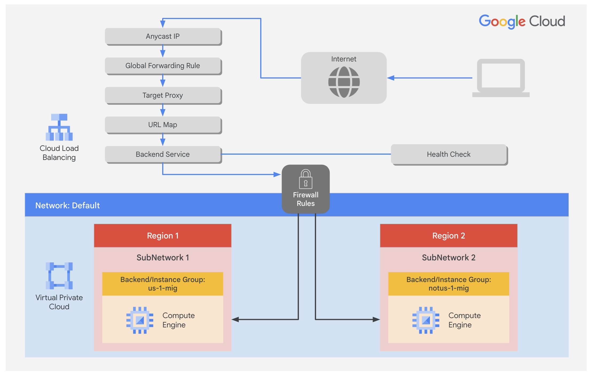

# 13. Configure an Application Load Balancer (HTTP) with Autoscaling (자동 확장을 지원하는 애플리케이션 부하 분산기(HTTP) 구성)

> [← 이전 실습](12.Configuring%20Google%20Cloud%20HA%20VPN_KR.md) · [📚 전체 목록](../README.md) · [다음 실습 →](14.Configure%20an%20Internal%20Network%20Load%20Balancer_KR.md)

## Overview (개요)

Application Load Balancing(HTTP/HTTPS)은 전 세계에 있는 Google 네트워크 엣지의 POP(Point of Presence)에 구현되어 있습니다. Application Load Balancer(HTTP/HTTPS)로 향하는 사용자 트래픽은 사용자와 가장 가까운 POP로 진입한 다음, Google의 글로벌 네트워크를 통해 충분한 가용 용량을 가진 가장 가까운 백엔드로 로드밸런싱됩니다.

이 실습에서는 아래 다이어그램과 같이 Application Load Balancer(HTTP)를 구성합니다. 그런 다음 부하 테스트(stress test)를 수행하여 글로벌 로드밸런싱과 자동 확장(autoscaling)을 시연합니다.


## Objectives (목표)

이 실습에서는 다음 작업을 수행하는 방법을 배웁니다.

- 상태 확인(health check) 방화벽 규칙을 생성합니다.
- Cloud Router를 사용하여 NAT 구성을 생성합니다.
- 웹 서버용 커스텀 이미지를 생성합니다.
- 커스텀 이미지를 기반으로 인스턴스 템플릿을 생성합니다.
- 관리형 인스턴스 그룹 2개를 생성합니다.
- IPv4와 IPv6를 지원하는 Application Load Balancer(HTTP)를 구성합니다.
- Application Load Balancer(HTTP)를 부하 테스트합니다.

---

---

## 🧩 Task 1. 상태 확인 방화벽 규칙 구성하기

이 작업에서는 인스턴스로 향하는 상태 확인(health check) 트래픽을 허용하는 방화벽 규칙을 구성합니다.

상태 확인은 Application Load Balancer(HTTP)의 어떤 인스턴스가 새 연결을 받을 수 있는지를 결정합니다. 로드밸런싱된 인스턴스로 향하는 상태 확인 프로브는 `130.211.0.0/22`와 `35.191.0.0/16` 범위의 주소에서 옵니다. 방화벽 규칙은 이러한 연결을 반드시 허용해야 합니다.

### 상태 확인 규칙 생성하기

상태 확인을 허용하는 방화벽 규칙을 생성합니다.

1. Google Cloud console에서 **Navigation menu(탐색 메뉴)**의 **VPC network(VPC 네트워크) > Firewall(방화벽)**을 클릭합니다.

   기존의 **ICMP**, **internal(내부)**, **RDP**, **SSH(SSH 접속)** 방화벽 규칙이 있는 것을 확인하세요.

   모든 Google Cloud 프로젝트는 **default(기본)** 네트워크와 이러한 방화벽 규칙들로 시작합니다.

2. **Create Firewall Rule(방화벽 규칙 만들기)**을 클릭합니다.
3. 다음과 같이 지정하고 나머지는 기본값으로 둡니다.

   | Property (속성) | Value (값) |
   |---|---|
   | Name (이름) | `fw-allow-health-checks` |
   | Network (네트워크) | `default` |
   | Targets (대상) | **Specified target tags (지정된 대상 태그)** |
   | Target tags (대상 태그) | `allow-health-checks` |
   | Source filter (소스 필터) | **IPv4 ranges (IPv4 범위)** |
   | Source IPv4 ranges (소스 IPv4 범위) | `130.211.0.0/22` 및 `35.191.0.0/16` |
   | Protocols and ports (프로토콜 및 포트) | **Specified protocols and ports (지정된 프로토콜 및 포트)** |

   > **💡 참고:** **Source IP ranges(소스 IP 범위)**에 `/22`와 `/16`을 반드시 포함해야 합니다.

4. **tcp**를 선택하고 포트 **80**을 지정합니다.
5. **Create(만들기)**를 클릭합니다.

**참고 (IAP SSH 접근):** Task 3에서 외부 IP가 없는(Private) VM에 브라우저 SSH로 연결하려면 Identity-Aware Proxy(IAP)를 통하게 됩니다. 만약 일반 GCP 프로젝트 환경에서 실습 중 SSH 접속 오류가 발생하면, IAP 대역(`35.235.240.0/20`, TCP:22)을 허용하는 방화벽 규칙(`allow-ssh-ingress-from-iap`)이 있는지 확인하세요.

---

---

## 🧩 Task 2. Cloud Router를 사용하여 NAT 구성하기

이 작업에서는 Cloud Router 인스턴스를 생성하고 Cloud NAT 게이트웨이를 구성하여 VM 인스턴스의 아웃바운드 인터넷 연결을 활성화합니다.

Task 3에서 설정할 Google Cloud VM 백엔드 인스턴스에는 외부 IP 주소가 구성되지 않습니다.

대신, Cloud NAT 서비스를 설정하여 이 VM 인스턴스들이 Cloud NAT를 통해서만 아웃바운드 트래픽을 보내고, 로드밸런서를 통해 인바운드 트래픽을 받도록 합니다.

### Cloud Router 인스턴스 생성하기

1. Google Cloud console 제목 표시줄 상단 검색창에 **Network services**를 입력한 다음, **Products & Pages(제품 및 페이지)** 섹션에서 **Network services(네트워크 서비스)**를 클릭합니다.
2. **Network services(네트워크 서비스)** 페이지에서 Network services 옆의 **Pin(고정)**을 클릭합니다.
3. **Cloud NAT(클라우드 NAT)**를 클릭합니다.
4. **Get started(시작하기)**를 클릭하여 NAT 게이트웨이를 구성합니다.
5. 다음과 같이 지정하고 나머지는 기본값으로 둡니다.

   | Property (속성) | Value (값) |
   |---|---|
   | Gateway name (게이트웨이 이름) | `nat-config` |
   | Network (네트워크) | `default` |
   | Region (리전) | `us-central1` (또는 지정된 Region 1) |

6. **Cloud Router(클라우드 라우터)** 드롭다운을 클릭하고 **Create new router(새 라우터 만들기)**를 선택합니다.
7. **Name(이름)**에 `nat-router-us1`을 입력합니다.
8. **Create(만들기)**를 클릭합니다.
9. **Create a NAT gateway(NAT 게이트웨이 만들기)** 화면에서 **Create(만들기)**를 클릭합니다.

> **💡 참고:** 다음 작업으로 넘어가기 전에 NAT Gateway의 **Status(상태)**가 **Running(실행 중)**으로 바뀔 때까지 기다리세요.

---

---

## 🧩 Task 3. 웹 서버용 커스텀 이미지 생성하기

이 작업에서는 로드밸런서의 백엔드로 사용할 커스텀 웹 서버 이미지를 생성합니다.

### VM 생성하기

1. Cloud console에서 **Navigation menu(탐색 메뉴)**의 **Compute Engine(컴퓨트 엔진) > VM instances(VM 인스턴스)**를 클릭합니다.
2. **Create Instance(인스턴스 만들기)**를 클릭합니다.
3. **Machine configuration(머신 구성)** 페이지에서 다음과 같이 지정하고 나머지는 기본값으로 둡니다.

   | Property (속성) | Value (값) |
   |---|---|
   | Name (이름) | `webserver` |
   | Region (리전) | `us-central1` (또는 지정된 Region 1) |
   | Zone (영역) | `us-central1-c` (또는 지정된 Zone 1) |

4. **OS and storage(OS 및 스토리지)**를 클릭합니다.

   **Change(변경)**를 클릭하여 부팅 디스크를 구성하고 다음 값을 선택합니다.

   - **Operating system(운영체제)**: Debian
   - **Version(버전)**: Debian GNU/Linux 12 (bookworm)
   - **Boot disk(부팅 디스크)**에서 **Show Advanced Configuration(고급 구성 표시)**을 클릭합니다.
   - **Deletion rule(삭제 규칙)**에서 **Keep boot disk(부팅 디스크 유지)**를 선택합니다.
   - **Select(선택)**를 클릭합니다.

5. **Networking(네트워킹)**을 클릭합니다.

   - **Network tags(네트워크 태그)**에 `allow-health-checks`를 입력합니다.
   - **Network interfaces(네트워크 인터페이스)**에서 **default**를 클릭합니다.
   - **External IPv4 address(외부 IPv4 주소)** 드롭다운에서 **None(없음)**을 선택합니다.
   - **Done(완료)**을 클릭합니다.

6. **Create(만들기)**를 클릭합니다.

> **💡 참고:** VM 생성 중 오류가 발생하면 **Details(세부정보)**를 클릭해 확인하세요. 대부분의 경우 다른 zone으로 다시 시도해야 합니다.

### VM 커스터마이징하기

1. **webserver**에서 **SSH(SSH 접속)**를 클릭하여 브라우저 터미널을 실행하고 접속합니다.
2. 메시지가 표시되면 SSH-in-browser가 VM에 연결하도록 허용하기 위해 **Authorize(승인)**를 클릭합니다.
3. Apache2를 설치하려면 다음 명령어를 실행합니다.

   ```bash
   sudo apt-get update
   sudo apt-get install -y apache2
   ```

4. Apache 서버를 시작하려면 다음 명령어를 실행합니다.

   ```bash
   sudo systemctl start apache2
   ```

5. Apache2 서버의 기본 페이지를 테스트하려면 다음 명령어를 실행합니다.

   ```bash
   curl localhost
   ```

   Apache2 서버의 기본 페이지가 표시되어야 합니다.

### Apache 서비스가 부팅 시 자동으로 시작되도록 설정하기

소프트웨어 설치는 성공적으로 완료되었습니다. 하지만 이 이미지를 사용해 새 VM을 생성하면, 새로 부팅된 VM에서는 Apache 웹 서버가 실행되고 있지 않습니다. 다음 명령어를 사용해 Apache 서비스가 부팅 시 자동으로 시작되도록 설정합니다. 그런 다음 정상적으로 동작하는지 테스트합니다.

1. webserver의 SSH 터미널에서 서비스가 부팅 시 시작되도록 설정합니다.

   ```bash
   sudo systemctl enable apache2
   ```

   *(참고: 기존 `sudo update-rc.d apache2 enable` 명령어도 호환됩니다.)*

2. Cloud console에서 **webserver**를 선택한 다음 **More actions(추가 작업 / 점 3개 아이콘)**를 클릭합니다.
3. **Reset(재설정)**을 클릭합니다.
4. 확인 대화상자에서 **Reset(재설정)**을 클릭합니다.

> **💡 참고:** **Reset(재설정)**은 머신을 중지했다가 재부팅합니다. 동일한 IP와 동일한 영구 부팅 디스크는 유지되지만 메모리는 초기화됩니다. 따라서 재설정 이후에도 Apache 서비스가 사용 가능하다면 부팅 시 자동 시작 설정이 성공적으로 적용된 것입니다.

5. VM에 SSH로 접속하여 다음 명령어를 입력해 서버를 확인합니다.

   ```bash
   sudo systemctl status apache2
   ```

   > **💡 참고:** **Connection via Cloud Identity-Aware Proxy Failed** 팝업이 표시되면 **Retry(재시도)**를 클릭하세요.

6. 결과에 **active (running)** 및 **Started The Apache HTTP Server**가 표시되어야 합니다.

### 커스텀 이미지 생성을 위해 디스크 준비하기

인스턴스를 삭제해도 부팅 디스크가 삭제되지 않는지 확인합니다.

1. **VM instances(VM 인스턴스)** 페이지에서 **webserver**를 클릭하여 VM 인스턴스 세부정보를 확인합니다.
2. **Storage(스토리지) > Boot disk(부팅 디스크)**에서 **When deleting instance(인스턴스 삭제 시)**가 **Keep disk(디스크 유지)**로 설정되어 있는지 확인합니다.
3. **VM instances(VM 인스턴스)** 페이지로 돌아가 **webserver**를 선택한 다음 **More actions(추가 작업)**를 클릭합니다.
4. **Delete(삭제)**를 클릭합니다.
5. 확인 대화상자에서 **Delete(삭제)**를 클릭합니다.
6. 왼쪽 탐색 패널에서 **Disks(디스크)**를 클릭하여 **webserver** 디스크가 보존되어 있는지 확인합니다.

### 커스텀 이미지 생성하기

1. 왼쪽 탐색 패널에서 **Images(이미지)**를 클릭합니다.
2. **Create image(이미지 만들기)**를 클릭합니다.
3. 다음과 같이 지정하고 나머지는 기본값으로 둡니다.

   | Property (속성) | Value (값) |
   |---|---|
   | Name (이름) | `mywebserver` |
   | Source (소스) | **Disk (디스크)** |
   | Source disk (소스 디스크) | `webserver` |

4. **Create(만들기)**를 클릭합니다.

> **💡 참고:** 이제 여러 개의 동일한 웹 서버를 시작할 수 있는 커스텀 이미지가 생성되었습니다. 이 시점에서 **webserver** 디스크는 삭제해도 됩니다.

다음 단계에서는 이 이미지를 사용하여 관리형 인스턴스 그룹에 사용할 인스턴스 템플릿을 정의합니다.

---

---

## 🧩 Task 4. 인스턴스 템플릿 구성 및 인스턴스 그룹 생성하기

이 작업에서는 인스턴스 템플릿을 구성하고 로드밸런싱된 웹 서버를 위한 관리형 인스턴스 그룹을 생성합니다.

관리형 인스턴스 그룹은 인스턴스 템플릿을 사용하여 동일한 인스턴스들의 그룹을 생성합니다. 이를 사용해 Application Load Balancer(HTTP)의 백엔드를 생성합니다.

### 인스턴스 템플릿 구성하기

인스턴스 템플릿은 VM 인스턴스와 관리형 인스턴스 그룹을 생성하는 데 사용할 수 있는 API 리소스입니다. 인스턴스 템플릿은 머신 유형, 부팅 디스크 이미지, 서브넷, 라벨 및 기타 인스턴스 속성을 정의합니다.

1. Cloud console에서 **Navigation menu(탐색 메뉴)**의 **Compute Engine(컴퓨트 엔진) > Instance templates(인스턴스 템플릿)**를 클릭합니다.
2. **Create Instance Template(인스턴스 템플릿 만들기)**을 클릭합니다.
3. **Name(이름)**에 `mywebserver-template`을 입력합니다.
4. **Location(위치)**에서 **Global(전역)**을 선택합니다.
5. **Series(시리즈)**에서 **E2**를 선택합니다.
6. **Machine type(머신 유형) > Shared-core(공유 코어)**에서 **e2-micro (2 vCPU, 1 GB memory)**를 선택합니다.
7. **Boot disk(부팅 디스크)**에서 **Change(변경)**를 클릭합니다.
8. **Custom images(커스텀 이미지)**를 클릭합니다.
9. **Image(이미지)**에서 **mywebserver**를 선택합니다.
10. **Select(선택)**를 클릭합니다.
11. **Advanced options(고급 옵션)**를 클릭합니다.
12. **Networking(네트워킹)**을 클릭합니다.

    - **Network tags(네트워크 태그)**에 `allow-health-checks`를 입력합니다.
    - **Network interfaces(네트워크 인터페이스)**에서 **default**를 클릭합니다.
    - **External IPv4 address(외부 IPv4 주소)** 드롭다운에서 **None(없음)**을 선택합니다.
    - **Done(완료)**을 클릭합니다.

13. **Create(만들기)**를 클릭합니다.

### 관리형 인스턴스 그룹용 상태 확인 생성하기

1. **Navigation menu(탐색 메뉴)**에서 **Compute Engine(컴퓨트 엔진) > Health checks(상태 확인)**를 클릭합니다.
2. **Create health check(상태 확인 만들기)**를 클릭합니다.
3. 다음과 같이 지정하고 나머지는 기본값으로 둡니다.

   | Property (속성) | Value (값) |
   |---|---|
   | Name (이름) | `http-health-check` |
   | Protocol (프로토콜) | **TCP** |
   | Port (포트) | `80` |

4. **Create(만들기)**를 클릭합니다.

관리형 인스턴스 그룹의 상태 확인은 비정상 상태가 된 인스턴스를 사전에 감지하여 삭제하고 다시 생성하도록 신호를 보냅니다.

### 관리형 인스턴스 그룹 생성하기

Region 1(`us-central1`)에 관리형 인스턴스 그룹 하나, Region 2(`europe-west1`)에 하나를 생성합니다.

1. **Navigation menu(탐색 메뉴)**에서 **Compute Engine(컴퓨트 엔진) > Instance groups(인스턴스 그룹)**를 클릭합니다.
2. **Create Instance Group(인스턴스 그룹 만들기)**을 클릭합니다.
3. 다음과 같이 지정하고 나머지는 기본값으로 둡니다.

   | Property (속성) | Value (값) |
   |---|---|
   | Name (이름) | `us-1-mig` |
   | Instance template (인스턴스 템플릿) | `mywebserver-template` |
   | Location (위치) | **Multiple zones (여러 영역 / 멀티존)** |
   | Region (리전) | `us-central1` (또는 지정된 Region 1) |

4. **Autoscaling(자동 확장)**에서 최소 인스턴스 수(Minimum number of instances)를 `1`, 최대 인스턴스 수(Maximum number of instances)를 `2`로 입력합니다.
5. **Autoscaling signals(자동 확장 신호)**에서 **CPU utilization(CPU 사용률)**을 클릭합니다.
6. **Signal type(신호 유형)**에서 **HTTP load balancing utilization(HTTP 부하 분산 사용률)**을 선택합니다.
7. **Target HTTP load balancing utilization(목표 HTTP 부하 분산 사용률)**을 `80`으로 입력합니다.
8. **Done(완료)**을 클릭합니다.
9. **Initialization period(초기화 기간)**를 `60`초로 설정합니다.

> **💡 참고:** 관리형 인스턴스 그룹은 부하의 증가나 감소에 따라 인스턴스를 자동으로 추가하거나 제거할 수 있는 **autoscaling(자동 확장)** 기능을 제공합니다.

자동 확장은 트래픽 증가에도 애플리케이션이 원활하게 대응하도록 돕고, 필요한 리소스가 줄어들 때는 비용을 절감해줍니다. 자동 확장 정책만 정의하면, 오토스케일러가 측정된 부하를 기반으로 자동으로 확장/축소를 수행합니다.

10. **Autohealing(자동 복구)**에서 **Health check(상태 확인)** 유형으로 `http-health-check`를 지정합니다.
11. **http-health-check (TCP)**를 선택합니다.
12. **Initial delay(초기 지연 시간)**에 `60`을 입력합니다.

    이는 인스턴스 그룹이 VM의 부팅 초기화 이후 상태 확인을 시도하기까지 대기하는 시간입니다. 실습 중에 5분씩 기다릴 필요가 없도록 1분으로 설정합니다.

13. **Create(만들기)**를 클릭합니다.
14. 대화상자에서 **Confirm(확인)**을 클릭합니다.

> **💡 참고:** Region 2(`europe-west1`)에서 **notus-1-mig**에 대해 동일한 절차를 반복하기 전에, 인스턴스 그룹이 생성될 때까지 몇 분 정도 기다리세요.

**Status(상태)**가 **Transforming(변환 중)** 또는 **Running(실행 중)**으로 바뀔 때까지 **Refresh(새로고침)**를 클릭하세요.

> **💡 참고:** 경고 창이 나타나거나, 생성 후 인스턴스 그룹 왼쪽에 **There is no backend service attached to the instance group**이라는 빨간 느낌표가 표시되어도 무시하세요. 이 실습의 다음 부분에서 백엔드 서비스와 함께 로드밸런서를 구성할 것입니다.

15. **Create Instance Group(인스턴스 그룹 만들기)**을 클릭합니다.
16. 다음과 같이 지정하고 나머지는 기본값으로 둡니다.

    | Property (속성) | Value (값) |
    |---|---|
    | Name (이름) | `notus-1-mig` |
    | Instance template (인스턴스 템플릿) | `mywebserver-template` |
    | Location (위치) | **Multiple zones (여러 영역 / 멀티존)** |
    | Region (리전) | `europe-west1` (또는 지정된 Region 2) |
    | Autoscaling > Minimum number of instances | `1` |
    | Autoscaling > Maximum number of instances | `2` |
    | Autoscaling signals > Signal Type | **HTTP load balancing utilization (HTTP 부하 분산 사용률)** |
    | Target HTTP load balancing utilization | `80` |
    | Initialization period (초기화 기간) | `60` |

17. **Autohealing > Health check(상태 확인)**에서 **http-health-check (TCP)**를 선택합니다.
18. **Initial delay(초기 지연 시간)**에 `60`을 입력합니다.
19. **Create(만들기)**를 클릭합니다.
20. 대화상자에서 **Confirm(확인)**을 클릭합니다.

### 백엔드 확인하기

두 리전 모두에서 VM 인스턴스가 생성되고 있는지 확인합니다.

- **Navigation menu(탐색 메뉴)**에서 **Compute Engine(컴퓨트 엔진) > VM instances(VM 인스턴스)**를 클릭합니다.

**us-1-mig**와 **notus-1-mig**로 시작하는 인스턴스들을 확인하세요. 이 인스턴스들은 관리형 인스턴스 그룹에 의해 자동으로 배포된 것입니다.

---

---

## 🧩 Task 5. Application Load Balancer(HTTP) 구성하기

이 작업에서는 아래 네트워크 다이어그램과 같이 두 백엔드(Region 1의 **us-1-mig**와 Region 2의 **notus-1-mig**) 사이에 트래픽을 분산하도록 Application Load Balancer(HTTP)를 구성합니다.



### 구성 시작하기

1. **Navigation menu(탐색 메뉴)**에서 **Network services(네트워크 서비스) > Load balancing(부하 분산)**을 클릭합니다.
2. **Create Load Balancer(부하 분산기 만들기)**를 클릭합니다.
3. **Type of load balancer(부하 분산기 유형)**에서 **Application Load Balancer (HTTP/HTTPS)(애플리케이션 부하 분산기)**를 선택하고 **Next(다음)**를 클릭합니다.
4. **Public facing or internal(공개 또는 내부)**에서 **Public facing (external)(공개(외부))**을 선택하고 **Next(다음)**를 클릭합니다.
5. **Global or single region deployment(전역 또는 단일 리전 배포)**에서 **Best for global workloads(글로벌 워크로드에 가장 적합)**를 선택하고 **Next(다음)**를 클릭합니다.
6. **Load balancer generation(부하 분산기 세대)**에서 **Global external Application Load Balancer(글로벌 외부 애플리케이션 부하 분산기)**를 선택하고 **Next(다음)**를 클릭합니다.
7. **Create load balancer(부하 분산기 만들기)** 화면에서 **Configure(구성)**를 클릭합니다.
8. **Load Balancer Name(부하 분산기 이름)**에 `http-lb`를 입력합니다.

### 프런트엔드 구성하기

호스트 및 경로 규칙(host and path rules)은 트래픽이 어떻게 전달될지를 결정합니다. 예를 들어, 동영상 트래픽은 한 백엔드로, 정적 트래픽은 다른 백엔드로 전달할 수 있습니다. 다만 이 실습에서는 호스트 및 경로 규칙을 구성하지 않습니다.

1. **Frontend configuration(프런트엔드 구성)**을 클릭합니다.
2. 다음과 같이 지정하고 나머지는 기본값으로 둡니다.

   | Property (속성) | Value (값) |
   |---|---|
   | Protocol (프로토콜) | **HTTP** |
   | IP version (IP 버전) | **IPv4** |
   | IP address (IP 주소) | **Ephemeral (임시)** |
   | Port (포트) | `80` |

3. **Done(완료)**을 클릭합니다.
4. **Add Frontend IP and Port(프런트엔드 IP 및 포트 추가)**를 클릭합니다.
5. 다음과 같이 지정하고 나머지는 기본값으로 둡니다.

   | Property (속성) | Value (값) |
   |---|---|
   | Protocol (프로토콜) | **HTTP** |
   | IP version (IP 버전) | **IPv6** |
   | IP address (IP 주소) | **Auto-allocate (자동 할당)** |
   | Port (포트) | `80` |

6. **Done(완료)**을 클릭합니다.

Application Load Balancing(HTTP/HTTPS)은 클라이언트 트래픽에 대해 IPv4와 IPv6 주소를 모두 지원합니다. 클라이언트의 IPv6 요청은 글로벌 로드밸런싱 레이어에서 종료(terminate)된 다음, IPv4를 통해 백엔드로 프록시됩니다.

### 백엔드 구성하기

백엔드 서비스는 들어오는 트래픽을 하나 이상의 연결된 백엔드로 전달합니다. 각 백엔드는 인스턴스 그룹과 추가적인 서빙 용량 메타데이터로 구성됩니다.

1. **Backend configuration(백엔드 구성)**을 클릭합니다.
2. **Backend services & backend buckets(백엔드 서비스 및 백엔드 버킷) > Create a Backend Service(백엔드 서비스 만들기)**를 클릭합니다.
3. 다음과 같이 지정하고 나머지는 기본값으로 둡니다.

   | Property (속성) | Value (값) |
   |---|---|
   | Name (이름) | `http-backend` |
   | Backend type (백엔드 유형) | **Instance group (인스턴스 그룹)** |
   | Instance group (인스턴스 그룹) | `us-1-mig` |
   | Port numbers (포트 번호) | `80` |
   | Balancing mode (분산 모드) | **Rate (요청 비율 / 초당 요청 수)** |
   | Maximum RPS (최대 RPS) | `50` |
   | Capacity (용량) | `100` |

   > **💡 참고:** 이 구성은 로드밸런서가 **us-1-mig**의 각 인스턴스를 초당 요청 수(RPS) 50 이하로 유지하려고 시도한다는 의미입니다.

4. **Done(완료)**을 클릭합니다.
5. **Add a Backend(백엔드 추가)**를 클릭합니다.
6. 다음과 같이 지정하고 나머지는 기본값으로 둡니다.

   | Property (속성) | Value (값) |
   |---|---|
   | Instance group (인스턴스 그룹) | `notus-1-mig` |
   | Port numbers (포트 번호) | `80` |
   | Balancing mode (분산 모드) | **Utilization (사용률)** |
   | Maximum backend utilization (최대 백엔드 사용률) | `80` |
   | Capacity (용량) | `100` |

   > **💡 참고:** 이 구성은 로드밸런서가 **notus-1-mig**의 각 인스턴스를 CPU 사용률 80% 이하로 유지하려고 시도한다는 의미입니다.

7. **Done(완료)**을 클릭합니다.
8. **Health Check(상태 확인)**에서 **http-health-check**를 선택합니다.
9. **Enable logging(로깅 사용 설정)** 체크박스를 클릭합니다.
10. **Sample rate(샘플링 비율)**를 `1`로 지정합니다.
11. **Create(만들기)**를 클릭합니다.
12. **OK(확인)**를 클릭합니다.

### HTTP 로드밸런서 검토 및 생성하기

1. **Review and finalize(검토 및 완료)**를 클릭합니다.
2. **Backend services(백엔드 서비스)**와 **Frontend(프런트엔드)**를 검토합니다.
3. **Create(만들기)**를 클릭합니다.

   로드밸런서가 생성될 때까지 기다립니다.

4. 로드밸런서의 이름(**http-lb**)을 클릭합니다.
5. 다음 작업에서 사용할 로드밸런서의 IPv4 및 IPv6 주소를 확인해 둡니다. 이 주소들은 각각 `[LB_IP_v4]`와 `[LB_IP_v6]`로 표기됩니다.

> **💡 참고:** IPv6 주소는 16진수 형식으로 표시된 것입니다.

---

---

## 🧩 Task 6. Application Load Balancer(HTTP) 부하 테스트하기

이 작업에서는 트래픽이 백엔드 서비스로 정상적으로 전달되는지 확인하기 위해 Application Load Balancer(HTTP)에 부하 테스트를 수행합니다.

> Application Load Balancer(HTTP)는 사용자와 가장 가까운 리전으로 트래픽을 전달해야 한다.
> - **True(참)**
> - False(거짓)

### Application Load Balancer(HTTP)에 접근하기

1. Google Cloud console 제목 표시줄 상단에서 **Activate Cloud Shell(Cloud Shell 활성화)** 아이콘을 클릭합니다.
2. 메시지가 표시되면 **Continue(계속)**를 클릭합니다.
3. 로드밸런서의 상태를 확인하려면 다음 명령어를 실행합니다. `[LB_IP_v4]`는 로드밸런서의 IPv4 주소로 바꿔서 입력합니다.

   ```bash
   LB_IP=[LB_IP_v4]
   while [ -z "$RESULT" ] ;
   do
     echo "Waiting for Load Balancer";
     sleep 5;
     RESULT=$(curl -m1 -s $LB_IP | grep Apache);
   done
   ```

   > **💡 참고:** 로드밸런서가 준비되면 명령어가 종료됩니다.

4. 브라우저에서 새 탭을 열고 `http://[LB_IP_v4]`로 이동합니다. `[LB_IP_v4]`는 로드밸런서의 IPv4 주소로 바꿔서 입력해야 합니다.

### Application Load Balancer(HTTP) 부하 테스트하기

Application Load Balancer(HTTP)에 부하를 시뮬레이션할 새 VM을 생성합니다. 그런 다음 부하가 높을 때 두 백엔드 사이에 트래픽이 분산되는지 확인합니다.

1. Cloud console에서 **Navigation menu(탐색 메뉴)**의 **Compute Engine(컴퓨트 엔진) > VM instances(VM 인스턴스)**를 클릭합니다.
2. **Create instance(인스턴스 만들기)**를 클릭합니다.
3. **Machine configuration(머신 구성)** 페이지에서 다음과 같이 지정하고 나머지는 기본값으로 둡니다.

   | Property (속성) | Value (값) |
   |---|---|
   | Name (이름) | `stress-test` |
   | Region (리전) | `us-west1` (또는 지정된 Region 3 / `us-east1`) |
   | Zone (영역) | `us-west1-b` (또는 지정된 Zone 3) |
   | Series (시리즈) | **E2** |
   | Machine Type (머신 유형) | **e2-micro (2 vCPU, 1 GB memory)** |

   > **💡 참고:** Region 3(`us-west1` 등)은 Region 2(`europe-west1`)보다 Region 1(`us-central1`)에 네트워크 지연 시간(RTT) 측면에서 훨씬 더 가깝기 때문에, (부하가 초당 요청 수 50 RPS를 초과하지 않는 한) 초기 트래픽은 **us-1-mig**로만 전달되어야 합니다.

4. **OS and storage(OS 및 스토리지)**를 클릭합니다.

   - **Boot Disk(부팅 디스크)**에서 **Change(변경)**를 클릭합니다.
   - **Custom images(커스텀 이미지)**를 클릭합니다.
   - **Image(이미지)**에서 **mywebserver**를 선택합니다.
   - **Select(선택)**를 클릭합니다.

5. **Create(만들기)**를 클릭합니다.

   **stress-test** 인스턴스가 생성될 때까지 기다립니다.

6. **stress-test**에서 **SSH(SSH 접속)**를 클릭하여 브라우저 터미널을 실행하고 접속합니다.
7. 메시지가 표시되면 SSH-in-browser가 VM에 연결하도록 허용하기 위해 **Authorize(승인)**를 클릭합니다.
8. 로드밸런서 IP 주소에 대한 환경 변수를 생성하려면 다음 명령어를 실행합니다.

   ```bash
   export LB_IP=<여기에 [LB_IP_v4] 입력>
   ```

9. `echo`로 값을 확인합니다.

   ```bash
   echo $LB_IP
   ```

10. 로드밸런서에 부하를 가하려면 다음 명령어를 실행합니다.

    ```text
    ab -n 50000 -c 200 http://$LB_IP/
    ```

    > **💡 참고:** `mywebserver` 커스텀 이미지를 사용했으므로 `ab`(Apache Benchmark) 명령어가 기본 내장되어 있습니다. 만약 기본 OS 이미지로 VM을 생성하여 `ab: command not found`가 발생할 경우 `sudo apt-get update && sudo apt-get install -y apache2-utils`를 실행하세요. 시간 초과(time-out) 오류가 발생하면 위 `ab` 명령어를 다시 실행하세요.

11. Cloud console에서 **Navigation menu(탐색 메뉴)**의 **Network services(네트워크 서비스) > Load balancing(부하 분산)**을 클릭합니다.
12. **http-lb**를 클릭합니다.
13. **Monitoring(모니터링)**을 클릭합니다.
14. 북아메리카와 두 백엔드 사이의 **Frontend Location (Total inbound traffic)(프런트엔드 위치 - 총 인바운드 트래픽)**을 몇 분 동안 모니터링합니다.

    > **💡 참고:** 처음에는 트래픽이 **us-1-mig**로만 전달되지만, RPS가 증가함에 따라 **notus-1-mig**로도 트래픽이 전달됩니다. 이는 기본적으로 트래픽이 가장 가까운 백엔드로 전달되지만, 부하가 매우 높을 경우에는 백엔드들 사이에 트래픽이 분산될 수 있다는 것을 보여줍니다.

15. Cloud console에서 **Navigation menu(탐색 메뉴)**의 **Compute Engine(컴퓨트 엔진) > Instance groups(인스턴스 그룹)**를 클릭합니다.
16. **us-1-mig**를 클릭하여 인스턴스 그룹 페이지를 엽니다.
17. **Monitoring(모니터링)**을 클릭하여 인스턴스 수와 LB 용량을 모니터링합니다.
18. **notus-1-mig** 인스턴스 그룹에 대해서도 동일하게 반복합니다.

> **💡 참고:** 부하 수준에 따라 백엔드가 부하를 감당하기 위해 확장(스케일 아웃)되는 것을 확인할 수 있습니다.

---

---

## 🧩 Task 7. Review (검토)

이 실습에서는 Region 1과 Region 2에 백엔드를 둔 Application Load Balancer(HTTP)를 구성했습니다. 그런 다음 VM을 사용해 Application Load Balancer에 부하 테스트를 수행하여 글로벌 로드밸런싱과 자동 확장을 시연했습니다.

---

## End your lab (실습 종료)

---

> [← 이전 실습](12.Configuring%20Google%20Cloud%20HA%20VPN_KR.md) · [📚 전체 목록](../README.md) · [다음 실습 →](14.Configure%20an%20Internal%20Network%20Load%20Balancer_KR.md)
