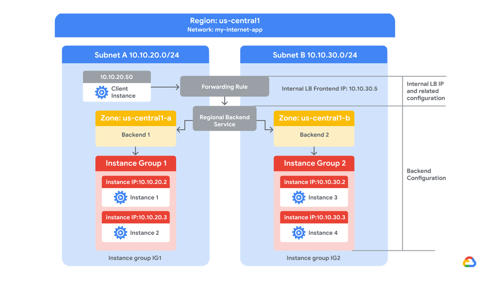

# 14. Configure an Internal Network Load Balancer

> [← 이전 실습](13.Configure%20an%20Application%20Load%20Balancer%20(HTTP)%20with%20Autoscaling_KR.md) · [📚 전체 목록](../README.md) · [다음 실습 →](15.Automating%20the%20Deployment%20of%20Infrastructure%20Using%20Terraform_KR.md)

## Overview (개요)

Google Cloud는 TCP/UDP 기반 트래픽을 위한 Internal Network Load Balancing(내부 네트워크 로드밸런싱)을 제공합니다. Internal Network Load Balancing을 사용하면 내부 가상 머신 인스턴스에서만 액세스할 수 있는 프라이빗 로드밸런싱 IP 주소 뒤에서 서비스를 실행하고 확장할 수 있습니다.

이 실습에서는 동일한 리전에 관리형 인스턴스 그룹 2개를 생성합니다. 그런 다음 아래 네트워크 다이어그램과 같이 이 인스턴스 그룹들을 백엔드로 하는 Internal Network Load Balancer를 구성하고 테스트합니다.



## Objectives (목표)

이 실습에서는 다음 작업을 수행하는 방법을 배웁니다.

- 내부 트래픽 및 상태 확인(health check) 방화벽 규칙을 생성합니다.
- Cloud Router를 사용하여 NAT 구성을 생성합니다.
- 인스턴스 템플릿 2개를 구성합니다.
- 관리형 인스턴스 그룹 2개를 생성합니다.
- Internal Network Load Balancer를 구성하고 테스트합니다.

---

---

## 🧩 Task 1. my-internal-app VPC 네트워크 및 방화벽 규칙 구성하기 (CLI)

이 작업에서는 내부 로드밸런서 실습을 위한 커스텀 VPC 네트워크(`my-internal-app`)와 2개의 서브넷(`subnet-a`, `subnet-b`), 그리고 필수 방화벽 규칙 4종을 Cloud Shell에서 `gcloud` CLI를 사용하여 직접 생성합니다.

### 1. VPC 네트워크 및 서브넷 생성하기 (gcloud CLI)

1. Google Cloud console 제목 표시줄 상단에서 **Activate Cloud Shell**(Cloud Shell 활성화) 아이콘을 클릭합니다.
2. 메시지가 표시되면 **Continue**(계속)를 클릭합니다.
3. 커스텀 서브넷 모드의 VPC 네트워크 `my-internal-app`을 생성합니다.

```bash
gcloud compute networks create my-internal-app --subnet-mode=custom
```

4. `us-central1` 리전에 2개의 서브넷(`subnet-a`, `subnet-b`)을 생성합니다.

```bash
# subnet-a 생성 (10.10.20.0/24)
gcloud compute networks subnets create subnet-a \
    --network=my-internal-app \
    --region=us-central1 \
    --range=10.10.20.0/24

# subnet-b 생성 (10.10.30.0/24)
gcloud compute networks subnets create subnet-b \
    --network=my-internal-app \
    --region=us-central1 \
    --range=10.10.30.0/24
```

### 2. 방화벽 규칙 4종 생성하기 (gcloud CLI)

인스턴스에 대한 Ping 테스트, 브라우저 SSH 관리, 내부 서브넷 통신 및 로드밸런서 상태 확인(Health Check) 프로브를 허용하는 방화벽 규칙을 생성합니다.

1. **ICMP (Ping) 허용 규칙 생성 (`app-allow-icmp`)**:

```bash
gcloud compute firewall-rules create app-allow-icmp \
    --network=my-internal-app \
    --action=ALLOW \
    --direction=INGRESS \
    --rules=icmp \
    --source-ranges=0.0.0.0/0
```

2. **SSH 및 RDP 관리 트래픽 허용 규칙 생성 (`app-allow-ssh-rdp`)**:

```bash
gcloud compute firewall-rules create app-allow-ssh-rdp \
    --network=my-internal-app \
    --action=ALLOW \
    --direction=INGRESS \
    --rules=tcp:22,tcp:3389 \
    --source-ranges=0.0.0.0/0
```

3. **내부 트래픽 접근 허용 규칙 생성 (`fw-allow-lb-access`)**:
   `10.10.0.0/16` 서브넷 대역에서 `backend-service` 대상 태그를 가진 백엔드 인스턴스로의 트래픽을 허용합니다.

```bash
gcloud compute firewall-rules create fw-allow-lb-access \
    --network=my-internal-app \
    --action=ALLOW \
    --direction=INGRESS \
    --rules=all \
    --source-ranges=10.10.0.0/16 \
    --target-tags=backend-service
```

4. **상태 확인 프로브 허용 규칙 생성 (`app-allow-health-checks`)**:
   Google Cloud 로드밸런서의 상태 확인 프로브 대역(`130.211.0.0/22`, `35.191.0.0/16`)에서 `backend-service` 대상 태그를 가진 VM의 80 포트로의 접근을 허용합니다.

```bash
gcloud compute firewall-rules create app-allow-health-checks \
    --network=my-internal-app \
    --action=ALLOW \
    --direction=INGRESS \
    --rules=tcp:80 \
    --source-ranges=130.211.0.0/22,35.191.0.0/16 \
    --target-tags=backend-service
```

**참고 (IAP SSH 접근):** Task 3에서 외부 IP가 없는(Private) VM에 브라우저 SSH로 연결하려면 Identity-Aware Proxy(IAP)를 통하게 됩니다. `app-allow-ssh-rdp` 규칙에서 `0.0.0.0/0`을 허용했으므로 IAP 대역(`35.235.240.0/20`, TCP:22)도 자동으로 포함되어 정상 접속됩니다.

---

---

## 🧩 Task 2. Cloud Router를 사용하여 NAT 구성하기

이 작업에서는 Cloud Router 인스턴스를 생성하고 Cloud NAT를 구성하여 백엔드 인스턴스가 아웃바운드 트래픽을 보낼 수 있도록 합니다.

Task 3에서 설정할 Google Cloud VM 백엔드 인스턴스에는 외부 IP 주소가 구성되지 않습니다.

대신, Cloud NAT 서비스를 설정하여 이 VM 인스턴스들이 Cloud NAT를 통해서만 아웃바운드 트래픽을 보내고, 로드밸런서를 통해 인바운드 트래픽을 받도록 합니다.

### Cloud Router 인스턴스 생성하기

1. Google Cloud console 제목 표시줄에서 검색 필드에 **Network services**를 입력한 다음, **Products & Pages**(제품 및 페이지) 섹션에서 **Network services**(네트워크 서비스)를 클릭합니다.
2. **Network services** 페이지에서 Network services 옆의 **Pin**(고정) 아이콘을 클릭합니다.
3. **Cloud NAT**를 클릭합니다.
4. **Get started**(시작하기)를 클릭하여 NAT 게이트웨이를 구성합니다.
5. 다음과 같이 지정하고 나머지는 기본값으로 둡니다.

   | Property (속성) | Value (값) |
   |---|---|
   | Gateway name | `nat-config` |
   | Network | my-internal-app |
   | Region | `us-central1` (또는 지정된 리전) |

6. **Cloud Router**(Cloud 라우터)를 클릭하고 **Create new router**(새 라우터 만들기)를 선택합니다.
7. **Name(이름)**에 `nat-router-us-central1`을 입력합니다.
8. **Create**(만들기)를 클릭합니다.
9. **Create Cloud NAT gateway**(Cloud NAT 게이트웨이 만들기)에서 **Create**(만들기)를 클릭합니다.

> **💡 참고:** 다음 작업으로 넘어가기 전에 NAT Gateway의 **Status**(상태)가 **Running**(실행 중)으로 바뀔 때까지 기다리세요.

---

---

## 🧩 Task 3. 인스턴스 템플릿 구성 및 인스턴스 그룹 생성하기 (CLI)

이 작업에서는 Cloud Shell에서 `gcloud` CLI를 사용하여 웹 서버용 시작(startup) 스크립트가 포함된 인스턴스 템플릿 2개와 관리형 인스턴스 그룹 2개를 직접 생성합니다. 그런 다음 백엔드 인스턴스로의 연결성을 테스트할 유틸리티 VM(`utility-vm`)을 생성하고 테스트합니다.

### 1. Cloud Shell 열기 및 시작 스크립트 준비

1. Google Cloud console 제목 표시줄 상단에서 **Activate Cloud Shell**(Cloud Shell 활성화) 아이콘을 클릭합니다.
2. 메시지가 표시되면 **Continue**(계속)를 클릭합니다.
3. 웹 서버 설치 및 테스트 웹 페이지를 생성하는 시작 스크립트 파일(`startup.sh`)을 생성합니다.

```bash
cat << 'EOF' > startup.sh
#! /bin/bash
apt-get update
apt-get install -y apache2
cat << 'PAGE' > /var/www/html/index.html
<h1>Internal Load Balancing Lab</h1>
<h2>Client IP</h2>Your IP address : $(curl -s http://metadata.google.internal/computeMetadata/v1/instance/network-interfaces/0/ip -H "Metadata-Flavor: Google")
<h2>Hostname</h2>Server Hostname: $(hostname)
<h2>Server Location</h2>Region and Zone: $(curl -s http://metadata.google.internal/computeMetadata/v1/instance/zone -H "Metadata-Flavor: Google" | cut -d/ -f4)
PAGE
systemctl enable apache2
systemctl restart apache2
EOF
```

### 2. 인스턴스 템플릿 생성하기 (gcloud CLI)

각 서브넷(`subnet-a`, `subnet-b`)에 배치될 인스턴스 템플릿 2개를 생성합니다.

1. **subnet-a**용 인스턴스 템플릿(`instance-template-1`)을 생성합니다.

```bash
gcloud compute instance-templates create instance-template-1 \
    --region=us-central1 \
    --machine-type=e2-micro \
    --network=my-internal-app \
    --subnet=subnet-a \
    --tags=backend-service \
    --no-address \
    --image-family=debian-12 \
    --image-project=debian-cloud \
    --metadata-from-file=startup-script=startup.sh
```

2. **subnet-b**용 인스턴스 템플릿(`instance-template-2`)을 생성합니다.

```bash
gcloud compute instance-templates create instance-template-2 \
    --region=us-central1 \
    --machine-type=e2-micro \
    --network=my-internal-app \
    --subnet=subnet-b \
    --tags=backend-service \
    --no-address \
    --image-family=debian-12 \
    --image-project=debian-cloud \
    --metadata-from-file=startup-script=startup.sh
```

### 3. 관리형 인스턴스 그룹 생성하기 (gcloud CLI)

각 존(`us-central1-a`, `us-central1-b`)에 관리형 인스턴스 그룹 2개를 생성합니다.

1. `us-central1-a` 영역에 **instance-group-1**을 생성합니다.

```bash
gcloud compute instance-groups managed create instance-group-1 \
    --zone=us-central1-a \
    --template=instance-template-1 \
    --size=1
```

2. `us-central1-b` 영역에 **instance-group-2**를 생성합니다.

```bash
gcloud compute instance-groups managed create instance-group-2 \
    --zone=us-central1-b \
    --template=instance-template-2 \
    --size=1
```

인스턴스들이 프로비저닝되고 시작 스크립트가 실행되는 데 약 1~2분이 소요됩니다.

### 백엔드 확인 및 utility-vm 생성하기

두 서브넷 모두에서 VM 인스턴스가 생성되고 있는지 확인하고, 백엔드의 HTTP 사이트에 접근할 유틸리티 VM을 생성합니다.

1. **Navigation menu**(탐색 메뉴)에서 **Compute Engine(컴퓨트 엔진) > VM instances**(VM 인스턴스)를 클릭합니다.

   **instance-group-1**과 **instance-group-2**로 시작하는 인스턴스들을 확인하세요.

   이 인스턴스들은 서로 다른 존에 있으며, 내부 IP 주소는 각각 **subnet-a**(`10.10.20.x`)와 **subnet-b**(`10.10.30.x`)의 CIDR 블록에 속합니다.

2. **Create Instance**(인스턴스 만들기)를 클릭합니다.
3. **Machine configuration**(머신 구성) 페이지에서 다음과 같이 지정하고 나머지는 기본값으로 둡니다.

   | Property (속성) | Value (값) |
   |---|---|
   | Name | `utility-vm` |
   | Region | `us-central1` (또는 지정된 리전) |
   | Zone | `us-central1-f` (또는 지정된 Zone 3) |
   | Series | E2 |
   | Machine type | e2-micro (2 vCPU, 1 GB memory) 또는 e2-medium (2 vCPU, 4 GB memory) |

4. **OS and storage**(OS 및 스토리지)를 클릭합니다.
5. **Image**(이미지)가 **Debian GNU/Linux 12 (bookworm)**이 아니라면, **Change**(변경)를 클릭하여 **Debian GNU/Linux 12 (bookworm)**을 선택한 다음 **Select**(선택)를 클릭합니다.
6. **Networking**(네트워킹)을 클릭합니다.
7. **Network interfaces**(네트워크 인터페이스)에서 **default** 드롭다운을 클릭해 네트워크 인터페이스를 편집합니다.
8. 다음과 같이 지정하고 나머지는 기본값으로 둡니다.

   | Property (속성) | Value (값) |
   |---|---|
   | Network | `my-internal-app` |
   | Subnetwork | `subnet-a` |
   | Primary internal IPv4 address | Ephemeral (Custom) |
   | Custom ephemeral IP address | `10.10.20.50` |
   | External IPv4 address | None |

9. **Done**(완료)을 클릭합니다.
10. **Create**(만들기)를 클릭합니다.
11. 백엔드의 내부 IP 주소가 `10.10.20.2`와 `10.10.30.2`인 것을 확인해 둡니다.

    > **💡 참고:** 이 IP 주소가 다르다면, 아래의 두 `curl` 명령어에서 해당 값으로 바꿔서 사용하세요.

12. **utility-vm** 행에서 **SSH(SSH 접속)**를 클릭하여 터미널을 실행하고 접속합니다.
13. 메시지가 표시되면 SSH-in-browser가 VM에 연결하도록 허용하기 위해 **Authorize**(승인)를 클릭합니다.
14. **instance-group-1-xxxx**의 시작 페이지를 확인하려면 다음 명령어를 실행합니다.

    ```bash
    curl 10.10.20.2
    ```

    출력은 다음과 비슷하게 나타납니다.

    ```html
    <h1>Internal Load Balancing Lab</h1><h2>Client IP</h2>Your IP address :
    10.10.20.50<h2>Hostname</h2>Server Hostname:
    instance-group-1-1zn8<h2>Server Location</h2>Region and Zone:
    ```

15. **instance-group-2-xxxx**의 시작 페이지를 확인하려면 다음 명령어를 실행합니다.

    ```bash
    curl 10.10.30.2
    ```

    출력은 다음과 비슷하게 나타납니다.

    ```html
    <h1>Internal Load Balancing Lab</h1><h2>Client IP</h2>Your IP address :
    10.10.20.50<h2>Hostname</h2>Server Hostname:
    instance-group-2-q5wp<h2>Server Location</h2>Region and Zone:
    ```

    > **💡 참고:** 이는 나중에 Internal Network Load Balancer가 두 백엔드 모두에 트래픽을 보내는지 확인할 때 유용합니다.

16. **utility-vm**의 SSH 터미널을 닫습니다.

    ```bash
    exit
    ```

---

---

## 🧩 Task 4. Internal Network Load Balancer 구성하기

이 작업에서는 아래 네트워크 다이어그램과 같이 두 백엔드(us-central1-a의 **instance-group-1**과 us-central1-b의 **instance-group-2**) 사이에 트래픽을 분산하도록 Internal Network Load Balancer를 구성합니다.


### 구성 시작하기

1. Google Cloud console에서 **Navigation menu**(탐색 메뉴)의 **Network Services > Load balancing**(네트워크 서비스 > 부하 분산)을 클릭합니다.
2. **Create Load Balancer**(부하 분산기 만들기)를 클릭합니다.
3. **Type of load balancer**(부하 분산기 유형)에서 **Network Load Balancer (TCP/UDP)**(또는 **Network Load Balancer (TCP/UDP/SSL)**)를 선택하고 **Next**(다음)를 클릭합니다.
4. **Proxy or passthrough**(프록시 또는 통과)에서 **Passthrough load balancer**(통과 부하 분산기)를 선택하고 **Next**(다음)를 클릭합니다.
5. **Public facing or internal**(공개 또는 내부)에서 **Internal**(내부)을 선택하고 **Next**(다음)를 클릭합니다.
6. **Create load balancer**에서 **Configure**(구성)를 클릭합니다.
7. **Load Balancer name**에 `my-ilb`를 입력합니다.
8. **Region(리전)**에서 **us-central1**(또는 지정된 리전)을 선택합니다.
9. **Network** 드롭다운 목록에서 **my-internal-app**을 선택합니다.

### 리전 백엔드 서비스 구성하기

백엔드 서비스는 인스턴스 그룹을 모니터링하며 구성된 사용량을 초과하지 않도록 관리합니다.

1. **Backend configuration**(백엔드 구성)을 클릭합니다.
2. 다음과 같이 지정하고 나머지는 기본값으로 둡니다.

   | Property (속성) | Value (값) |
   |---|---|
   | Instance group | instance-group-1 (us-central1-a) |

3. **Done**(완료)을 클릭합니다.
4. **Add a backend**(백엔드 추가)를 클릭합니다.
5. **Instance group**에서 **instance-group-2 (us-central1-b)**를 선택합니다.
6. **Done**(완료)을 클릭합니다.
7. **Health check**(상태 확인)에서 **Create a health check**(상태 확인 만들기)를 선택합니다.
8. 다음과 같이 지정하고 나머지는 기본값으로 둡니다.

   | Property (속성) | Value (값) |
   |---|---|
   | Name | `my-ilb-health-check` |
   | Protocol | TCP |
   | Port | 80 |
   | Check interval | 10 sec |
   | Timeout | 5 sec |
   | Healthy threshold | 2 |
   | Unhealthy threshold | 3 |

   > **💡 참고:** 상태 확인은 어떤 인스턴스가 새로운 연결을 받을 수 있는지를 결정합니다. 이 상태 확인은 10초마다 인스턴스를 폴링하고, 응답을 최대 5초까지 기다리며, 2번 연속 성공하면 정상(healthy), 3번 연속 실패하면 비정상(unhealthy)으로 판단합니다.

9. **Save**(저장)를 클릭합니다.
10. Cloud console에서 **Backend configuration**(백엔드 구성) 옆에 파란색 체크표시가 있는지 확인합니다. 없다면 위 단계를 모두 완료했는지 다시 확인하세요.

### 프런트엔드 구성하기

프런트엔드는 트래픽을 백엔드로 전달합니다.

1. **Frontend configuration**(프런트엔드 구성)을 클릭합니다.
2. 다음과 같이 지정하고 나머지는 기본값으로 둡니다.

   | Property (속성) | Value (값) |
   |---|---|
   | Subnetwork | subnet-b |
   | Internal IP purpose > IP address | Create IP address |

3. 다음과 같이 지정하고 나머지는 기본값으로 둡니다.

   | Property (속성) | Value (값) |
   |---|---|
   | Name | `my-ilb-ip` |
   | Static IP address | Let me choose |
   | Custom IP address | `10.10.30.5` |

4. **Reserve**(예약)를 클릭합니다.
5. **Ports**에서 **Port number**에 80을 입력합니다.
6. **Done**(완료)을 클릭합니다.

### Internal Network Load Balancer 검토 및 생성하기

1. **Review and finalize**(검토 및 완료)를 클릭합니다.
2. **Backend**(백엔드)와 **Frontend**(프런트엔드)를 검토합니다.
3. **Create**(만들기)를 클릭합니다.

   다음 작업으로 넘어가기 전에 로드밸런서가 생성될 때까지 기다립니다.

---

---

## 🧩 Task 5. Internal Network Load Balancer 테스트하기

이 작업에서는 **my-ilb** IP 주소가 Zone 1의 **instance-group-1**과 Zone 2의 **instance-group-2**로 트래픽을 전달하는지 확인합니다.

### Internal Network Load Balancer 접근하기

1. **Navigation menu**(탐색 메뉴)에서 **Compute Engine(컴퓨트 엔진) > VM instances**(VM 인스턴스)를 클릭합니다.
2. **utility-vm** 행에서 **SSH(SSH 접속)**를 클릭하여 터미널을 실행하고 접속합니다.
3. 메시지가 표시되면 SSH-in-browser가 VM에 연결하도록 허용하기 위해 **Authorize**(승인)를 클릭합니다.
4. Internal Network Load Balancer가 트래픽을 전달하는지 확인하려면 다음 명령어를 실행합니다.

   ```bash
   curl 10.10.30.5
   ```

   출력은 다음과 비슷하게 나타납니다.

   ```html
   <h1>Internal Load Balancing Lab</h1><h2>Client IP</h2>Your IP address :
   10.10.20.50<h2>Hostname</h2>Server Hostname:
   instance-group-2-1zn8<h2>Server Location</h2>Region and Zone: Zone 2
   ```

   > **💡 참고:** 예상대로 내부 로드밸런서(`10.10.30.5`)에서 백엔드로 트래픽이 전달됩니다.

5. 같은 명령어를 여러 번 실행합니다.

   ```bash
   curl 10.10.30.5
   curl 10.10.30.5
   curl 10.10.30.5
   curl 10.10.30.5
   curl 10.10.30.5
   curl 10.10.30.5
   curl 10.10.30.5
   curl 10.10.30.5
   curl 10.10.30.5
   curl 10.10.30.5
   ```

   Zone 1의 **instance-group-1**과 Zone 2의 **instance-group-2** 양쪽 모두에서 응답이 오는 것을 확인할 수 있어야 합니다. 확인되지 않는다면 명령어를 다시 실행하세요.

---

## Congratulations! (축하합니다!)

이 실습에서는 **us-central1** 리전에 관리형 인스턴스 그룹 2개를 생성하고, 해당 인스턴스로의 HTTP 트래픽과 Google Cloud 상태 확인기(health checker)로부터의 TCP 트래픽을 허용하는 방화벽 규칙을 생성했습니다. 그런 다음 이 인스턴스 그룹들을 위한 Internal Network Load Balancer를 구성하고 테스트했습니다.

---

## End your lab (실습 종료)

---

> [← 이전 실습](13.Configure%20an%20Application%20Load%20Balancer%20(HTTP)%20with%20Autoscaling_KR.md) · [📚 전체 목록](../README.md) · [다음 실습 →](15.Automating%20the%20Deployment%20of%20Infrastructure%20Using%20Terraform_KR.md)
