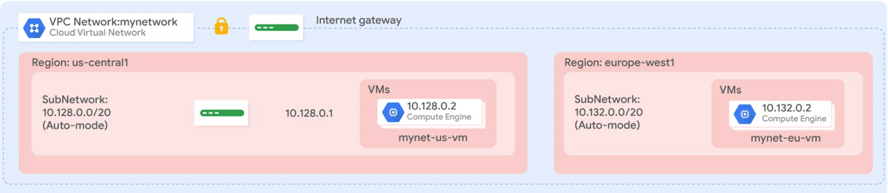
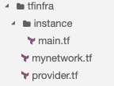

# 15. Automating the Deployment of Infrastructure Using Terraform (Terraform을 사용한 인프라 배포 자동화)

> [← 이전 실습](14.Configure%20an%20Internal%20Network%20Load%20Balancer_KR.md) · [📚 전체 목록](../README.md)

## Overview (개요)

Terraform을 사용하면 인프라를 안전하고 예측 가능한 방식으로 생성, 변경, 개선할 수 있습니다. Terraform은 오픈소스 도구로, API를 선언적(declarative) 구성 파일로 코드화하여 팀원들과 공유하고, 코드처럼 다루고, 편집·검토·버전 관리를 할 수 있게 해줍니다.

이 실습에서는 모듈(module)을 포함한 Terraform 구성을 작성하여 Google Cloud 인프라 배포를 자동화합니다. 구체적으로, 아래 다이어그램과 같이 방화벽 규칙을 가진 auto mode 네트워크 1개와 VM 인스턴스 2개를 배포합니다.



## Objectives (목표)

이 실습에서는 다음 작업을 수행하는 방법을 배웁니다.

- auto mode 네트워크를 위한 구성을 생성합니다.
- 방화벽 규칙을 위한 구성을 생성합니다.
- VM 인스턴스를 위한 모듈을 생성합니다.
- 구성을 생성하고 배포합니다.
- 구성의 배포 상태를 확인합니다.

---

---

## 🧩 Task 1. Terraform 및 Cloud Shell 설정하기

이 작업에서는 Terraform을 사용하도록 Cloud Shell 환경을 구성합니다.

### Terraform 설치 확인하기

Terraform은 이제 Cloud Shell에 기본 통합되어 있습니다. 설치된 버전을 확인합니다.

1. Google Cloud console 제목 표시줄 상단에서 **Activate Cloud Shell(Cloud Shell 활성화)** 아이콘을 클릭합니다.
2. 메시지가 표시되면 **Continue(계속)**를 클릭합니다.
3. Terraform이 설치되어 있는지 확인하려면 다음 명령어를 실행합니다.

   ```bash
   terraform --version
   ```

   출력은 다음과 비슷하게 나타납니다.

   ```text
   Terraform v1.5.7 (또는 최신 v1.8+)
   ```

   > **💡 참고:** Terraform 버전이 오래되었다는 경고가 표시되어도 걱정하지 마세요. 이 실습 안내는 Terraform v1.5.7 이상 버전에서 모두 완벽하게 동작합니다. 최신 버전의 Terraform 다운로드는 [Terraform website](https://www.terraform.io/downloads)에서 확인할 수 있습니다. Terraform은 지원되는 모든 플랫폼과 아키텍처를 위한 바이너리 패키지로 배포되며, Cloud Shell은 Linux 64비트 환경을 사용합니다.

4. Terraform 구성을 위한 작업 디렉터리를 생성하려면 다음 명령어를 실행합니다.

   ```bash
   mkdir tfinfra
   ```

5. Cloud Shell 툴바에서 **Open editor(편집기 열기)** 아이콘을 클릭합니다.

   > **💡 참고:** **"Unable to load code editor because third-party cookies are disabled"** 메시지가 표시되면 **Open in New Window(새 창에서 열기)**를 클릭하세요. 코드 편집기가 새 탭에서 열립니다. 원래 탭으로 돌아가 **Open Terminal(터미널 열기)**을 클릭한 다음 다시 코드 편집기 탭으로 전환하세요. 이 실습에서는 코드 편집기와 Cloud Shell 터미널을 주기적으로 전환하며 사용합니다.

6. 코드 편집기의 왼쪽 탐색기(Explorer) 패널에서 **tfinfra** 폴더를 펼칩니다.

### Terraform 초기화하기

Terraform은 플러그인 기반 아키텍처를 사용하여 다양한 인프라 및 서비스 제공업체(provider)를 지원합니다. 각 "provider"는 Terraform 자체와는 별도로 배포되는 독립적인 바이너리입니다. Google Cloud를 provider로 설정하여 Terraform을 초기화합니다.

1. **tfinfra** 폴더 안에 새 파일을 생성하려면, **tfinfra** 폴더를 마우스 오른쪽 버튼으로 클릭한 다음 **New File(새 파일)**을 클릭합니다.
2. 새 파일 이름을 `provider.tf`로 지정하고 엽니다.
3. `provider.tf`에 다음 코드를 복사해 붙여넣습니다.

   ```hcl
   terraform {
     required_providers {
       google = {
         source  = "hashicorp/google"
         version = "~> 5.0"
       }
     }
   }

   provider "google" {}
   ```

   *(참고: 간소화된 기본 형태인 `provider "google" {}` 단독 작성도 완벽히 지원됩니다.)*

4. `provider.tf`를 저장하려면 상단 메뉴에서 **File(파일) > Save(저장)**를 클릭하거나 단축키(`Ctrl+S` / `Cmd+S`)를 누릅니다.
5. Cloud Shell 터미널에서 `tfinfra` 디렉터리로 이동하고 Terraform을 초기화하려면 다음 명령어를 실행합니다.

   ```bash
   cd tfinfra
   terraform init
   ```

이제 Cloud Shell에서 Terraform 작업을 진행할 준비가 되었습니다.

---

---

## 🧩 Task 2. mynetwork와 그 리소스 생성하기

이 작업에서는 auto mode 네트워크 **mynetwork**와 그 방화벽 규칙, 그리고 VM 인스턴스 2개(**mynet-vm-1**과 **mynet-vm-2**)를 생성합니다.

### mynetwork 구성하기

새 구성을 생성하고 **mynetwork**를 정의합니다.

1. **tfinfra** 안에 새 파일을 생성하려면, **tfinfra** 폴더를 마우스 오른쪽 버튼으로 클릭한 다음 **New File(새 파일)**을 클릭합니다.
2. 새 파일 이름을 `mynetwork.tf`로 지정하고 엽니다.
3. `mynetwork.tf`에 다음 기본 코드를 복사해 붙여넣습니다.

   ```text
   # Create the mynetwork network
   resource [RESOURCE_TYPE] "mynetwork" {
     name = [RESOURCE_NAME]
     # RESOURCE properties go here
   }
   ```

   이 기본 템플릿은 모든 Google Cloud 리소스를 정의할 때 좋은 출발점이 됩니다. **name** 필드로 리소스의 이름을 지정할 수 있고, **type** 필드로 생성하려는 Google Cloud 리소스를 지정할 수 있습니다. 속성(properties)도 정의할 수 있지만, 일부 리소스에서는 선택 사항입니다.

4. `mynetwork.tf`에서 `[RESOURCE_TYPE]`을 `"google_compute_network"`(따옴표 포함)로 바꿉니다.

   > **💡 참고:** **google_compute_network** 리소스는 VPC 네트워크입니다. 사용 가능한 리소스 목록은 [Google Cloud provider documentation](https://registry.terraform.io/providers/hashicorp/google/latest/docs)에서 확인할 수 있습니다. 이 특정 리소스에 대해 더 자세히 알아보려면 [Terraform documentation](https://registry.terraform.io/providers/hashicorp/google/latest/docs/resources/compute_network)을 참고하세요.

5. `mynetwork.tf`에서 `[RESOURCE_NAME]`을 `"mynetwork"`(따옴표 포함)로 바꿉니다.
6. `mynetwork.tf`에 다음 속성을 추가합니다.

   ```text
   auto_create_subnetworks = "true"
   ```

   정의상 auto mode 네트워크는 각 리전에 서브네트워크를 자동으로 생성합니다. 따라서 **auto_create_subnetworks**를 **true**로 설정합니다.

7. `mynetwork.tf` 파일이 다음과 같은지 확인합니다.

   ```hcl
   # Create the mynetwork network
   resource "google_compute_network" "mynetwork" {
     name                    = "mynetwork"
     auto_create_subnetworks = "true"
   }
   ```

8. `mynetwork.tf`를 저장하려면 **File(파일) > Save(저장)**를 클릭합니다.

### 방화벽 규칙 구성하기

**mynetwork**에서 HTTP, SSH, RDP, ICMP 트래픽을 허용하는 방화벽 규칙을 정의합니다.

1. `mynetwork.tf`에 다음 기본 코드를 추가합니다.

   ```text
   # Add a firewall rule to allow HTTP, SSH, RDP and ICMP traffic on mynetwork
   resource [RESOURCE_TYPE] "mynetwork-allow-http-ssh-rdp-icmp" {
     name = [RESOURCE_NAME]
     # RESOURCE properties go here
   }
   ```

2. `mynetwork.tf`에서 `[RESOURCE_TYPE]`을 `"google_compute_firewall"`(따옴표 포함)로 바꿉니다.

   > **💡 참고:** **google_compute_firewall** 리소스는 방화벽 규칙입니다. 이 특정 리소스에 대해 더 자세히 알아보려면 [Terraform documentation](https://registry.terraform.io/providers/hashicorp/google/latest/docs/resources/compute_firewall)을 참고하세요.

3. `mynetwork.tf`에서 `[RESOURCE_NAME]`을 `"mynetwork-allow-http-ssh-rdp-icmp"`(따옴표 포함)로 바꿉니다.
4. `mynetwork.tf`에 다음 속성을 추가합니다.

   ```hcl
   network = google_compute_network.mynetwork.self_link
   ```

   > **💡 참고:** 이 방화벽 규칙은 자신이 속한 네트워크에 의존하기 때문에, `google_compute_network.mynetwork.self_link` 참조를 사용하여 Terraform이 이 리소스들을 의존 순서대로 해석하도록 지시합니다. 이 경우 네트워크가 먼저 생성된 다음 방화벽 규칙이 생성됩니다.

5. `mynetwork.tf`에 다음 속성들을 추가합니다.

   ```text
   allow {
     protocol = "tcp"
     ports    = ["22", "80", "3389"]
   }
   allow {
     protocol = "icmp"
   }
   source_ranges = ["0.0.0.0/0"]
   ```

   **allow** 규칙 목록은 어떤 프로토콜과 포트가 허용되는지를 지정합니다.

6. `mynetwork.tf` 파일이 다음과 같은지 확인합니다.

   ```hcl
   # Create the mynetwork network
   resource "google_compute_network" "mynetwork" {
     name                    = "mynetwork"
     auto_create_subnetworks = "true"
   }

   # Add a firewall rule to allow HTTP, SSH, RDP and ICMP traffic on mynetwork
   resource "google_compute_firewall" "mynetwork-allow-http-ssh-rdp-icmp" {
     name    = "mynetwork-allow-http-ssh-rdp-icmp"
     network = google_compute_network.mynetwork.self_link
     allow {
       protocol = "tcp"
       ports    = ["22", "80", "3389"]
     }
     allow {
       protocol = "icmp"
     }
     source_ranges = ["0.0.0.0/0"]
   }
   ```

7. `mynetwork.tf`를 저장하려면 **File(파일) > Save(저장)**를 클릭합니다.

### VM 인스턴스 구성하기

VM 인스턴스 모듈(module)을 생성하여 VM 인스턴스들을 정의합니다. 모듈은 폴더 안에 있는 재사용 가능한 구성입니다. 이 실습의 두 VM 인스턴스 모두에 이 모듈을 사용합니다.

1. **tfinfra** 안에 새 폴더를 생성하려면, **tfinfra** 폴더를 선택한 다음 **File(파일) > New Folder(새 폴더)**를 클릭합니다.
2. 새 폴더 이름을 `instance`로 지정합니다.
3. **instance** 안에 새 파일을 생성하려면, **instance** 폴더를 마우스 오른쪽 버튼으로 클릭한 다음 **New File(새 파일)**을 클릭합니다.
4. 새 파일 이름을 `main.tf`로 지정하고 엽니다.

   Cloud Shell에는 다음과 같은 폴더 구조가 있어야 합니다.

   

5. `main.tf`에 다음 기본 코드를 복사해 붙여넣습니다.

   ```text
   resource [RESOURCE_TYPE] "vm_instance" {
     name = [RESOURCE_NAME]
     # RESOURCE properties go here
   }
   ```

6. `main.tf`에서 `[RESOURCE_TYPE]`을 `"google_compute_instance"`(따옴표 포함)로 바꿉니다.

   > **💡 참고:** **google_compute_instance** 리소스는 Compute Engine 인스턴스입니다. 이 특정 리소스에 대해 더 자세히 알아보려면 [Terraform documentation](https://registry.terraform.io/providers/hashicorp/google/latest/docs/resources/compute_instance)을 참고하세요.

7. `main.tf`에서 `[RESOURCE_NAME]`을 `"${var.instance_name}"`(따옴표 포함)로 바꿉니다.

   이 모듈을 두 VM 인스턴스 모두에 사용할 것이므로, 인스턴스 이름을 입력 변수(input variable)로 정의합니다. 이렇게 하면 `mynetwork.tf`에서 이 변수의 값을 제어할 수 있습니다. 입력 변수에 대해 더 자세히 알아보려면 [Terraform: Define Input Variables Guide](https://developer.hashicorp.com/terraform/language/values/variables)을 참고하세요.

8. `main.tf`에 다음 속성들을 추가합니다.

   ```text
   zone         = "${var.instance_zone}"
   machine_type = "${var.instance_type}"
   ```

   이 속성들은 인스턴스의 존(zone)과 머신 유형을 입력 변수로 정의합니다.

9. `main.tf`에 다음 속성들을 추가합니다.

   ```text
   boot_disk {
     initialize_params {
       image = "debian-cloud/debian-12"
     }
   }
   ```

   이 속성은 부팅 디스크가 **Debian 12 (bookworm)** OS 이미지를 사용하도록 정의합니다. 두 VM 인스턴스 모두 동일한 이미지를 사용하므로, 이 속성은 모듈 안에 하드코딩할 수 있습니다.

10. `main.tf`에 다음 속성들을 추가합니다.

    ```text
    network_interface {
      network = "${var.instance_network}"
      access_config {
        # Allocate a one-to-one NAT IP to the instance
      }
    }
    ```

    이 속성은 네트워크 이름을 입력 변수로 제공하고 액세스 구성(access configuration)을 함께 정의하여 네트워크 인터페이스를 설정합니다. 액세스 구성을 비워두면 임시(ephemeral) 외부 IP 주소가 할당됩니다(이 실습에서 필요합니다). 내부 IP 주소만 가진 인스턴스를 생성하려면 `access_config` 섹션을 제거하면 됩니다.

11. `main.tf`가 중괄호 `{}`를 포함해 다음과 같은지 확인합니다.

    ```hcl
    resource "google_compute_instance" "vm_instance" {
      name         = "${var.instance_name}"
      zone         = "${var.instance_zone}"
      machine_type = "${var.instance_type}"
      boot_disk {
        initialize_params {
          image = "debian-cloud/debian-12"
        }
      }
      network_interface {
        network = "${var.instance_network}"
        access_config {
          # Allocate a one-to-one NAT IP to the instance
        }
      }
    }
    ```

12. `main.tf`를 저장하려면 **File(파일) > Save(저장)**를 클릭합니다.
13. **instance** 안에 새 파일을 생성하려면, **instance** 폴더를 마우스 오른쪽 버튼으로 클릭한 다음 **New File(새 파일)**을 클릭합니다.
14. 새 파일 이름을 `variables.tf`로 지정하고 엽니다.
15. `variables.tf`에 4개의 입력 변수를 정의합니다.

    ```hcl
    variable "instance_name" {}
    variable "instance_zone" {}
    variable "instance_type" {
      default = "e2-micro"
    }
    variable "instance_network" {}
    ```

    **instance_type**에 기본값(`e2-micro`)을 지정하면 이 변수는 선택 사항이 됩니다. **instance_name**, **instance_zone**, **instance_network**는 필수이며, `mynetwork.tf`에서 정의합니다.

16. `variables.tf`를 저장하려면 **File(파일) > Save(저장)**를 클릭합니다.
17. `mynetwork.tf` 파일 하단에 다음 VM 인스턴스 2개를 추가합니다.

    ```hcl
    # Create the mynet-vm-1 instance
    module "mynet-vm-1" {
      source           = "./instance"
      instance_name    = "mynet-vm-1"
      instance_zone    = "us-central1-c" # (또는 지정된 Zone 1)
      instance_network = google_compute_network.mynetwork.self_link
    }

    # Create the mynet-vm-2 instance
    module "mynet-vm-2" {
      source           = "./instance"
      instance_name    = "mynet-vm-2"
      instance_zone    = "europe-west1-c" # (또는 지정된 Zone 2)
      instance_network = google_compute_network.mynetwork.self_link
    }
    ```

    이 리소스들은 **instance** 폴더에 있는 모듈을 활용하며, 이름·존·네트워크를 입력값으로 제공합니다. 이 인스턴스들은 VPC 네트워크에 의존하므로, `google_compute_network.mynetwork.self_link` 참조를 사용하여 Terraform이 이 리소스들을 의존 순서대로 해석하도록 지시합니다. 이 경우 네트워크가 먼저 생성된 다음 인스턴스가 생성됩니다.

    > **💡 참고:** Terraform 모듈을 작성할 때의 장점은 여러 구성에서 재사용할 수 있다는 점입니다. 직접 모듈을 작성하는 대신, [Terraform Module registry](https://registry.terraform.io/browse/modules)에 있는 기존 모듈을 활용할 수도 있습니다.

18. `mynetwork.tf`를 저장하려면 **File(파일) > Save(저장)**를 클릭합니다.
19. `mynetwork.tf` 파일 전체가 다음과 같은지 확인합니다.

    ```hcl
    # Create the mynetwork network
    resource "google_compute_network" "mynetwork" {
    name = "mynetwork"
    # RESOURCE properties go here
    auto_create_subnetworks = "true"
    }
    # Add a firewall rule to allow HTTP, SSH, RDP and ICMP traffic on mynetwork
    resource "google_compute_firewall" "mynetwork-allow-http-ssh-rdp-icmp" {
    name = "mynetwork-allow-http-ssh-rdp-icmp"
    # RESOURCE properties go here
    network = google_compute_network.mynetwork.self_link
    allow {
     protocol = "tcp"
     ports    = ["22", "80", "3389"]
     }
    allow {
     protocol = "icmp"
     }
    source_ranges = ["0.0.0.0/0"]
    }
    # Create the mynet-vm-1 instance
    module "mynet-vm-1" {
      source           = "./instance"
      instance_name    = "mynet-vm-1"
      instance_zone    = "us-central1-c" # (또는 지정된 Zone 1)
      instance_network = google_compute_network.mynetwork.self_link
    }

    # Create the mynet-vm-2 instance
    module "mynet-vm-2" {
      source           = "./instance"
      instance_name    = "mynet-vm-2"
      instance_zone    = "europe-west1-c" # (또는 지정된 Zone 2)
      instance_network = google_compute_network.mynetwork.self_link
    }
    ```

### mynetwork와 그 리소스 생성하기

이제 **mynetwork** 구성을 적용할 차례입니다.

1. Terraform 구성 파일을 표준 형식과 스타일로 재작성(포맷팅)하려면 Cloud Shell 터미널에서 다음 명령어를 실행합니다.

   ```bash
   terraform fmt
   ```

   출력은 다음과 비슷하게 나타납니다.

   ```text
   mynetwork.tf
   ```

2. 모듈을 인식하고 Terraform을 초기화하려면 다음 명령어를 실행합니다.

   ```bash
   terraform init
   ```

   출력은 다음과 비슷하게 나타납니다.

   ```text
   Initializing modules...
   - mynet-vm-1 in instance
   - mynet-vm-2 in instance
   ...
   Terraform has been successfully initialized!
   ```

3. 실행 계획(execution plan)을 생성하려면 다음 명령어를 실행합니다.

   ```bash
   terraform plan
   ```

   출력은 다음과 비슷하게 나타납니다.

   ```text
   ...
   Plan: 4 to add, 0 to change, 0 to destroy.
   ...
   ```

   Terraform은 다음 4개의 리소스를 추가해야 한다고 판단했습니다.

   | Name (이름) | Description (설명) |
   |---|---|
   | `mynetwork` | VPC network (auto mode) |
   | `mynetwork-allow-http-ssh-rdp-icmp` | Firewall rule to allow HTTP, SSH, RDP and ICMP |
   | `mynet-vm-1` | VM instance in us-central1-c |
   | `mynet-vm-2` | VM instance in europe-west1-c |

4. 원하는 변경사항을 실제로 적용하여 인프라를 배포하려면 다음 명령어를 실행합니다.

   ```bash
   terraform apply
   ```

5. 계획된 작업을 확인하는 프롬프트가 나타나면 다음과 같이 입력하고 Enter 키를 누릅니다.

   ```text
   yes
   ```

   배포가 완료되면 출력은 다음과 비슷하게 나타납니다.

   ```text
   ...
   Apply complete! Resources: 4 added, 0 changed, 0 destroyed.
   ```

---

---

## 🧩 Task 3. 배포 확인하기

Google Cloud console에서 Terraform으로 배포된 리소스들을 확인합니다.

### Cloud console에서 네트워크 확인하기

1. Google Cloud console에서 **Navigation menu(탐색 메뉴)**의 **VPC network(VPC 네트워크) > VPC networks(VPC 네트워크)**를 클릭합니다.
2. 모든 리전에 서브네트워크를 가진 **mynetwork** VPC 네트워크를 확인합니다.
3. **Navigation menu(탐색 메뉴)**에서 **VPC network(VPC 네트워크) > Firewall(방화벽)**을 클릭합니다.
4. 방화벽 규칙을 **Network(네트워크)** 기준으로 정렬합니다.
5. **mynetwork**의 **mynetwork-allow-http-ssh-rdp-icmp** 방화벽 규칙이 정상 생성되어 있는지 확인합니다.

### Cloud console에서 VM 인스턴스 확인하기

1. **Navigation menu(탐색 메뉴)**에서 **Compute Engine(컴퓨트 엔진) > VM instances(VM 인스턴스)**를 클릭합니다.
2. **mynet-vm-1**과 **mynet-vm-2** 인스턴스가 실행 중(**Running**)인지 확인합니다.
3. **mynet-vm-2**의 내부 IP 주소(Internal IP)를 확인해 둡니다.
4. **mynet-vm-1** 행에서 **SSH(SSH 접속)**를 클릭하여 터미널을 실행하고 접속합니다.
5. **mynet-vm-2**의 내부 IP 주소로의 네트워크 연결성을 테스트하려면, SSH 터미널에서 다음 명령어를 실행합니다(`[mynet-vm-2의 내부 IP]`는 앞서 확인한 실제 내부 IP 주소로 바꿔서 입력합니다).

   ```bash
   ping -c 3 <mynet-vm-2의 내부 IP 입력>
   ```

   > **💡 참고:** 두 VM 인스턴스가 같은 VPC 네트워크에 있고, Terraform으로 생성한 방화벽 규칙이 ICMP 트래픽을 허용하기 때문에 Ping 응답이 정상적으로 수신되어야 합니다.

---

---

## 🧩 Task 4. Review (검토)

이 실습에서는 모듈(Module)을 포함한 Terraform 구성을 작성하여 Google Cloud 인프라 배포를 완전 자동화했습니다. 구성이 변경될 때마다 Terraform은 점진적인 실행 계획(incremental execution plan)을 생성할 수 있어, 전체 구성을 안전하고 단계별로 구축할 수 있습니다.

`instance` 모듈을 통해 속성을 입력 변수로 제공하면서 여러 리소스에 동일한 리소스 구성을 재사용할 수 있었습니다. 이번에 만든 구성과 모듈은 향후 다양한 Google Cloud 인프라 배포 자동화 작업의 표준 템플릿으로 활용할 수 있습니다.

---

## End your lab (실습 종료)

---

> [← 이전 실습](14.Configure%20an%20Internal%20Network%20Load%20Balancer_KR.md) · [📚 전체 목록](../README.md)
